# Security in TCP/IP (NETCORE)

## nmap

- Scanner tool
- Can apply various approcahes for detecting open ports
- Uses the RFC 9293
- Can be detected by most ids and ips systems today 

- scans the first 1000 most used ports 

Journey: 
    - sends TCP request with SYN flag
    - Get syn/ack response from open ports 

    ON WIRESHARK to see open ports : tcp.flags.syn==1&&tcp.flags.ack==1

### nmap host discovery:
- some of the scanning modes are more aggressive than others
    - sudo nmap -vv -n -sn -T4 <IP>
        - vv = very verbose, n = no packet resolution, sn = ping scan - arp discovery, T4 = Time (the higher the number, the faster)
        - Wireshark : send who has and find the "is at" to see the ones open (filer = opcode 2) arp.opcode == 2
        - Is to detect if host is up or not
    - sudo nmap -vv -Pn -sT -A <IP> - target of open ip
        - Pn = No ping! , sT = full three way handshake to the machine (scan Transaction), A = aggressive
        - wireshark :
        - is to sniff host

The faster you scan, the more patterns and traces you leave - therefore the more chances of detection. On the other hand, the slowest you scan packets, the less traces and visible patterns you leave and therefore less chances of detection.

### ARP vs PIng to detect:

Ping uses ICMP protocol and is on network layer
arp in on datalink layer.

So to run arp, you have to been on same network as host. ICMP packs gets routed - you can scan out fo your own network.

Arp is less intrusive than ping, ergo less detectable, they usually run in the background. Whereas ping is something you have to actively do. Arp is never detected by ids and ips, its under the radar. So if possible, use arp, much less suspicious and malicious.

### nmap output to file 

nmap can write the output to a file
> sudo nmap -sn <IP> -oG ips.txt

You can now use grep and cut to process the output
> grep "Up" ips.txt | cut -d' ' f2 > ips_up.txt

Now you can use -iL to read from file
> nmap -sS -iL ips_up.txt

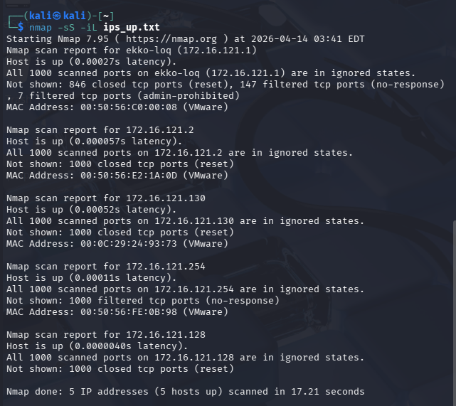

### nmap TCP scans

-sS and -sT dif?
- -sT is a full conection
- -sS is a half connection, we send a syn and get at syn/ack back and then reset, drop the last ack (stealth scan) - is stealth because most firewalls dont write a connection if its not full - but most ids will detect anyways. but really not stealthy anyways because pattern is : syn, syn/ac, reset instead of full 3 way handshake syn, syn/ack, ack.
nmap injects a syn in the driver - not the kernel-, an os cannot make a haslf connection on purpose. then the kernel receives the syn/ack and doesnt know here it comes from - then the kernel resets it immediately because it cannot know it. To avoid that, you can make a firewall rule tgat says that you dont send a reset packet.

How do we know if a firewall is tehre?
    - consider using -sA -- you can force the host to send a response back (a reset), so it is to check is there are services on this host or not
    - a rst is sent back in case its open or closed
    - open: connection possible
    - closed: no service availabke
    - filtered firewall drops packet - this shows up in nmap, you can see if there is a firewall rule because you get no response, it drops the packets. If ping good and then no response on port -> assume port is filtered.

Then the last packet doesnt come through, but the syn/ack just stays there and waits - which is an otehr way to detect attack - is another pattern to look out for.
You have to think abotu which flags you want to trigger.

Sometimes the firewall sends a reject instead of droppping the pack. It sends a reject response.

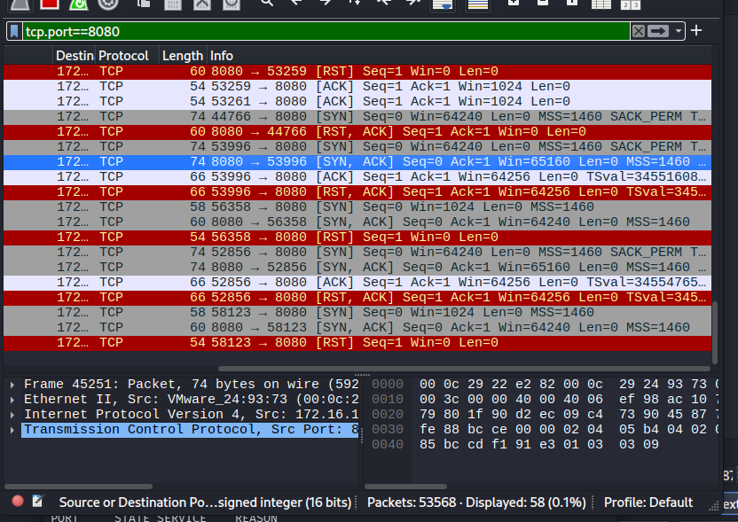

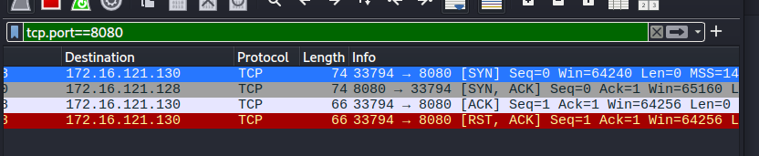
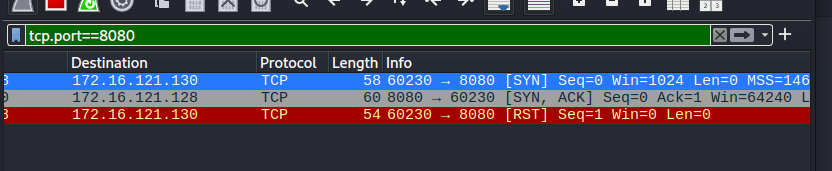
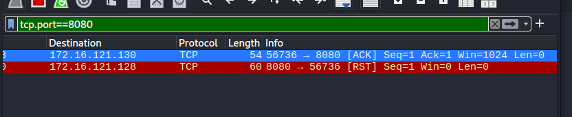

### nmap banner grabbing

To verify a service you can do a banner grabbing
    - nmap -sV <IP>
    - This is highly detectable and gets logged fully as it makes a request and wants a response etc - operates on app level
    - you can see the logs at /var/apache2/access.log

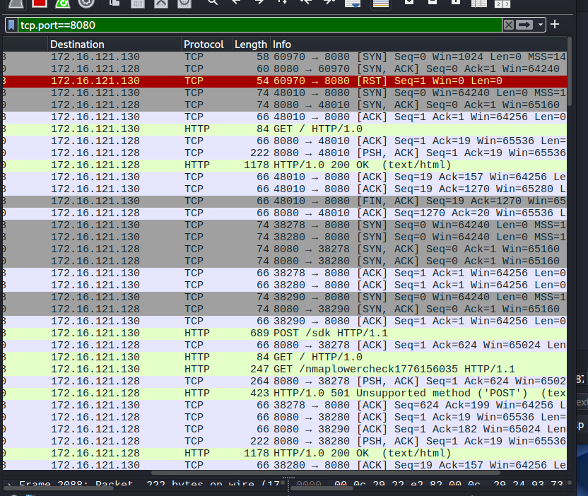

Sometimes a nmap scan can put down a system

### nmap OS fingerprinting
- can do OS fingerprinting
- run the command: > sudo nmap -O -v <IP>
- 

How does it make an educated guess?

> MY GUESSES
- maybe tcp ip behaviour/responses?, maybe based on services it can detect, maybe based on mac address?, structure of response?, updates-time/date > cross reference all info and makes educated guess.
> CLAUDE ANSWER
**TCP/IP Stack Fingerprinting — the main method**

Every OS implements the TCP/IP stack slightly differently. Nmap sends a series of crafted probes and analyzes the responses. *Things like:*

- TTL values (Linux default 64, Windows 128, Cisco 255)
- TCP window size in responses
- IP ID sequencing (how the OS increments packet IDs)
- TCP options ordering (which options, in what order)
- Response to weird/illegal packets (e.g. a FIN to an open port — different OSes react differently)

**Other signals**

MAC address OUI — can hint at vendor (e.g. VMware NIC → probably a VM)
Open ports — certain services are OS-specific (e.g. port 445 = likely Windows)
Uptime estimation — from TCP timestamp option, can estimate how long since boot

**How the guess is made**

Nmap collects all these signals → compares against its nmap-os-db database of known OS fingerprints → scores the closest match → outputs a confidence percentage

**Why it's a guess**

Firewalls/NAT can alter responses
Custom kernel configs can change defaults
A match is never guaranteed — hence the % confidence shown

> CLASS ANSWER
Sends packs and look at the content it gets back  the windows size, is there a pattern iin seq numbers, scaling factor?, option for SACK? ect + fingerprijting on services - runs http -> banner grabbing -> gets data, cross references with its own db for fingerprints => makes educated guess. 

### nmap scripting engine (NSE)

- We can use custom amde scripts to perfomr various scans
- In kali the scripts are located at /usr/share/nmap/scripts
- to see list of all scripts, look into script.db with grep fx.
- We can use --script-help to read about a specific script
    - > nmap --script-help http-apache-server-status
- Now we can run it
    - > nmap --script=http-apache-server-status <IP>

Some of them run illegal exploits if they can - so be mindful when using them.

### nmap in python

> import nmap (python3-nmap)
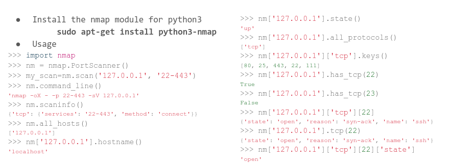

There are other tools used to scan other than nmap : 
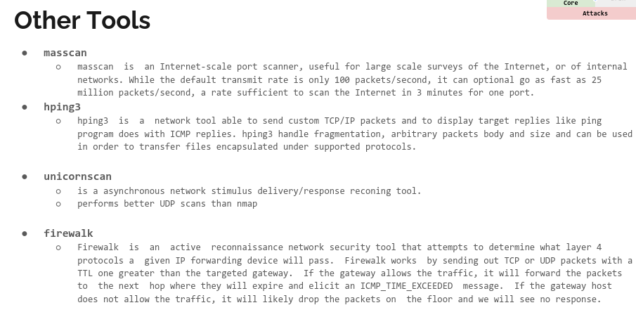

Packets are not magic, we can make them ourselves. Ergo we can spoof packs and other malicious uses.

● Colasoft packet builder (http://www.colasoft.com/packet_builder/) - windows

● TCP inspection (https://docs.microsoft.com/da-
dk/sysinternals/downloads/tcpview)
● RawCap (http://www.netresec.com/?page=RawCap)

Most of these tools require that you run them as administrator

## scapy

- This this a tool that bith is a sniffer and a packet injector.
- It can be used directly from commad line
- It can also be used in python as a library
- There are a lot of scripts built with it.
- used more as proof of concept, as its limited in its effectivity.

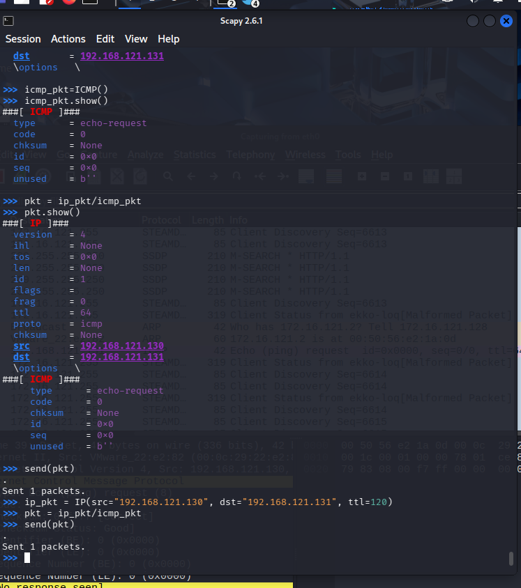

● From your kali terminal enter scapy
● You will then get python terminal and you are ready to go
● Use ls() and lsc() or explore() to help you with the commands
and protocols you want to issue.
○ ls(TCP) - will show info/help about TCP
○ lsc() - will show a list of scapy functions
○ explore() - can be used to get help for the supported protocols
● Use help(<function_name>) to see the options for a command
○ help(sniff)

Most important functions include
● send() Sends a packet in layer 3
● sendp() Sends a packet in layer 2
● sr() Send and wait for response
● sniff() sniffs traffic
● rdpcap() import a pcap file

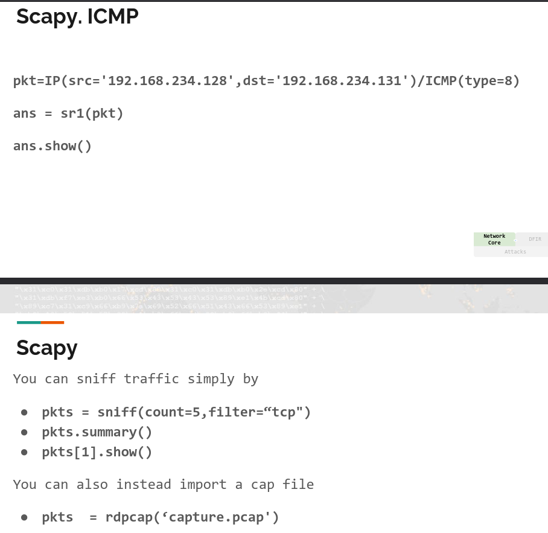

To Import scapy in your own script
> from scapy.all import *
OBS!! - this is the easiest way to import scapy, at this level, its all good 

## TCP Attacks
Abusing some of TCP's features -> 3way HS can form basis for multiple attacks.

It doesnt require a already established connection
TCP is connection oriented and therefore uses resources
TCP handshake is very common and the basis of all traffic

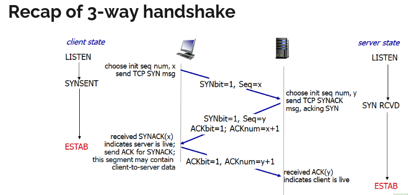

### SYNflood
● Exploiting the 3 way handshake by only using the syn flag
● Established “half-open” connections that eat up resources on the
system
● Is somewhat dealt with by modern OS, but problem remains

Is still currently an attack that works, even with the computers and servers, and cloud server we have.

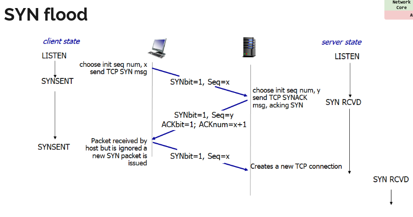

You can use scapy amongst other tools to do a syn flood
> scapy.srflood()
You can spoof your src ip addr and ports, just as long as the dst ip and port, and it would work. 
But if you send form existing ip addresses, youll get a reset after the syn/ack.

TCP syn from the other side 
from kali: 
> sudo iptables -A OUTPUT -p tcp --tcp-flags RST RST -s
<KALI_IP> -j DROP
>>>> really good for pentesting, you dont send resets back, but don't do on home machine.

**MANDATORY 2 - PART1/4**
MAN2.1-scapy (syn flood with scapy)

Now write a program in python that will send 100 SYN packets in
the following form:
○ It will send the packets spoofing the ip address of the
sender (src) to 10 addresses of your choosing.
○ The source port (sport) in the TCP should also be at least
10 different ports.
○ Ps. Use send() to send each packet or other.

WE NEED TO THINK ABOUT WHICH IPS WE USE.
*Documentation* : screenshot with descriptions/explanations

### ARP poisoning

## SSLstrip/SSLsplit

## DNSspoof

