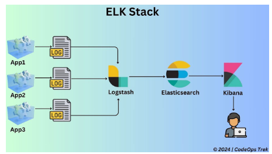
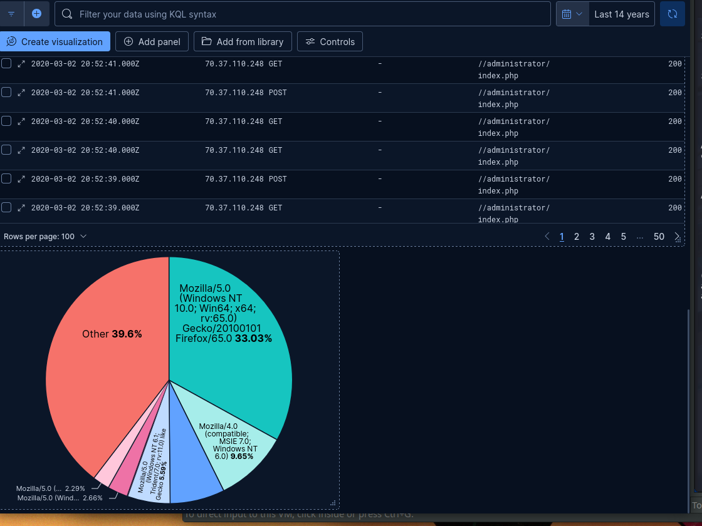

# SOF ELK
## ELK stack

Elastic search (free), a swissknife to inget data and make it visual. So you usually customize it to your specific usecase.

Logstash -> ingest log files to searcheable stash format, you put in elasticsearch (a db), so you can search on felter

Kibana -> GUI to visualize the data into graphs and charts

What we use is a VM built on top of ELK.

SO you have multiple apps that can go into the stash (fireall log, påroxy log, server logs etc ) -> logstash -> elasticsearhc db -> kibana to use the results and make searches and visualise data.

## SOF ELK

Securtity Operatiopns and Forensics - Elasticsearch Logstash Kibana
Not real time nor near rela itme -> forensics tool.
Use it off line.

> WATCH THE VIDEO
[video sof elk](https://www.youtube.com/watch?v=Hk6An-LJ4jY)

better to ssh into the vm than using server vm.

Use putty to ssh 
<ip> = 172.16.121.137

on browser : <ip>:5601

<exercises done>

## HTTPD logs

HTTP servers use one of thes elogs format : common, conbined or vhost-combined formats

SOF ELK support all of those, but if use another format, it
 might put the whole thing together in a "message"
Logsttash can only handle files f max 1Gb

mandatory 
syn flood check = fidderent src ips but same dest port 

portscan = same src ip but different dst ports 
if nma p-sS Stealthy = no last ack sent
if -sT = full handshake so last ack is sent
if -sV full handshake and banner grabber try to ssh into open port - so makes a req
-> full report - so screenshots, descriptions, anomalies to check and resulsts etc