# IDS and IPS basics

## IDS/IPS

### IDS
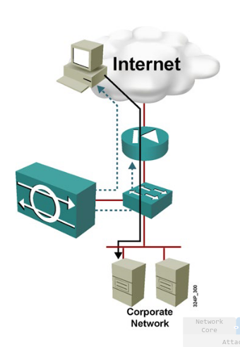
Intrusion Detection System

Is a passive device:
    - traffic does not pass through the device
    - typicaly only uses promiscuous interface
    - reactive :
        - generates an alert to notify the manager of malicous traffic
    - optional active responses : 
        - further malicious traffic can be denied with a security appliance or router
        - TCP resets can be sent to the src device

### IPS
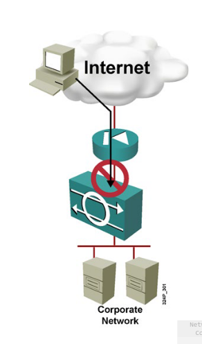
Intrusion Prevention System

Is an active device:
    - lets all traffic pass through
    - Uses multiples interfaces
    - Is poractive prevention : 
        - denies all malicious traffic
        - sends alert to management station

An IPS is effectively also an IDS because it can notify of tarffic.

### Combining IDS and IPS
IPS actuvely blocks offending traffic:
    - Should not block legitimate data
    - Only stops "known malicious traffic"
    - Requires focused tuning to avoid connectivity disruption
IDS compelemnts IPS:
    - Verfies that IPS is still operational
    - Alerts about any sus data execpt "known good traffic"
    - covers the gray area of possibly malicious traffic that IPS did not stop

### IDS and IPS Types and Options
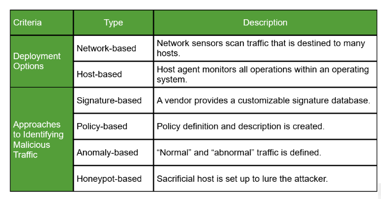

### Network based and Host based IPS

NIPS : Sensor appliances are connected to network segments to monitor many hosts

HIPS: Centrally managed software agents are installed on each host : 
    - provides individual hostd etection and portection
    - does not require special HW

### NIPS vs HIPS
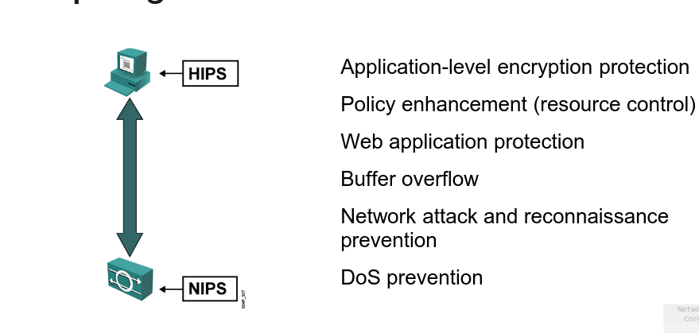

How do they compelemtn each other?
fx. If traffic is sym. encrypted, NIPS cant see it but HIPS can see bc it gets decrypted there.
On the other side if there are netwrok attacks performed, HIPS cant see bc they inly see themselves (host) them but NIPS can. Some machines cant have HIPS, like printers, so they are protected under NIPS - They complement each other, they should be used together to have a full picture.  

### NIPS Feat.
Stripped of functionalities so they have their core functionality.
- Sensors are network appliances that you tunen for intrusion detection analysis:
    - the operating system is "hardened"
    - the HW is dedicated to intrusion detection analysis
- Sensors are connected to netwoork segemnts. A single sensor cam monitor many hosts. You usually connect them to a switch to see what happens baheing switch and monitor what comes in.
- Growing network are easily portected:
    - New hosts and devices can be added without adding sensors.
    - New sensors can easily be added to new networks. 

### NIDS and NIPS deployment
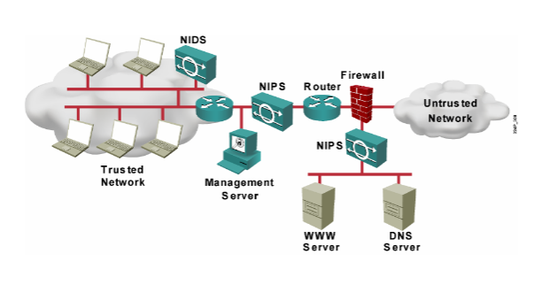

so fx nips for web and dns server can have sepcial rules for those and so on.

They can't see whatever doesnt go through them directly, on both sides. so if employee has malicious usb and sticks them in computer, you only get alerted when the malicious ocntent goes through the nids.

**!= ways to do ids and ips:**

### Signature Based IDS and IPS
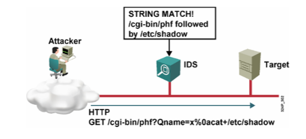
EASIEST way

look for a specific signature/ fingerprint and map through.

Observes and blocks or alarms if a known malicious event is detected:
    - requires a db of known malicious patterns
    - !! db must be continusouly updated !! daily, multiple times a day - every 5 min fx

### Policy based IDS and IPS
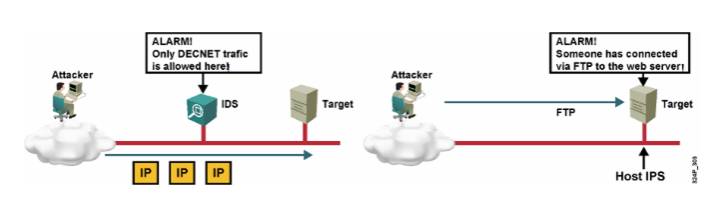

Observes and blocks or alarms if an event outside of the configures policy is detected
    - Requires a poilcy db

### Anomaly based IDS and IPS
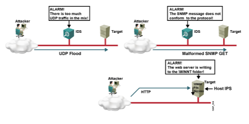

Most difficult way to do ids

OObeserves and blocks or alarms if an event outside of known normal traffic behaviour is detected:
    - statisctical vs non stat anomaly detection
    - requires a def of "normal" traffic

**You usually use them and combine them based on your use cases**

### Exploit signatures
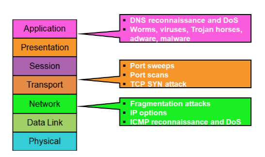
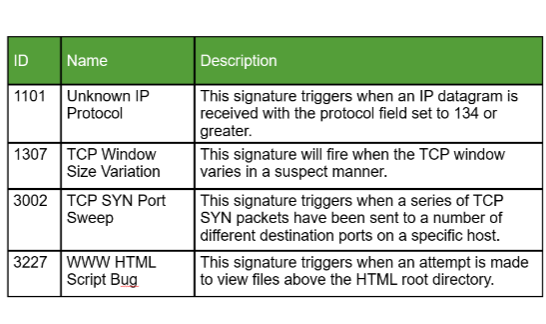

Actions in a IPS are typically :
    - pass
    - drop (drop pack wihtout answer)
    - reject (rejects with answer sent to sender)
    - alert
    - (log) - in some systems  

## Security onion 2.4/3.0

Collection of tools
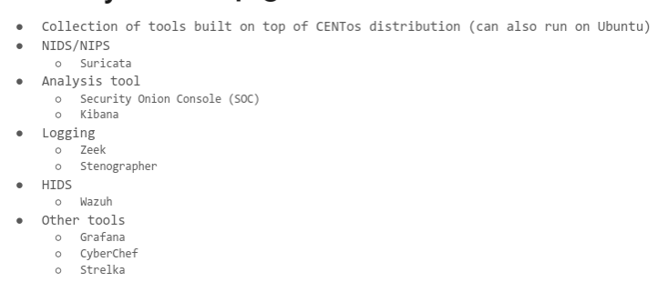

We dont use bc is very heavy!!! so Dany made homemade vms with "bare minimum"

## ELK-SIEM and NIDS-light

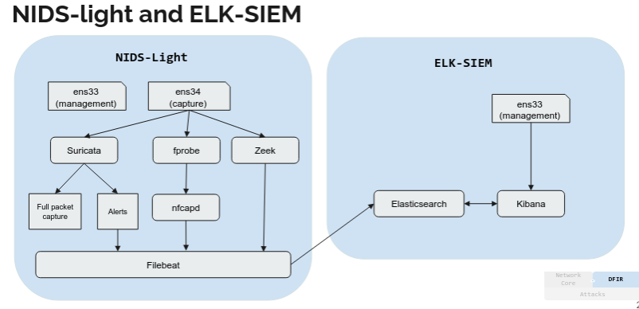

---------- Exercise ---------

## Category 1: NIDS / NIPS — Network Intrusion Detection & Prevention

### Suricata
- Open-source NIDS/NIPS engine.
- Monitors network traffic in real time and matches it against a database of rules (Snort-compatible syntax).
- IDS mode: runs passively off a SPAN port + generates alerts. - IPS mode: runs inline in the traffic path + can drop malicious packets.
- Used as the core detection engine in both Security Onion and the NIDS-light setup.
- Supports multi-threading, making it faster than the older Snort tool.

---

## Category 2: Logging & Capture

### Zeek (formerly Bro)
- Network analysis framework that passively monitors traffic + generates structured log files, not alerts.
- Produces:
    - `conn.log` (all connections)
    - `dns.log`
    - `http.log`
    - `ssl.log`
    - `files.log`
    - + more
- != Suricata -> Zeek doesn't use signatures, it generates rich metadata about network behaviour that analysts can search and correlate.
- Feeds its logs into the SIEM via Filebeat.
- Very useful for threat hunting and incident investigation.

### Stenographer
- Full packet capture tool developed by Google.
- Runs silently in the background and writes all raw network traffic to disk in pcap format.
- Provides a way to go back and retrieve the original packets when an alert fires, like a network DVR.
- Integrated into Security Onion to allow analysts to pull full packet captures for any connection that Suricata or Zeek flagged.

### Filebeat
- Lightweight log shipper from Elastic.
- Reads log files on disk (Suricata alerts, Zeek logs, etc.) + forwards them to Elasticsearch for indexing.
- Acts as the transport layer between the NIDS-light sensor and the ELK-SIEM.
- Runs on the NIDS-light VM + ships data to the separate ELK-SIEM VM.

### fprobe
- Netflow exporter for Linux.
- Captures packets on a network interface and exports flow records (aggregated L3/L4 metadata) to a collector (nfcapd).
- Generates netflow data without storing full packet payloads = ++ storage-efficient.
- Used in NIDS-light alongside Suricata so you get both signature-based alerts AND flow-level metadata.

### nfcapd / nfdump
- `nfcapd` is the netflow collector daemon, it receives flow records from fprobe and writes them to disk.
- `nfdump` is the analysis tool for reading and querying the collected netflow files (filter by IP, port, bytes, flags etc.).
- Together = netflow pipeline: fprobe → nfcapd → nfdump.

---

## Category 3: Analysis & Visualisation

### Security Onion Console (SOC)
- The web-based alert management interface built into Security Onion.
- Analysts use it to review, triage, and escalate alerts generated by Suricata.
- Shows alert details, allows pivoting to related Zeek logs or full pcaps via Stenographer.
- Replaces the older Squert/Sguil interfaces from earlier Security Onion versions.

### Kibana
- Web-based data visualisation and search interface for Elasticsearch.
- Used in both Security Onion and the standalone ELK-SIEM to build dashboards, run searches, and explore log data.
- Lets analysts query Zeek logs, Suricata alerts, netflow data, and system logs through a browser.
- Visual layer on top of Elasticsearch database.

### Grafana
- Open-source dashboarding and metrics visualisation tool.
- + focused on time-series data and performance metrics than Kibana.
- Used in Security Onion to display operational dashboards, ex sensor health, traffic volume over time, alert rates.
- Works with multiple data sources including Elasticsearch and InfluxDB.

---

## Category 4: HIDS — Host-Based Intrusion Detection

### Wazuh
-Open-source HIDS (Host-based Intrusion Detection System).
- Agent software installed on each individual host/server that monitors: log files, file integrity (detects changed/added/deleted files), running processes, network connections, and system calls.
- Sends events to a central Wazuh manager where they are analysed and forwarded to Elasticsearch/Kibana.
- Complements network-level detection, Suricata sees what crosses the network, Wazuh sees what happens on the host itself.

---

## Category 5: Utility & Forensic Tools

### CyberChef
- Web-based data analysis and transformation tool developed by GCHQ (UK).
- Lets you chain together "recipes", operations like base64 decode, hex decode, XOR, regex extract, hash, decompress, etc.
- Used in incident response to decode suspicious strings, malware payloads, and obfuscated data without needing to write custom scripts.
- Runs entirely in the browser, no data sent externally.
- https://gchq.github.io/CyberChef/

### Strelka
- File analysis framework developed by Airbnb.
- Designed to scan files in real time as they cross the network (extracted by Zeek from network traffic) and classify them:
    - identify malware
    - extract metadata
    - detect embedded executables
    - decode encoded payloads.
- Works as a pipeline: Zeek extracts files → Strelka scans them → results sent to Elasticsearch for analysis.
- Adds a file/malware analysis layer on top of the network monitoring.

---

## Category 6: Core Infrastructure (ELK Stack)

### Elasticsearch
- Distributed search and analytics engine.
- The central storage and indexing layer of the ELK stack.
- All logs and alerts (from Suricata, Zeek, Wazuh, netflow, etc.) are indexed into Elasticsearch, making them searchable in milliseconds even across billions of events.
- Kibana queries Elasticsearch to display dashboards and search results.

---

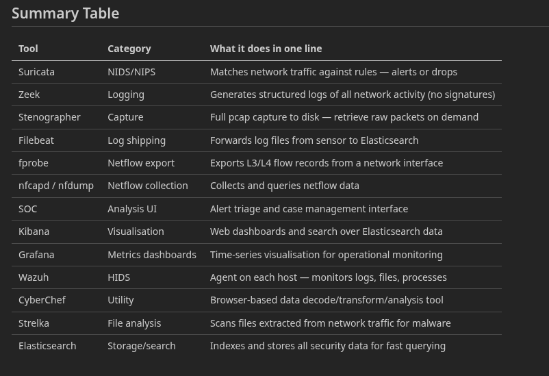

http://172.16.121.140:5601/ elk siem