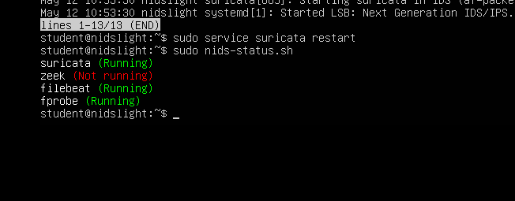
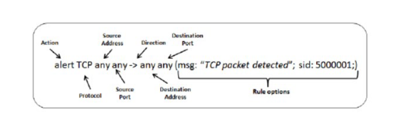

# IDS i Praksis: Suricata Rules

## Hvad er Suricata?
Suricata er en open-source NIDS (Network Intrusion Detection System). Den kører på NIDS-light og **lytter passivt på netværkstrafik** via `ens34` (capture interface). Når den opdager mistænkelig trafik der matcher en regel, genererer den en **alert** — den blokerer ikke (det ville være NIPS).

Alerts sendes videre til **ELK-SIEM** via Filebeat, så du kan visualisere dem i Kibana.

---

## Setup overblik

```
Kali (angriber)  →  netværk  →  NIDS-light (Suricata lytter på ens34)
                                      ↓ Filebeat
                                  ELK-SIEM (Kibana: 172.16.121.140:5601)
```

- NIDS-light IP: `172.16.121.141`
- ELK-SIEM IP: `172.16.121.140`
- ELK_SIEM gui browser http://172.16.121.140:5601/ 

---

## Vigtige kommandoer (kør på NIDS-light)

```bash
# Tjek at Suricata kører
sudo service suricata status

# Tjek alle NIDS-light services
sudo nids_status.sh

# Genstart Suricata
sudo service suricata restart

# Opdater regler fra Emerging Threats (ET) databasen
sudo suricata-update

# Se alle regler
sudo less /var/lib/suricata/rules/suricata.rules

# Test at config/regler er gyldige (ingen syntax fejl)
sudo suricata -T
```




---

## Regel-struktur

En Suricata regel ser sådan ud:



```
action  protocol  src_ip  src_port  ->  dst_ip  dst_port  (options)
```

cant drop or reject - ids not ips here, so typicalyy an alert

direction is either -> or <-> 
you can add a lot fo options in the options so you can go in the dep of the packet


**Eksempel:**
```
alert tcp $HOME_NET any -> $EXTERNAL_NET 80 (msg:"Putty download"; content:"putty.exe"; http_uri; nocase; sid:7000002; rev:1;)
```

| Del | Hvad det betyder |
|-----|-----------------|
| `alert` | Handling — generer en alert |
| `tcp` | Protokol |
| `$HOME_NET` | Dit interne netværk (defineret i suricata.yaml) |
| `any` | Alle porte |
| `->` | Retning (fra → til) |
| `msg:` | Tekst der vises i alerten |
| `content:` | Det payload der matches på |
| `sid:` | Unikt regel-ID — **dine egne regler skal være over 7000000** |
| `rev:` | Revision nummer — forhøj når du redigerer reglen |

---

## Custom regler

Dine egne regler skrives her:
```bash
sudo nano /etc/suricata/local.rules
```

### Regel 1 – Detect root user exfiltration
```
alert ip any any -> any any (msg:"DAKA ATTACK_RESPONSE id check returned root"; content:"uid=0|28|root|29|"; classtype:bad-unknown; sid:7000001; rev:3;)
```
**Test:** Fra Kali: `wget http://kallas.dk/idstest.htm`

### Regel 2 – Detect Putty download
```
alert http any any -> any any (msg:"DAKA Possible disallowed tool: Putty"; content:"putty.exe"; http_uri; nocase; sid:7000002; rev:2;)
```
**Test:** Fra Kali: `wget http://kallas.dk/putty.exe`

### Regel 3 – TCP SYN flood detection
```
alert tcp any any -> 172.16.121.141 any (msg:"TCP SYN flood attack detected"; flags:S; threshold: type threshold, track by_dst, count 20, seconds 60; classtype:denial-of-service; priority:5; sid:7000100; rev:1;)
```
**Test:** Fra Kali med Scapy — send mange SYN pakker mod NIDS-light IP.

> **Husk:** Skift IP i regel 3 til din NIDS-light IP (`172.16.121.141`)

---

## Workflow: tilføj og aktiver en regel

```bash
# 1. Åbn local.rulesl
sudo nano /etc/suricata/local.rules

# 2. Tilføj din regel og gem

# 3. Test for syntax fejl
sudo suricata -T

# 4. Genstart Suricata
sudo service suricata restart
```

---

## Find alerts

```bash
# Se alle alerts i fast.log
cat /var/log/suricata/fast.log

# Grep efter specifik regel (sid)
grep 7000001 /var/log/suricata/fast.log

# Grep efter ET-regel eksempel
grep 2100498 /var/log/suricata/fast.log
```

Alerts kan også ses i **Kibana** på `http://172.16.121.140:5601/`

---

## Interaktiv IDS tester (kør fra Kali)

```bash
curl -sSL https://raw.githubusercontent.com/0xtf/testmynids.org/master/tmNIDS -o /tmp/tmNIDS && chmod +x /tmp/tmNIDS && /tmp/tmNIDS
```

> Hvad gør denne kommando egentlig? Den downloader et script fra GitHub, giver det execute-rettigheder og kører det. **Altid tjek et script inden du kører det!**

---

## Mandatory 2.4 – IDS opgaver [IDS.01]

1. **ncat.exe regel** — Lav en regel der detecter download af `ncat.exe`
   - Test: `wget http://www.kallas.dk/ncat.exe`

2. **Basic auth regel** — Lav en regel der detecter HTTP basic authentication mod `kallas.dk`
   - Test: `http://kallas.dk/basic.php`

3. **SYN flood regel** — Forstå og test regel 3 ovenfor med Scapy fra Kali

---

## Key Concepts for Exam

- **Suricata** = passiv NIDS, lytter på netværket og genererer alerts (blokerer ikke = ikke NIPS)
- **Regler** har altid: action, protokol, IP/port, retning, options med msg og sid
- **SID** for egne regler skal være **over 7000000** for at undgå konflikt med officielle regler
- **ET (Emerging Threats)** = gratis open-source regeldatabase opdateret med `suricata-update`
- **fast.log** = lokal alert-fil på NIDS-light
- **ELK-SIEM + Kibana** = centraliseret visualisering af alerts fra Suricata via Filebeat
- **`suricata -T`** = validér regler uden at genstarte (test mode)