# 📡 NCS — Session 09: Network Monitoring + SNMP

**Last updated:** 19 May 2026 | Based on slide deck: `09-NCS-Network_monitoring-SNMP.pdf`
**Exam topic:** Topic 6 — Network Monitoring / SNMP

---

## 🗺️ Big Picture

This session sits at the **management layer** of the NCS curriculum. After we've attacked (SYN flood, ARP poison), detected (IDS/IPS), and segmented (firewalls), we now ask: how do we *continuously monitor* that everything is running correctly and alert when it isn't?

**Where it fits in the NCS story:**
```
Recon → Attacks → MitM → Detection → Prevention → [MONITORING] → Analysis
Nmap    SYN/ARP   SSL     IDS/IPS     Firewall      SNMP/Nagios    SOF-ELK
```

---

## 📋 What is Network Management?

A network = hundreds or thousands of interacting hardware/software components. Network management is the practice of deploying, integrating, and coordinating hardware, software, and human elements to meet real-time operational and QoS requirements at reasonable cost.

**Core operations:**
- Monitor, test, poll, configure, analyze, evaluate, control

---

## 🏗️ Infrastructure for Network Management

The framework has three key pieces:

```
Managing Entity
(NMS software)
      |
      | network management protocol (SNMP)
      |
  [Agent + MIB]     [Agent + MIB]     [Agent + MIB]
  Managed device    Managed device    Managed device
```

- **Managing entity** — the NMS (e.g. Nagios, Zabbix) that queries devices
- **Managed device** — any network device (router, switch, server, printer…)
- **Agent** — software running on the managed device, responds to queries
- **MIB** — database of managed object data on each device
- **Network management protocol** — SNMP (how manager and agent talk)

---

## 📡 SNMP — Simple Network Management Protocol

### Why SNMP won over OSI CMIP

| | OSI CMIP | SNMP |
|---|---|---|
| Designed | 1980s | Internet roots (SGMP) |
| Standardization | Too slow | Rapid deployment/adoption |
| Current status | Dead | De facto standard (SNMPv3) |
| WHY SNMP won | — | Started simple, grew organically with the internet |

### SNMP 4 Key Parts

| Part | Full name | What it does |
|---|---|---|
| **MIB** | Management Information Base | Distributed info store of network management data on each device |
| **SMI** | Structure of Management Information | Data definition language — defines syntax/semantics of MIB objects |
| **SNMP protocol** | — | Conveys manager↔agent info and commands |
| **Security + admin** | — | Auth + encryption + access control — major addition in SNMPv3 |

---

## 🗄️ MIB — Management Information Base

- Each managed device maintains its own MIB
- Contains **managed objects** — data about device state (interface stats, error counts, uptime, etc.)
- MIB modules are specified using SMI's `MODULE-IDENTITY` construct
- ~100 standardized MIBs exist, plus many vendor-specific ones

```
MIB Module (MODULE-IDENTITY)
├── OBJECT TYPE: udpInDatagrams   (Counter32)
├── OBJECT TYPE: udpNoPorts       (Counter32)
├── OBJECT TYPE: udpInErrors      (Counter32)
└── OBJECT TYPE: udpTable         (SEQUENCE)
```

---

## 📝 SMI — Structure of Management Information

**Purpose:** Ensure syntax and semantics of management data are well-defined and unambiguous.

**Key constructs:**
- `OBJECT-TYPE` — defines data type, status, and semantics of a managed object
- `MODULE-IDENTITY` — groups related objects into a MIB module

**Basic data types:** INTEGER, Integer32, Unsigned32, OCTET STRING, OBJECT IDENTIFIER, IPaddress, Counter32, Counter64, Gauge32, TimeTicks, Opaque

**Example OBJECT-TYPE:**
```
ipInDelivers OBJECT-TYPE
  SYNTAX      Counter32
  MAX-ACCESS  read-only
  STATUS      current
  DESCRIPTION "Total number of input datagrams successfully
               delivered to IP user-protocols (including ICMP)"
  ::= { ip 9 }
```

---

## 🌳 SNMP Naming — OID Tree

Problem: How do you give every possible object in every possible network standard a globally unique name?

**Answer: ISO Object Identifier (OID) tree** — hierarchical naming where every branch point has a name and number.

```
1.3.6.1.2.1.7.1  =  UDPInDatagrams
│ │ │ │ │ │ │ └── object within UDP module
│ │ │ │ │ │ └──── UDP
│ │ │ │ │ └────── MIB-2
│ │ │ │ └──────── management
│ │ │ └────────── Internet
│ │ └──────────── US DoD
│ └────────────── ISO-identified organization
└──────────────── ISO
```

Reference: http://oid-info.com/

---

## 📨 SNMP Protocol — Message Types

Two communication modes:

### Request/Response mode (polling)
Manager queries agent periodically.

### Trap mode (event-driven)
Agent sends unsolicited alert to manager when something happens.

| Message type | Direction | Function |
|---|---|---|
| `GetRequest` | Mgr → Agent | Get a specific MIB variable |
| `GetNextRequest` | Mgr → Agent | Get next variable in the MIB tree (walk) |
| `GetBulkRequest` | Mgr → Agent | Get a block of variables efficiently |
| `SetRequest` | Mgr → Agent | Set/write a MIB variable value |
| `InformRequest` | Mgr → Mgr | Share MIB value between managers |
| `Response` | Agent → Mgr | Reply to a Get/Set request |
| `Trap` | Agent → Mgr | Proactive alert on exceptional event |

**Exam point:** The key security-relevant messages are `SetRequest` (write access = dangerous if unprotected) and `Trap` (asynchronous alerting).

---

## 🔒 SNMP Security Evolution — v1 → v2c → v3

This is the most exam-relevant part of SNMP.

| Version | Authentication | Encryption | Notes |
|---|---|---|---|
| **SNMPv1** | Community string (plaintext) | None | Password sent in every packet as cleartext |
| **SNMPv2c** | Community string (plaintext) | None | Added GetBulkRequest, better performance, still plaintext |
| **SNMPv3** | Username + auth protocol (MD5/SHA) | AES or DES | Adds replay protection via nonce; view-based access control |

### SNMPv3 security features:
- **Encryption:** AES or DES on the SNMP message payload
- **Authentication:** User-based Security Model (USM) — MD5 or SHA hash of message
- **Replay protection:** Nonce (timestamp) prevents captured packets from being replayed
- **View-based access control (VACM):** SNMP entity maintains database of access rights per user — the access control database is itself accessible as a managed object

### Why community strings are dangerous:
- Default strings: `public` (read-only), `private` (read-write)
- Sent in **plaintext** in every SNMP packet — visible in Wireshark
- Rarely changed from defaults
- With read-write access, attacker can reconfigure devices remotely

**WHY this matters for the exam:** SNMPv1/v2c running on a network = all device config visible to anyone who can sniff the wire. This is a real-world vulnerability in enterprise networks.

---

## 🛠️ Network Monitoring Tools

### Nagios 4

**What:** Open source event monitoring service. Monitors hosts and services and alerts on failures.

**How it works:**
- Uses **plugins** in `/usr/lib/nagios/plugins/` to check status
- Config files in `/etc/nagios4/` and `/etc/nagios4/objects/`
- Supports many protocols: SNMP, HTTP/HTTPS, ping, Telnet, SSH, custom scripts
- Plugins run periodically and return OK/WARNING/CRITICAL/UNKNOWN

**Installation (Ubuntu):**
```bash
sudo apt update
sudo apt install nagios4 nagios-plugins
sudo a2enmod rewrite cgi          # enable Apache2 modules
sudo systemctl restart apache2
sudo systemctl start nagios4
sudo systemctl enable nagios4
sudo systemctl enable apache2
# Access at: http://<ubuntu-ip>/nagios4
```

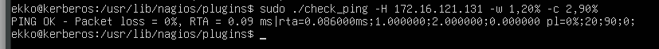
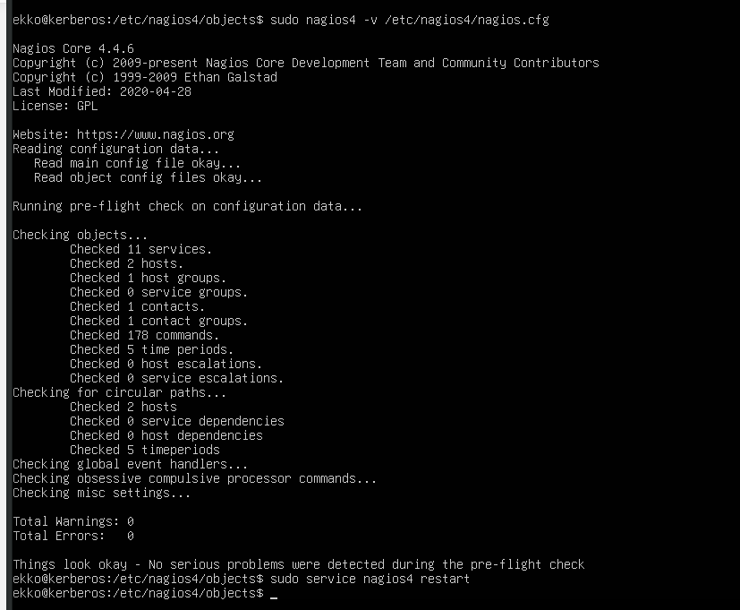
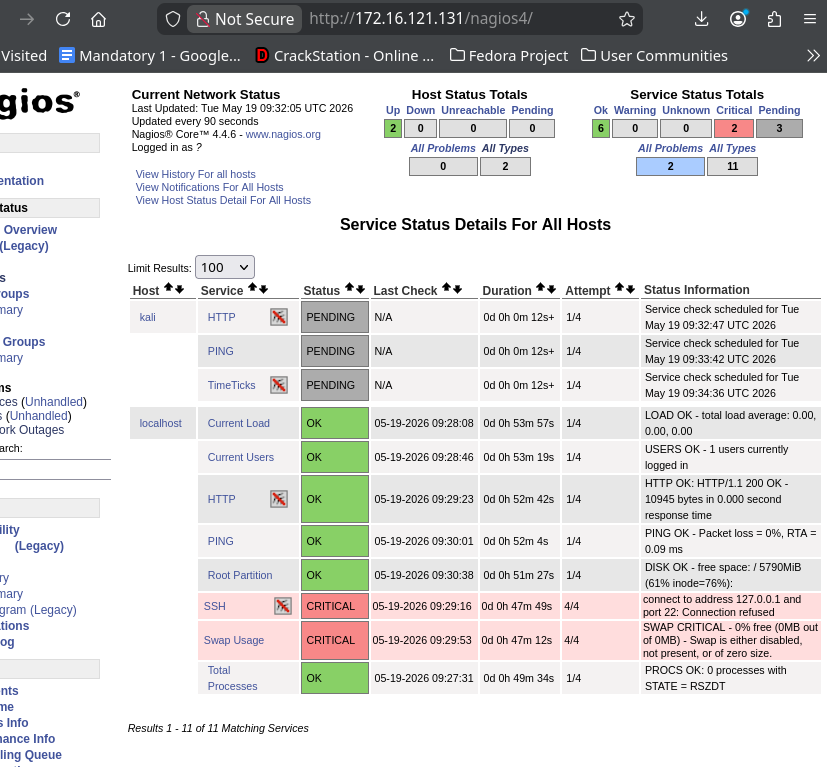

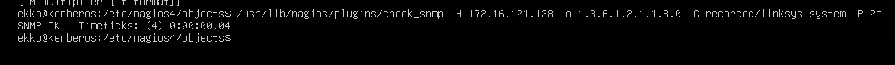

**Defining a host + service (example — monitor Kali's SNMP):**
```
# /etc/nagios4/conf.d/kali.cfg
define host {
    use         linux-server
    host_name   kali
    alias       kali
    address     172.16.121.128   # your Kali IP
}

define service {
    use                  local-service
    host_name            kali
    service_description  TimeTicks
    check_command        check_snmp!-o 1.3.6.1.2.1.1.8.0 -C recorded/linksys-system -P 2c
    notifications_enabled 0
}
```

**Validate + restart:**
```bash
sudo nagios4 -v /etc/nagios4/nagios.cfg
sudo service nagios4 restart
```

**Using check_snmp manually:**
```bash
/usr/lib/nagios/plugins/check_snmp \
  -H <kali-ip> \
  -o 1.3.6.1.2.1.1.8.0 \
  -C recorded/linksys-system \
  -P 2c
# Returns TimeTicks value from SNMP simulator on Kali
```

### SNMP Simulator (on Kali)

Used in exercises to simulate a real SNMP-capable device:
```bash
# Install
sudo apt-get install snmp snmp-mibs-downloader
sudo mkdir /usr/snmpsim/
sudo mkdir /usr/snmpsim/data
sudo mkdir /var/log/snmpsim/
pipx install snmpsim
sudo apt install python3-pysmi
pipx inject snmpsim pysmi

# Start simulator
snmpsim-command-responder \
  --agent-udpv4-endpoint=0.0.0.0:161 \
  --agent-udpv6-endpoint='[::1]:161'

# Test (in another terminal)
snmpwalk -v2c -c recorded/linksys-system 127.0.0.1
```

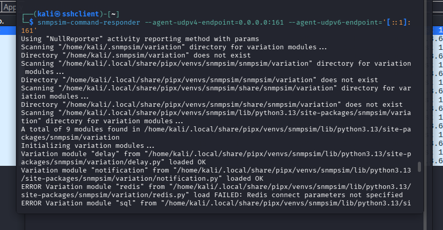
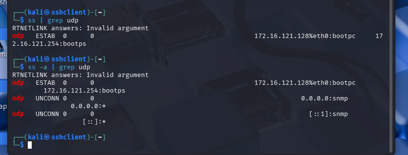
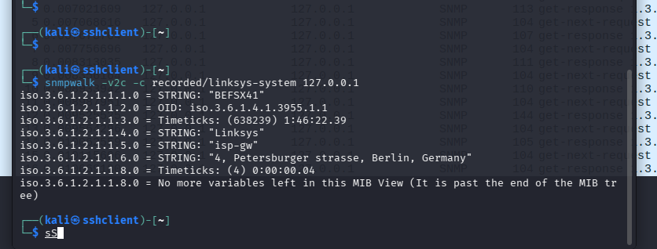
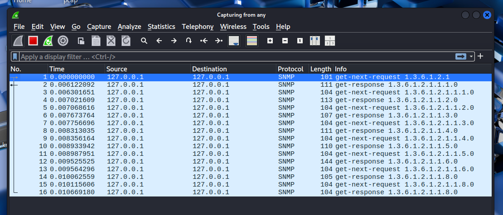

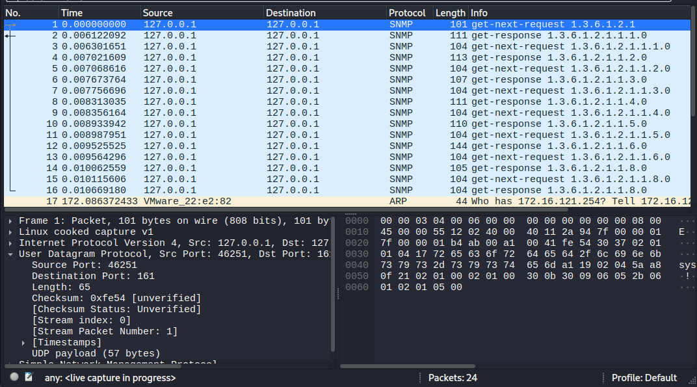
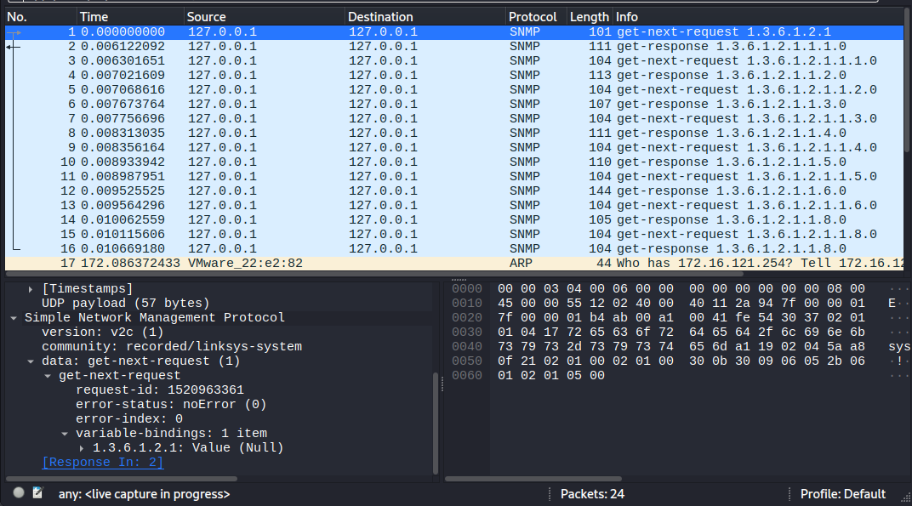

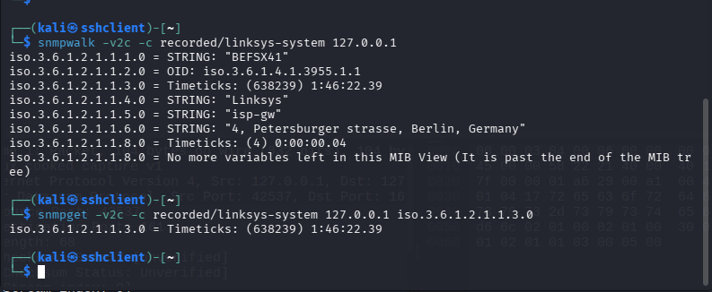
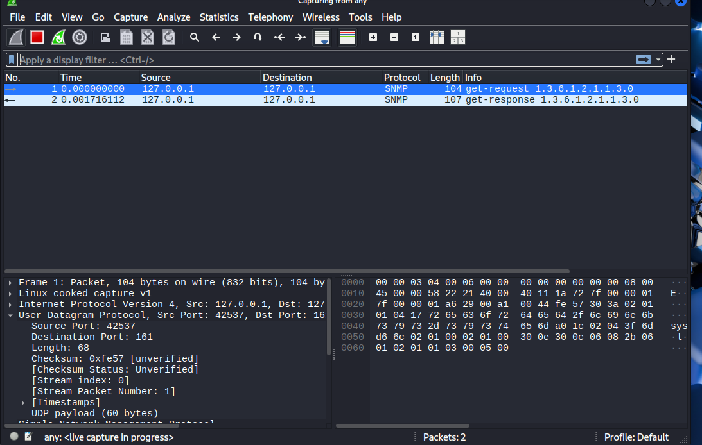


### Zabbix

**What:** Open source monitoring platform with a graphical web UI. Alternative to Nagios.

**Key difference from Nagios:**
- Nagios = file-based configuration (edit text config files)
- Zabbix = web UI-based configuration (configure everything through browser)

**When to use which:** Zabbix is friendlier for large environments where you don't want to edit config files; Nagios gives more granular scripting control.

---

## 🔗 Connection to Other NCS Topics

| Topic | SNMP/Monitoring relevance |
|---|---|
| **IDS/IPS (Topic 4)** | Monitoring feeds into SIEM — Nagios alerts + SNMP traps can trigger IDS investigation |
| **SOF-ELK (Topic 3)** | SOF-ELK is the analysis layer; SNMP/syslog feeds into it |
| **Firewalls (Topic 5)** | SNMP is used to monitor firewall rule hit counts, interface stats |
| **ARP/MitM (Topic 7)** | SNMPv1/v2c community strings are vulnerable to sniffing during MitM |

---

## 🎯 Key Exam Points

**WHY questions you must be able to answer:**

1. **Why is SNMPv1/v2c a security risk?** Community strings in plaintext = anyone sniffing the wire can read them. Default public/private strings are widely known.

2. **Why was SNMPv3 introduced?** To add the security layer missing from v1/v2c: encryption, authentication, replay protection, access control.

3. **Why use Nagios/Zabbix vs just reading logs manually?** Scale — you cannot manually check 100s of devices. Automated polling + alerting = you know immediately when something breaks. Proactive vs reactive.

4. **Why is SNMP useful for defenders?** Gives structured, machine-readable data about every device on the network. Track interface errors, CPU load, unusual traffic counters — baseline and detect anomalies.

5. **What is the difference between SNMP trap and polling?** Polling = manager asks periodically (guaranteed but creates traffic). Trap = device alerts proactively (efficient but can be lost). Best practice: use both.

---

## 📚 References from Slides

- SNMP: Chapter 2, *Essential SNMP* (2nd edition, O'Reilly)
- Nagios book: https://www.packtpub.com/product/learning-nagios4/9781783288649
- OID lookup: http://oid-info.com/


MANDATORY NOT MANDATORY :

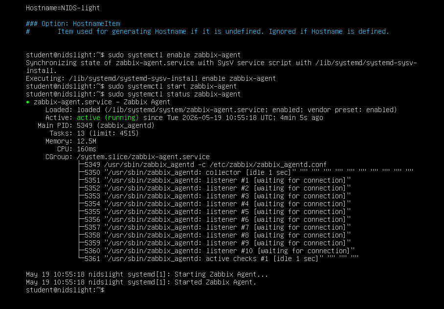
added nids-light host on 172.16.121.131/zabbit
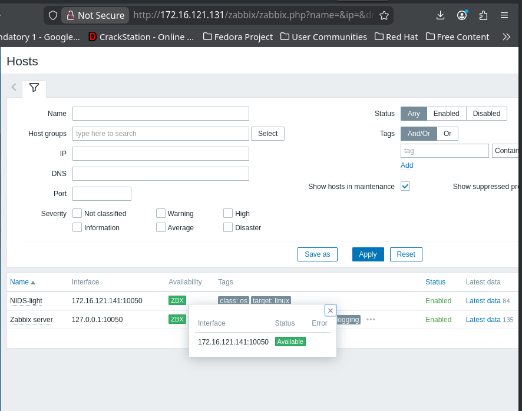

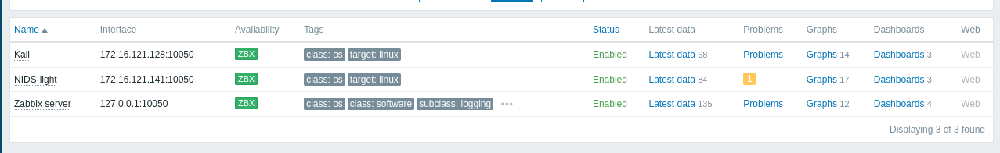

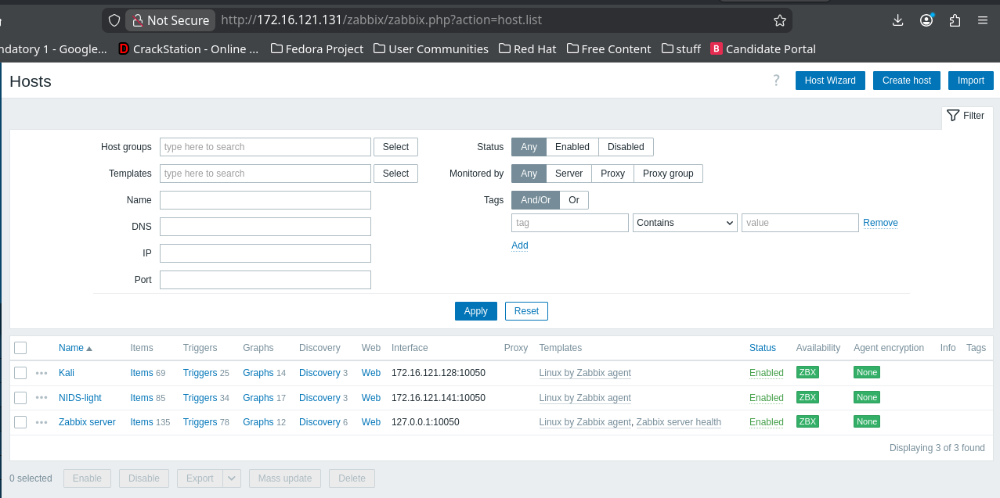

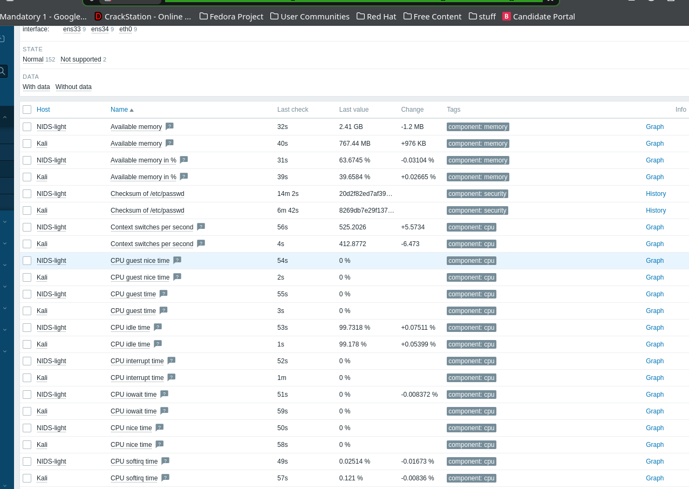

[monitoring of surictata on nids light + kali ssh services ](http://172.16.121.131/zabbix/zabbix.php?name=&evaltype=0&tags%5B0%5D%5Btag%5D=&tags%5B0%5D%5Boperator%5D=0&tags%5B0%5D%5Bvalue%5D=&show_tags=3&tag_name_format=0&tag_priority=&state=-1&filter_name=NCS%20MAND2-e&filter_show_counter=0&filter_custom_time=0&sort=name&sortorder=ASC&show_details=0&action=latest.view&hostids%5B%5D=10780&hostids%5B%5D=10781)