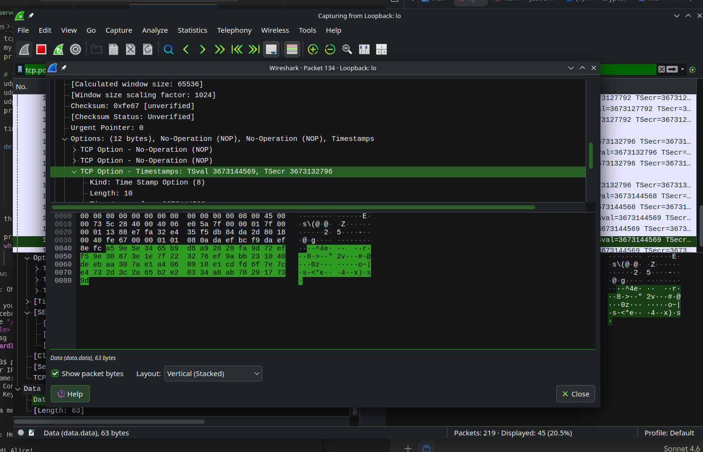
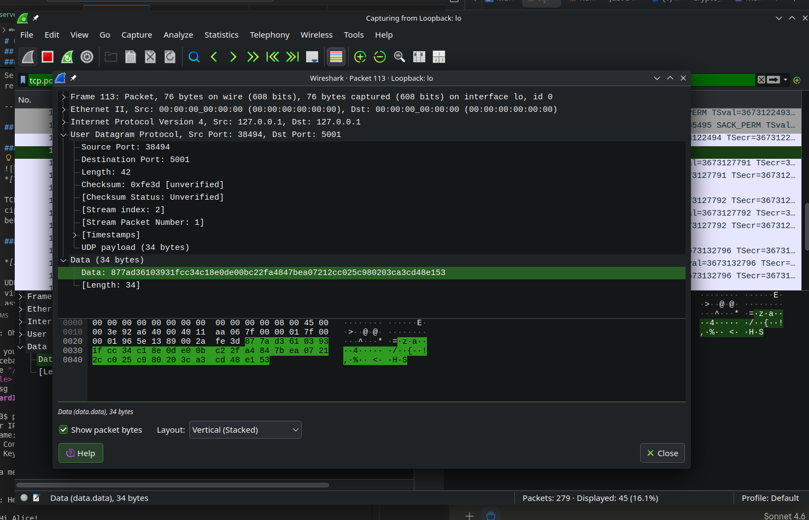

# Obligatorisk opgave 2 — Chatapplikation
**AES-GCM krypteret chat over TCP/IP med UDP nøgleudveksling**

Gustav Søderberg & Emma Kofod

---

## 1. Introduktion

Denne opgave implementerer en chatapplikation i Python ved brug af **AES-GCM (Advanced Encryption Standard – Galois/Counter Mode)**. Arkitekturen følger en **klient-server model**: flere klienter forbinder til en central server over TCP/IP. Hver klient genererer en unik 256-bit AES-nøgle og sender den til serveren over UDP, inden chatten begynder. Alle beskeder er krypterede; serveren dekrypterer indkommende beskeder og re-krypterer dem til de øvrige modtagere.

---

## 2. Kryptografi-implementering

### 2.1 AES-GCM — Overblik

AES-GCM er et *authenticated encryption*-skema, der giver:

- **Fortrolighed** — beskeden krypteres med AES i Counter Mode (CTR), hvilket gør cipherteksten beregningsmæssigt uadskillelig fra tilfældige data.
- **Integritet / Autentificering** — et 128-bit GCM-autentificeringstag tilføjes til hver besked. Enhver ændring af cipherteksten medfører, at dekryptering kaster en `InvalidTag`-exception.
- **Replay-beskyttelse** — en ny 96-bit (12-byte) tilfældig nonce genereres per besked med `os.urandom(12)`.

Biblioteket der anvendes er `cryptography`-pakkens hazmat-primitiver:

```python
from cryptography.hazmat.primitives.ciphers.aead import AESGCM
```

### 2.2 Nøgleudveksling (UDP)

Når en klient starter, genereres en 256-bit nøgle med `os.urandom(32)` og sendes til serveren som et råt 32-byte UDP-datagram på port 5001. Dette er en **engangsnøgleudveksling** per session.

```python
# client.py — nøglegenerering og UDP-afsendelse
key    = os.urandom(32)        # AES-256: 32 bytes
aesgcm = AESGCM(key)
udp_sock.sendto(key, (server_ip, UDP_PORT))
```

### 2.3 Beskedkryptering (TCP)

Alle beskeder krypteres inden transmission. Wireformat: **nonce (12 bytes) || ciphertekst || GCM-tag (16 bytes)**.

```python
# Kryptering
nonce      = os.urandom(12)
ciphertext = aesgcm.encrypt(nonce, plaintext.encode(), None)
tcp_sock.sendall(nonce + ciphertext)

# Dekryptering
nonce      = data[:12]
ciphertext = data[12:]
plaintext  = aesgcm.decrypt(nonce, ciphertext, None)
```

Serveren dekrypterer hver indkommende besked med afsenderens nøgle og re-krypterer den herefter med hver modtagers individuelle nøgle inden udsendelse.

---

## 3. Wireshark-analyse

### 3.1 TCP — Krypteret chatbesked (port 5000)


*[TCP-stream, Data-felt med ciphertekst]*

TCP Data-feltet indeholder den rå pakke: 12-byte nonce efterfulgt af AES-GCM ciphertekst og 16-byte autentificeringstag. Ingen læsbar tekst er synlig, hvilket bekræfter fortroligheden.

### 3.2 UDP — Nøgleudveksling (port 5001)

*[UDP-datagram, Data-felt med 32-byte nøgle]*

UDP-datagrammet transporterer den 32-byte AES-nøgle i klartekst. Data-feltet viser præcis 32 hex-bytes. I et produktionssystem ville dette erstattes af en asymmetrisk nøgleudveksling (f.eks. Diffie-Hellman), så nøglen aldrig eksponeres på netværket.

---

## 4. Brugervejledning

**Installer dependencies:**
```bash
pip install cryptography
```

**Start server:**
```bash
python server.py
```

**Forbind clients** (kør i separate terminaler):
```bash
python client.py
# Server IP: 127.0.0.1
# Brugernavn: Alice
```

**Wireshark-filtre:**
- `tcp.port == 5000`: krypteret chat traffic
- `udp.port == 5001` : key exchange
- `tcp.port == 5000 or udp.port == 5001`: begge

---