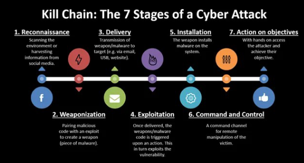
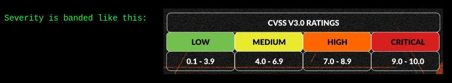

## Note taking tips

Basically taake all the notes you can, dump command results so you can grep in that etc - get all the data you ever get and keep it so you can write a clean report afterwards.

## WRAP UP SWCHEESE

## CYBER KILL CHAIN

1. Reconnaissance
2. Weaponization
3. Delivery
4. Exploitation
5. Installation
6. Command and Control
7. Action on objectives

Minimum catch bag guys at step 6 -> stop exfiltration before real attac.
Hard to stop in stages before, but earliest is best.

Overlap for this kill chain in blue and red. In pen test you kind of follow this chain.

Recon, Weaponization, Exploitation, 

## Vulnerabilities

What is a vuln?
Is a weakness in a system that lets someone make it do something it was never meant to allow.
Needs to break at least 1 of CIA. Otherwise is just a finding.

Many causes, in a lot of cats:
- bugs in code
- misconfig - get to be root 
- weak / default creds - been autom. to make botnets
- leaked / disclosed info - info that should be confidential, but is shown
- bad design decisions - the architecture of an api etc is wrong fundamentally.

Vuln is dependent on its context : ex. anonymous FTP can be a feat. on a puiblic mirror (ex. apt update, cred is anonymous anonymous - no confidentality broken), but a breach on a payroll server.

- Vuln is weakness itself
- Exploit is technique that takes advantage of vuln.
- Threat is who or what would want to exploit
- Risk is how likely and how bad exploit by a threat would be

I real life: attacks are often a chain of many vulns. As seen with cyber kill chain.

SO : An open port is not a vuln, an open port that gives credentials for another service is. Always depends.

#### CVE
Common Vulnerabilities and Exposure

Give a unique ID for every vuln.
format : CVE-YYYY-NNNNN
Year is when cve is reported.

CVE's are assigned by CNAs (is authority that tis allowed to give them. vendors, research orgs etc)

Is a hard long process, depending on vendor aswell.

NVD is a db for CVEs, othersd exist.

A CVE doesnt mean that there is an exploit availbale for it. 

#### CVSS

Common Vulnerability Scoring System

Open framewoork for scroing severity. 0 - 10

- Base
- Threat / Temporal
- Environmental

AV:N/AC:L/PR:N/UI:N/S:U/C:H/I:H/A:H

AV = Attack vector
AC = Attack complexity
PR : Privilege required
UI = User Interaction
S = Scope

+ 3 fields for CIA

is it internet facing? is the vulnerable feature even enabled? what would the cost damage be?

A 9.8 on something you haven enabled - is a 0 for you.
https://nvd.nist.gov/vuln-metrics/cvss

## Vulnerability scanning

### WHAT IS
automatted systematic probing for known weaknesses

1. sweep for live hosts
2. enumerate open ports
3. fingerprint services and versions
4. match again a vuln database
5. report 

in some ++ manual checks

Authenticated vs unauthenticated, logged in probbably finds more info.

False positives and false negatives need to bee expected.

Scanning is noisy AF and will be seen in logs.

### 
Tenable / nessus -> most used vuln scanner

OpenVAS (free) - good coverage but can be dated.
