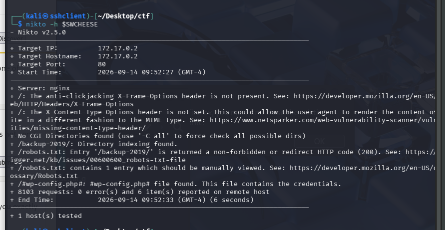
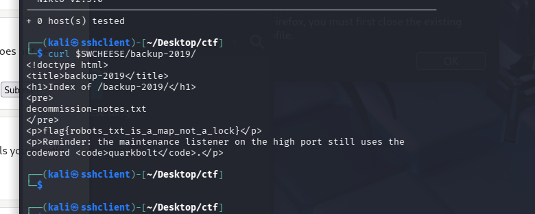
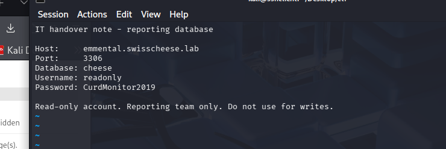
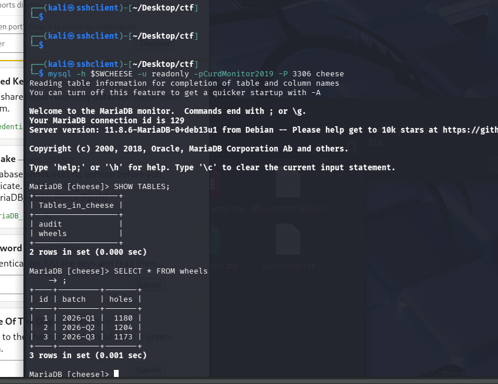

## RECON

ID what exists (domais, ips, hosts, people, technologies)

Passive = no direct interaction with teh targets (public records, serach engines etc) => OSINT

Active = touch target directly (ping, DNS queries, port scans) - leaves traces in logs. Almost never legal with proper authorization.

Quality of recon determines quality of everything after.

### METHODLOGY
1. define scope: whats in and out of bounds ()
2. foorprinting: organization, domains, IP blocks, ASN, email formats, tech stack
3. dns and subdomain discovery: map alle external surface
4. host discorvery: which IPs are alive
5. Document everything: timestamped notes feed the enumeration phase

Recon is iterative - eahc finig loops back and widens the search

KEEP evidence trail: screenshots, tool output, timestamps (amtters for reports and legal defensibility)

### Tools: 
Host discovery -> ping sweep w/ nmap, no port scan

Dns/subdomains -> dnsrecon etc

ASN/ Ip blocks -> whois, bgp.he.net, amass intel -asn <n>

### Recon vs enumeration
- Recon is broad (hosts, services, gen landscape)
- Enumeration is deep (ex usernames, shares, versions, config etc)
Overlap is normal. Dont get hung up on the boundary, just focus on documenting findings.

### OSINT
Intel for publicly availbale sources, which is fully passive.

What you can find without evee touching the target:
- Domains, subdmains, IP ranges, certificates.
- Employee names, emails, job titles, tech stack (from job ads fx.)
- Leaked subdomains

### free osint tools
Free OSINT tools / resources:
- Search engines / dorking: Google dorks (site:, filetype:, inurl:)
- Cyber specific search engine services: Shodan, Censys, FOFA
- Certificates/subdomains: crt.sh (Certificate Transparency logs)
- DNS/infra history: SecurityTrails, DNSDumpster, ViewDNS
- People/email: Hunter.io, theHarvester (theHarvester -d example.com -b all)
- Breach data: Have I Been Pwned (also exists a version for passwords), Dehashed
- Web tech: Wappalyzer, BuiltWith, Wayback Machine (web.archive.org)
- Metadata: exiftool on downloaded documents
(often leaks usernames, software versions, internal paths)
- All-in-one tools/frameworks: Maltego, SpiderFoot, OSINT Framework

## Enumeration

Extract detailed info from recon data
ex. if we know a port is open -> probe to get info about deviice config, running processes, network interfaces

Typically we gain info about:
- service versions -> map to cves
- usernames / accounts -> pwd attacks
- shares, directories, files -> data exposure or upload points
- config details -> show misconfigurations to exploit

IS LOUD AND ACTIVE -> interacting with target

Enumeration output is the bridge to exploitation.

Pick at the low hanging fruits first.

### METHODOLOGY
1. portscan to fiind every open TCP/UDP port (step 1 -> 2000, then all)
2. service + version detection to id what's atually running
3. Per-service enunmeration, using the right tool for each protocol
4. Banner grabbbing to check versions + try default creds
5. Map versions to known cves
6. DOCUMENT - one section per service w/ exact commands used

Golden rule: Enumerate one service at a time and do it thoroughly
TCP scan first -> faster, but dont forget UDP. (SNMP, DNS, TFTP, NTP are all UDP and often get missed)

### TOOLS

- Discovery / scanning:
nmap is the go to and is made more powerful by NSE scripts (--script)
Alternatives: rustscan, masscan
- SMB (139/445):
Can expose file shares, users and OS info.
Useful tools include enum4linux, smbclient, smbmap, crackmapexec
Useful NSE scripts: smb-enum-shares, smb-enum-users, smb-os-discovery
- SNMP (161/udp):
Can leak a lot of information when misconfigured (processes, users, routing, etc.)
snmpwalk can be used to “walk” the whole MID tree.
Other useful tools include onesixtyone and snmp-check
Useful NSE scripts: snmp-info, snmp-processes, snmp-netstat
- DNS (53):
dig can be used to look through records or do a zone transfer (axfr).
Other useful tools include dnsenum and fierce.
- Web (80/443):
Enumeration of web applications focused on discovering directories.
Useful tools include nikto, gobuster/dirb and whatweb
- FTP (21):
Connect with ftp and run HELP.
The ftp-anon NSE script is useful for checking anonymous login.
wget can also be used to download all files fro FTP servers.
- SSH (22)
Shows banner/version, which can help identify OS, but is unreliable.
ssh-audit is a useful tool to find misconfigurations.
 - SMTP (25):
User enumeration using the NSE script smtp-enum-users
- RPC / NFS (111/2049)
Useful information can be gathered using rpcinfo and showmount
- Databases (3306 MySQL / 1433 MSSQL / 5432 Postgres):
Check for default credentials on the given version
There a useful NSE scripts for each DB (mysql-info, ms-sql-info, etc.)
- LDAP (389, 636, 3268, 3269):
Using ldapsearch or windapsearch to search the DIT

Check out HackTricks (on the left you can see tricks for each port):
https://hacktricks.wiki/en/index.html
And the Nmap Scripting Engine (NSE) documentation can be useful too:
https://nmap.org/nsedoc/

### FUZZING

Throwing many inputs at a target to discover hidden enexpected things.

1. Content / path discovery: where we brute force hidden dirs, files, subdomaisn, virtual hosts, API endpoints, etc
2. Parameter / input fuzzing: Where we vary parameters/ values to find bugs (LFI, injection points, hidden params, etc.)

== Automated guessing and only as good as your wordlist.
Rate limiting / lockouts can be necessary since fuzzing can be oud, ex ssh blocks after xx tries in xx timeframe

#### TOOLS
Some basic fuzzing tools/commands for web:
- Directory/file:
gobuster dir -u <url> -w <wordlist>
- Alternatively: dirb, dirsearch, feroxbuster (better for recursion)
ffuf is a good tool for general-purpose web fuzzing:
- Paths: ffuf -u http://<ip>/FUZZ -w wordlist.txt
- Vhosts: ffuf -u http://<ip>/ -H "Host: FUZZ.example.com" -w subs.txt
- Params: ffuf -u "http://<ip>/page?FUZZ=test" -w params.txt

There are many many more tools and commands for these tools.

This is where we learn n important aspect of hacking…
- Searching for information and trying things out ourselves

Steam achievement:
- Timeboxed assignment = (max. 2 timer og så pause) stop selvom jeg ikke er færdig 
- Waiting mode = start i en periode hvor jge ellers ikke ivlle havet noget
- 