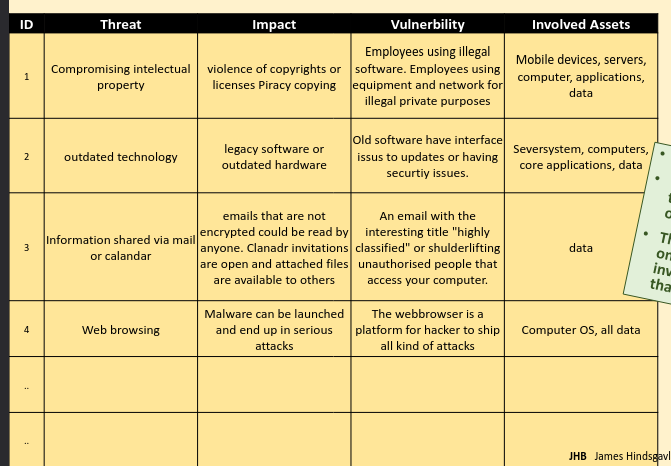
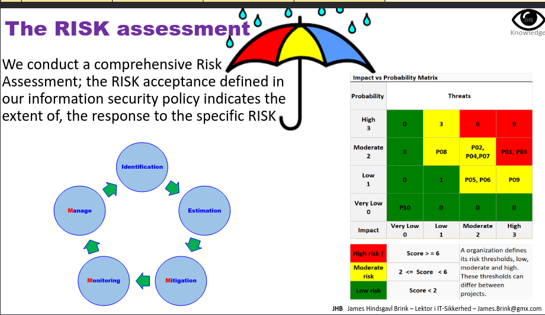
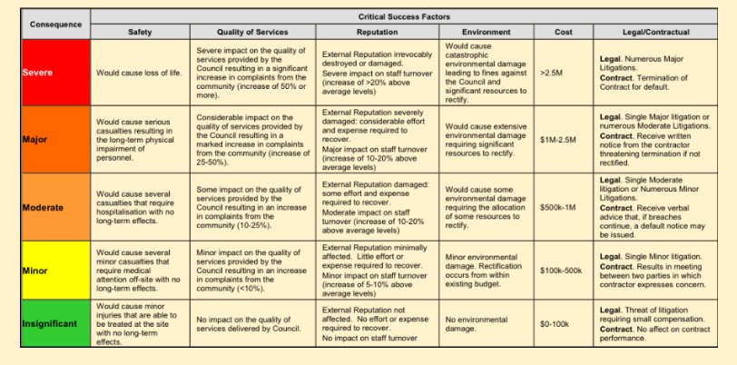
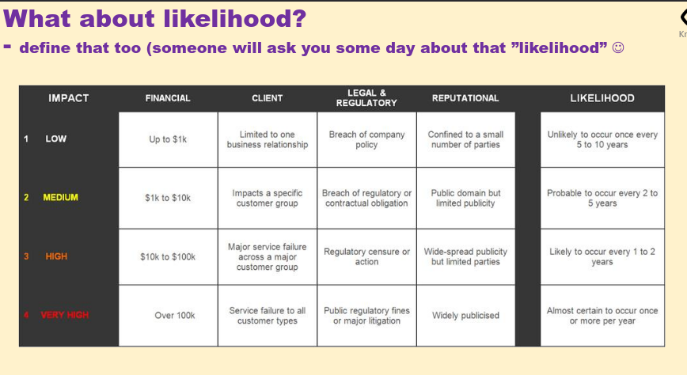
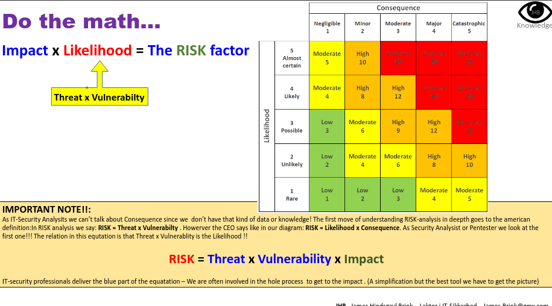
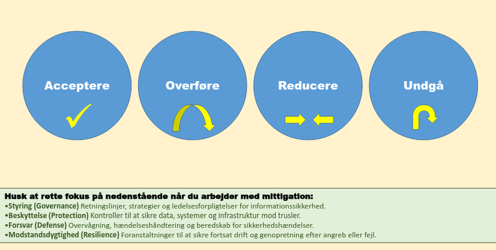
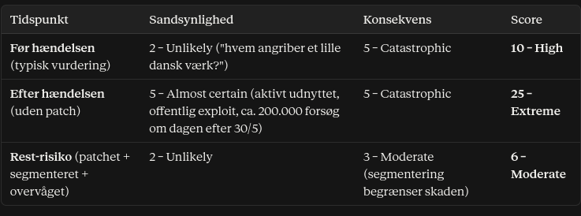

Hvad kigge vi på i forhold til risiko vurdering?

Sårbarheder (vulns) + trussel = risiko ++ 

Kigge på alle foranstaltninger
-> risiko vurdering - ikke maths beregning, VURDERING

Identificere trussel profiler :

Trussel - impact - vulnerability - involved assets (kigge på aktiver liste)

risk assessment - risiko vurdering:

3M -> 

NOT PROBABILITY -> LIKELIHOOD

risk factor = impact x likelihood (threat x vulnerability)

lave en risk matrix for risk mitigation og have en forklarende tekst med risk faktor som bilag.

ATRA - Accept, Transfer, Reduce, Avoid

Accept risk = know the metrics, and eccept anywayss 
Transfer = give the risk to 3rd party (ex betalign med NETS), take insurance on something
Reduce = actually to sonething to make better
Avoid = completely avoid that risk 

[OPGAVE]

1. Angrebsflade og angrebsvektor

Angrebsfladen (attack surface):

Zyxel-firewalls, der var eksponeret mod internettet og stod som eneste barriere foran energiselskabernes OT-netværk (industrielle styresystemer).
Specifikt firewallens VPN-service (IPsec / IKE), som lytter på UDP port 500.
Uopdaterede enheder. Nogle selskaber vidste slet ikke, at de havde en Zyxel-firewall, fordi en leverandør havde sat den op.

Angrebsvektoren (attack vector):

Én specialkonstrueret netværkspakke sendt til UDP port 500.
Fejlen sidder i firewallens IKE packet decoder ("improper error message handling"). Den giver fjernkørsel af OS-kommandoer med root-rettigheder uden login.
CVSS 9.8/10: nem at udnytte, netværksbaseret, kræver ingen godkendelse og ingen brugerinteraktion.
Efter kompromitteringen kontaktede firewallen angriberens server (46.8.198.196:8080/8081) og kørte show username og show running-config. Det var rekognoscering: angriberne hentede konfiguration og brugernavne for at planlægge næste skridt.
Resultat: 16 mål, 11 kompromitteret. Angriberne vidste præcis, hvem der var sårbare, og ramte ved siden af 0 gange ud af ca. 300 medlemmer.

2. Mitigering, contingency og BCM + vores faglige vurdering

Forebyggende (mitigation):

Patch management: patchen var ude 25/4, altså 16 dage før angrebet. Det er den vigtigste læring.
Minimér eksponering: kun nødvendige services på internettet. VPN bør begrænses, fx med IP-allowlisting.
Asset inventory: kend alle enheder på netværket, også dem leverandøren har installeret.
Netværkssegmentering: firewallen må ikke være den eneste barriere foran OT (defense in depth).
Leverandørstyring: klare aftaler om, hvem der opdaterer.
Sårbarhedsscanning for at verificere, at patches faktisk er installeret.

Detektion:

Logopsamling og SektorCERTs sensornetværk på tværs af sektoren. Det var dét, der opdagede angrebet.

Contingency / BCM:

Ø-drift (island mode): afbryd internetforbindelsen og kør videre isoleret.
Manuel drift, fx at køre ud til fjernlokationer.
Øvede beredskabsplaner og nødprocedurer, så forsyningen af el og varme fortsætter.

Vores vurdering:

Det var ikke en teknisk 0-day-katastrofe, men en organisatorisk fejl. Løsningen fandtes, men blev ikke brugt. Årsagerne var, at man troede, nye enheder var opdaterede, at leverandøren tog sig af det, at man fravalgte patching af økonomiske grunde, eller at man ikke kendte enheden.
Systemisk sårbarhed: den samme enhed hos mange små operatører betyder, at én sårbarhed rammer hele sektoren.
Single point of failure: sikkerhedsenheden var selv indgangen.
CIA:
Confidentiality: konfiguration og brugernavne blev lækket.
Integrity: angriberne fik root-kontrol over firewallen.
Availability: der var risiko for strøm- og varmeforsyningen.
Positivt: hurtig respons og godt samarbejde mellem SektorCERT, selskaberne og leverandørerne gjorde, at angrebet blev stoppet samme døgn.

3. Risikomatrix

Asset: internet-eksponeret Zyxel-firewall foran OT-netværket hos et dansk energiselskab.
Trussel: udnyttelse af CVE-2023-28771.

Har hændelsen fået dem til at revurdere risikoanalysen?
Ja, det mener vi. Sandsynligheden var undervurderet: man så sig ikke som mål, og man antog, at enheden var opdateret. Hændelsen viste målrettede, koordinerede angreb, muligvis med en statslig aktør involveret (indikationer på Sandworm i anden bølge). Derfor bør sandsynligheden løftes markant.

Samtidig bør risikoanalysen udvides med:

systemisk risiko på tværs af sektoren,
leverandørrisiko,
ukendte assets.

SektorCERT fremhæver selv systemiske sårbarheder og manglende 24/7-bemanding som læringspunkter.