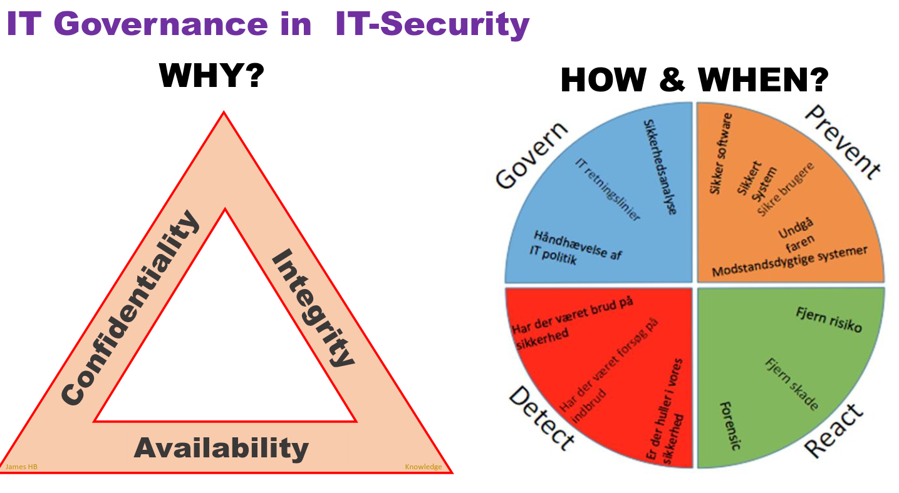
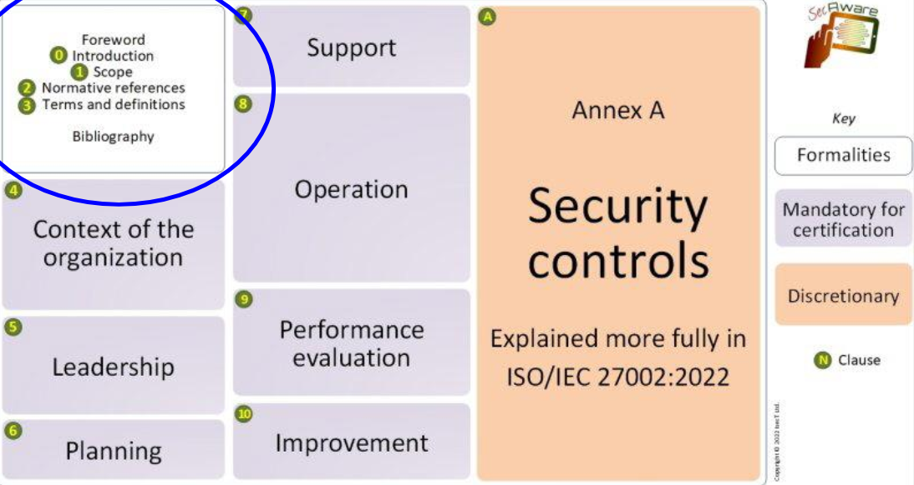
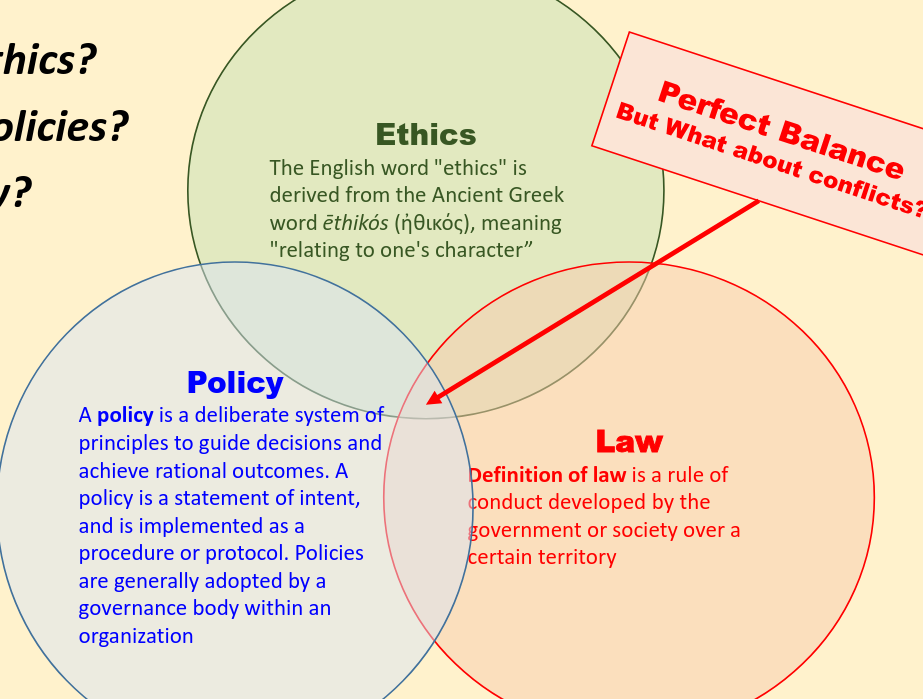

# Introduction to IT-Security GOVERNANCE
Goals:
• Awareness of the overall aim of this journey in IT-
Governance
• Understanding the influence of ethic, law and policies

## SemesterPlan + Topics and form

### Læringsmål for Sikkerhed i IT-Governance (Studieordningen)
#### Viden - Den studerende har viden om og forståelse for:
• Praktiske etiske overvejelser ifm. arbejdet indenfor it-sikkerhed
• Principper indenfor it-sikkerhed
• Risikoanalyse
• Standarder og organisationer i sikkerhedsarbejdet
• Trusler og trusselsbilledet
• Operationelle overvejelser for it-sikkerhed
• Sikkerhedspolitikker og -procedurer (Business Continuity and Disaster Recovery)

#### Færdigheder - Den studerende kan:
• Foretage risikovurdering af mindre systemer/virksomheder, herunder datasikkerhed
• Vurdere hvilke sikkerhedsprincipper, der skal anvendes i forhold til en given kontekst

#### Kompetencer - Den studerende kan:
• Håndtere analyser om, hvilke sikkerhedstrusler der aktuelt skal behandles i et konkret itsystem

CIA = Confidentialaity, Integrity, Availability;
GDPR = Govern, Detect, Prevent, React (NOT GDPR - General Data Protection Regulation)

Information security > IT security > Cybersecurity

### Where do we find information
• By looking at **best practice** in the business
(copy the trend! State of the art hardware and software - the newest versions without vulnerbilities or flaws – STAY ALERT!!!)
• By **updating courses and maintain skills**
(new strategies, new policies, new best practice…)
• In newspaper and Internet **news**
(especially zero-day vulnerbilities can have a huge impact)
• Read **Professional litterature and manuals**
(Here you got the solid – and correct information about the tech-stuff)
• **Networking** - Professional IT-Secuirty webpages
(By networking you will get a lot of information and new knowledge and techniques)

## ISO27001-ISO27002
• The coexistence of ISO-27001 and ISO-27002
• The Risk approach to IT-security
• The RISK analysis

European standards, based on an english standard. It is OBLIGATORY to be compliant to 01 and GDPR as europeans in europa.
01 and 02 are coexistant. 01 can stand on its own.
Built on the RISK approach.

Asset list - list of ALL assets (people, data, hardware etc)
SOA document - Statement of Applicability (How, why and if all iso standards are implemented)

Least to most detailed (top to bottom)
Strategi -> tactic -> How to do it (pocedures)

## Opgave

Non invasive metoder først : ringe til den syygemedlt person og høre om ikek de kan forwarde det mail
Ringe til dem som har sendt mailen og hære om de kan sende en kopi til medarbejder osm skal kigge på det.

Er der politikker vi har som vi kan følge iforhold til syg medarbejder og deadlines vigtige for virsomheden.
SKAL det besvares i dag? KAN det vente osv
Precedurer?
Vores chef skal måske vide det, vi skal ikke selv have ansvaret.
Hvis igen procedurer så er det stadigi en NEJ til at åbne hans mail konto og se på mails - så desværre nej, og lad os lave procedure for det tilfælde, så det ikke sker en anden gang.
I dag!!! not my problem, du skulle måske have skrevet før, så ville dte ikke være så akut.

## Ethic, Policy and Law

## Opgave politi og mails

• Discuss the Information security. How does the policy comply with the
CIA-triangle? How does it comply with GDPR?

Availability mangler. Ikke etisk, de har bøjet GDPR og loven til deres Policies, til deres bedste interesse. Mails med specifikke arkiveringspligt - det er myndighed mails.

• Is the mailbox a private repository? What about documentation?
Det er personligt men ikke private. Man kan selv styre sin indbox og slette mails, men der skal nok være spor af mailsne, en trail, noget dokumentation.
Man skal kunne stå for ansvar over noget man har beordret i en mail.

• What do YOU think as an IT information security professional?
Sketchy, og virker som om man aktivt har prøvet at slette ting for at skjule noget man ikke gad stå inden for.

• Can you recommend a better solution?

Pattern matching, måske ka man gemme alle mails som har en sagsnummer i headeren længere tid en 30 dage. specielt hvis sagsnummeret ikke matcher en løst sag.

next time : isms