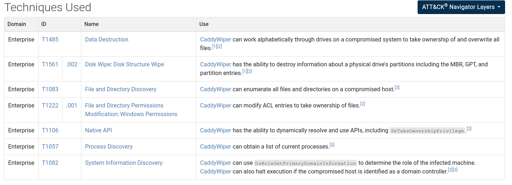
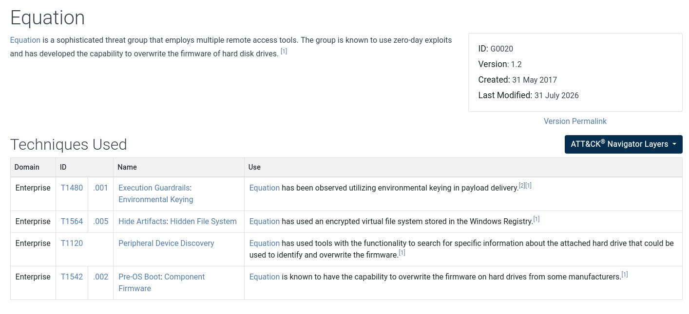
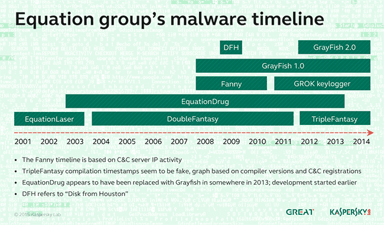
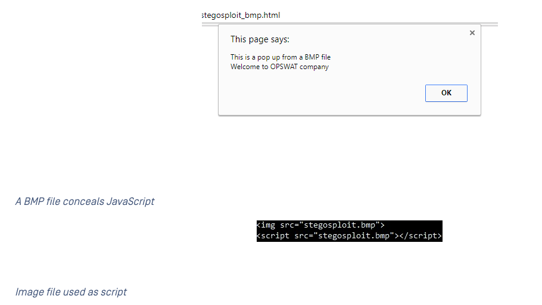
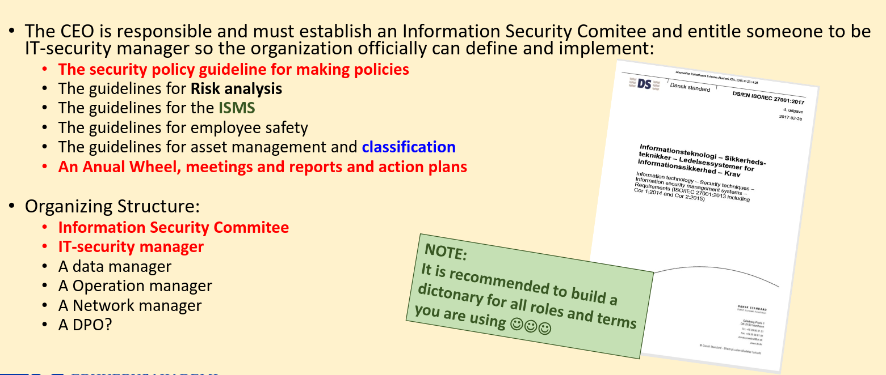
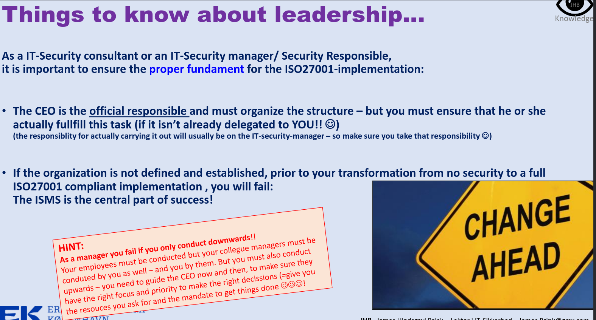
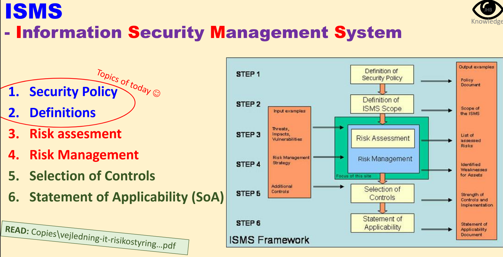
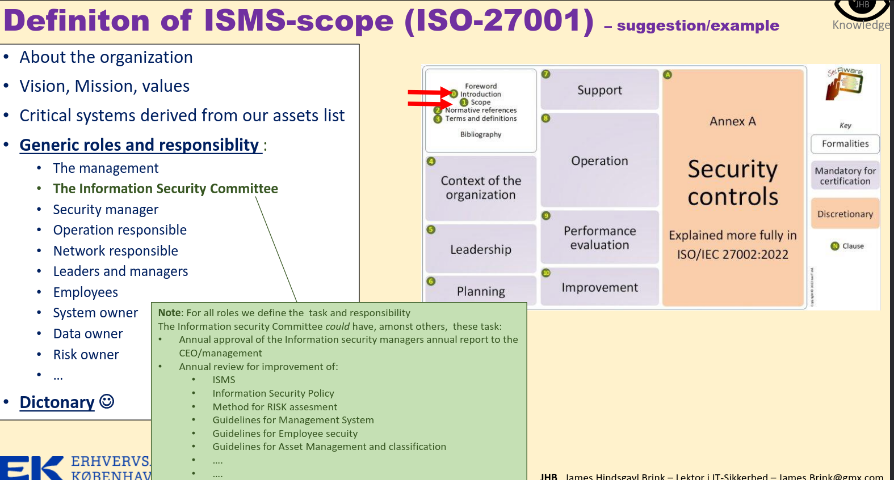
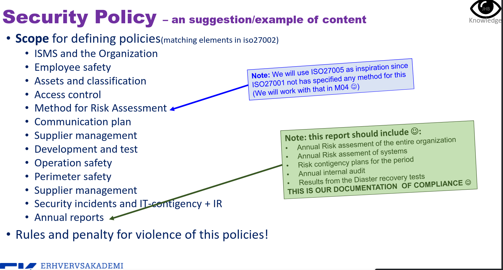
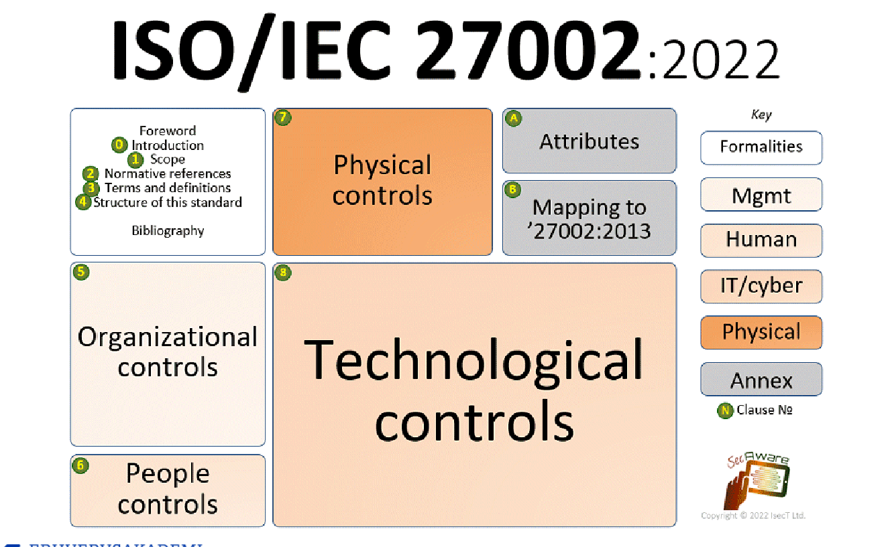

# Trusselsbilledet & Hvordan får vi hul på ISMS’en: Strategi process og køreplan

## Unintended threats - no bad guys, can be the weather or power failure.. 
Can take precautions:
    - UPS (machine with extra electricity in case of power shortage, prevents loss of data, also takes care of voltage changes so nothing short circuits)
    - Physical metal doors, for fires or thieves
    - Inactive gas, gas that kills fire in server room fx.
    - Aircondition for temp/humidity (server rooms -> 25C, normal humidity ish 55%/65% to avoid static electricity that can break a motherboard)
    - Early warnings, take actions on ealry warnings and yellow lights before something important happens
    - Remote backups 
    - Split operations - 2 sites, load balancer working with a firewal, mirror data, share the load
Usually an overlap when compromise happens - people can attack those surfaces.

## Intended threats - who threatens us?

They always change shape, following motivations and current world events

Criminals:
- Industry spies
- Hacktivism Wikileaks, Anonymous, Terrorists, Journalists
- Internal fraud - use knowledge and opportunity to steal data and or money
- External fraud - tricking, blackmail. steal info
- Hackers for fun

Governments and Countries
- Economical spies
- Intel for the sake of National security
- Investigations by police or military
- Acts of war

## Attacks have ed to frameworks for defence

over time impact deepens and attacks ++ serious
We develop software + hardware just for this purpose
ex. antivirus software and forewalls and ips and collections of security tools (ex KALI) or Ghidra - the free NSA analysis tool (reverse engineering)

As complexity grows, we need + frameworks to help us organize strats and policiess that are needed to implement Information Security at pro level

## Focus on hacking
Is one of the many threats
- economic gain (ransomware)
- political reasons (hacktivism, terrorists)
- spying (industry or uiniversities, governments)
- act of war (Styxnet, radar jamming priror to launch)

### Who are they?

White, grey and black hats.
- white : by the rules and laws, find vulnerabilities but no exploits
- black: criminals, for personal gains, aslo called crackers.
- grey : do they exist? morals, standards vs law etc
- scriptkiddies: hackers who use standard tools to gain access
- hacktivism: hacking for political, social, religious means. typically by hijacking of webpagessand leaving a statement
- phreakers: phone hacker rather than computers

## Opgave
### Caddywiper ?
"CaddyWiper is a destructive data wiper that has been used in attacks against organizations in Ukraine since at least March 2022."

[mitre](https://attack.mitre.org/software/S0693/)
[ibm](https://www.ibm.com/think/x-force/caddywiper-malware-targeting-ukrainian-organizations)

### HDD exploit, who is equation group, grayfish and tripple fantasy?

[mitre](https://attack.mitre.org/groups/G0020/)

"GReAT has been able to recover two modules which allow reprogramming of the hard drive firmware of more than a dozen of the popular HDD brands. This is perhaps the most powerful tool in the Equation group’s arsenal and the first known malware capable of infecting the hard drives."

"To infect their victims, the group uses a powerful arsenal of “implants” (Trojans) including the following that have been named by Kaspersky Lab: EquationLaser, EquationDrug, DoubleFantasy, TripleFantasy, Fanny and GrayFish. Without a doubt there will be other “implants” in existence."

[kaspersky - also referred to in mitre, February 17, 2015](https://www.kaspersky.com/about/press-releases/equation-group-the-crown-creator-of-cyber-espionage)

[triple fantasy](https://paigehai.github.io/blog/triple-fantasy-deepdive/)

### Stegosploit?

"Stegosploit is a type of malware that is inserted into certain extra-data sections of an image. The malware is JavaScript code that can be loaded and executed by a browser. The script can automatically download malicious payloads, upload data, and execute malicious code.

The remarkable thing is that the malware is inserted into an image and the image still looks harmless. For that reason, it is difficult to detect and block this kind of attack."

[opswat](https://www.opswat.com/blog/hacking-pictures-stegosploit-and-how-stop-it)
[interactive training](https://ransomleak.com/exercises/image-based-attacks-stegosploit/)

## Iso standards 001 and 002

Riskbased tools to implement information security

work with the internal org, define central docs, identift risks, identidy assets, vulnerabilties, threats.
working with isms is working wth 001 - that is when we make a SoA, that is tracking 002.

## Gode links til research 
- Digitaliseringsstyrelsen https://digst.dk/
- Erhvervsstyrelsen https://erhvervsstyrelsen.dk/
- Datatilsynet https://www.datatilsynet.dk/
- Dansk Standard https://www.ds.dk/da
- CERT (forskningsnettet) https://www.cert.dk/
- CFCS /FET (Forsvarsmyndigheden) https://www.cfcs.dk/da/
- NC3 / PET (Politimyndigheden) https://pet.dk/
- The Open Web Application Security Project (OWASP) WWW.OWASP.ORG
- Mitre : https://attack.mitre.org/
- Greynoise: https://www.greynoise.io/
- Version2 https://www.version2.dk/
______
Threats

- http://owasp.org/
- https://attack.mitre.org/

These are well known and trusted sources to work with.
When OSINT researching always check for:
- accuracy
- authority
- coverage
- validity
- objectivity

## Opgave:
Orientér dig her: Exercise\Rigspolitiet.pdf.
Denne artikel søger at samle op på et hackerangreb begået mod politiet.
- Afdæk hændelsen:
- Hvem var under angreb?
- Hvem står faktisk bag denne virksomhed?
- Hvem angreb og vurder omfang og konsekvens
- Hvordan kom de ind?
- Hvilke teknikker – sårbarheder er i spil
- Hvordan var sikkerheden?
- IDS-IPS Overvågning – logning mm
- Peg på kontroller i 27002 der kunne have gjort en forskel!
- Hvad betyder dette reelt for berørte data (CIA:Confidentiality Integrity Availability)
- Vurder på baggrund af jeres research om man som dansk stat kan have tillid til virksomheden?

remember : ethics, policy and laws.

Hvem var under angreb?:

- Politiets register
    - Databasen over danske kørekort samt et fælles EU-system til efterlyste personer og ID-papirer, Schengen Information System
    - CPR-numre på millioner af danskere er blevet stjålet

Det var Rigspolitiets registre, som blev udsat for hackerangrebet. Systemerne blev drevet af it-leverandøren CSC på vegne af politiet. Hackerne fik blandt andet adgang til databasen over danske kørekort og Schengen Information System, som indeholder oplysninger om efterlyste personer og ID-papirer.

Der blev hentet store mængder data fra systemerne. Det betyder, at CPR-numre på millioner af danskere sandsynligvis blev stjålet. Derudover blev brugernavne og passwords til omkring 10.000 e-mailkonti kompromitteret.

Hvem står faktisk bag denne virksomhed?

- Regeringen, det offentlige?

Selve oplysningerne tilhørte politiet og dermed den offentlige sektor, men systemerne blev drevet af CSC, som fungerede som ekstern it-leverandør for politiet. Det viser, at staten godt kan være ansvarlig for data, selvom den tekniske drift er lagt ud til en privat virksomhed.

Hvem angreb og vurder omfang og konsekvens:

- Dansk 20-årig mand
- Den svenske stifter af Pirate Bay-tjenesten, Gottfrid Svartholm Warg
    - Konsekvensen var lav, men omfanget var stort, da der var mange danskere angrebet gik ud over, men ifølge Justitsministeriet og politiet er der ikke tegn på, at oplysningerne er blevet misbrugt.
    - Men at hackere har fået adgang til politiets egne systemer, og først blev opdaget på grund af den svenske efterforskning af en anden sag, har tydeligvis gjort indtryk på politikerne.

Omfanget af angrebet var stort, fordi hackerne havde adgang til politiets systemer i flere måneder og kunne hente store mængder følsomme oplysninger.

Den direkte konsekvens ser dog ud til at have været mindre end den potentielle konsekvens. Ifølge Justitsministeriet og politiet var der på tidspunktet ikke tegn på, at de stjålne oplysninger var blevet misbrugt.

Det betyder dog ikke, at angrebet var ufarligt. CPR-numre, loginoplysninger og oplysninger fra politiets registre kunne potentielt være blevet solgt eller brugt til identitetstyveri eller andre angreb.

Hvordan kom de ind?

- Her fremgår det blandt andet, at sikkerheden i adgangsmodulet RACF i IBM’s z/OS-system til mainframes var lav, og at Logicas ansatte sløsede med passwordsikkerheden.

Det præcise angreb mod CSC blev ikke offentliggjort i artiklen. Derfor kan vi ikke med sikkerhed sige præcis, hvilken sårbarhed hackerne brugte.

Der var dog mange ligheder med et andet angreb i Sverige. Her viste en rapport, at sikkerheden omkring adgangssystemet RACF på IBM's z/OS-mainframes var utilstrækkelig, og at medarbejdere hos Logica havde dårlig passwordsikkerhed. Det kan derfor have været lignende problemer, som gjorde angrebet muligt.

Hvordan var sikkerheden?

- Dårlig sikkerhed, sikkerheden i adgangsmodulet RACF i IBM’s z/OS-system til mainframes var lav, og at Logicas ansatte sløsede med passwordsikkerheden.

Sikkerheden virker samlet set utilstrækkelig. Det største problem er ikke kun, at hackerne kom ind, men også at de kunne være i systemerne i flere måneder uden at blive opdaget.

Angrebet begyndte den 7. april 2012 og sluttede først den 27. august 2012. Politiet og CSC opdagede ikke selv angrebet. De blev først gjort opmærksomme på problemet i januar 2013, efter svensk politi fandt danske IP-adresser under deres egen efterforskning.

IDS/IPS 

- Det ville blive opdaget noget før hvis IDS og IPS var optimmeret og ordenlig loggning.
    - Hackerangrebet begyndte ifølge politiet den 7. april 2012 og sluttede den 27. august samme år.

Her kunne bedre overvågning sandsynligvis have gjort en stor forskel. Et IDS kan opdage mistænkelig aktivitet på netværket, mens et IPS også kan forsøge at blokere angrebet.

Hvis CSC havde haft bedre overvågning, alarmer og gennemgang af logs, burde det have været lettere at opdage, at store mængder data blev hentet fra politiets systemer.

At angrebet kunne fortsætte i flere måneder uden intern opdagelse tyder derfor på, at overvågning og kontrol ikke har været god nok.

27002 (foranstaltninger) 2022

- *Formål*: Standarden fungerer som en praktisk værktøjskasse og vejledning til, hvordan man udvælger, implementerer og administrerer sikkerhedskontroller.
- Technological controls
    
    
    - 8.3 – Information access restriction
    - 8.5 – Secure authentication
    - 8.7 – Protection against malware
    - 8.8 – Management of technical vulnerabilities
    - 8.12 – Data leakage prevention
    - 8.15 – Logging
    - 8.16 – Monitoring activities
    - 8.19 – Installation of software on operational systems
    - 8.20 – Network security
    - 8.21 – Security of network services
    - 8.22 – Segregation of networks
    - 8.24 – Use of cryptography
    - 8.26 – Application security requirements
    - 8.27 – Secure system architecture and engineering principles
    - 8.28 – Secure coding
    - 8.29 – Security testing in development and acceptance
    - 8.34 – Protection of information systems during audit testing
    

ISO 27002 kunne blandt andet have været relevant i forhold til:

- bedre styring af brugernavne, passwords og adgangsrettigheder
- logging og overvågning af systemerne
- regelmæssig kontrol af sikkerheden
- håndtering af sikkerhedshændelser
- bedre kontrol med privilegerede brugere og kritiske systemer

Standarden skal altså ikke ses som et produkt, der automatisk stopper hackere, men som en vejledning til at etablere de sikkerhedskontroller, der kan reducere risikoen og gøre det nemmere at opdage angreb.

Hvad betyder dette reelt for berørte data?

*Confidentiality – fortrolighed:* Brudt. Hackerne fik adgang til og downloadede oplysninger, som de ikke havde ret til at se. Det gælder blandt andet CPR-numre, kørekortdata og loginoplysninger.

*Integrity – integritet:* Potentielt brudt. Den danske sigtelse omfattede også ændringer i konfigurationsfiler, og artiklen vurderer derfor, at hackerne muligvis også havde mulighed for at ændre data.

*Availability – tilgængelighed:* Delvist påvirket. Ændringerne i konfigurationsfiler skulle have medført større forstyrrelser i politiets informationssystemer.

Samlet vurdering

Sagen er alvorlig, fordi meget følsomme oplysninger blev kompromitteret, og fordi hackerne kunne være i systemerne i lang tid uden at blive opdaget. Selvom der ikke var tegn på konkret misbrug af oplysningerne, var risikoen stor.

Det mest kritiske er derfor både selve sikkerhedsbruddet og den manglende overvågning. Når en virksomhed håndterer så følsomme oplysninger for staten, bør man kunne forvente stærk adgangskontrol, god passwordsikkerhed, logging og hurtig opdagelse af unormal aktivitet.

## ISO27001
First move?
Talk with CEO, get the top of the company to know the important assets/valuables of the company.
Establiich an org and have names for who to talk to about different areas. An infrmation security Comittee. A group that organizes the work, not iimplements it or does the work.
The CEO is alwasy responsible, we dont need to fight with peopke to do stuff, we just mke a statement and the CEO is the one to "force" teh hjobn on somebody or employs a new person to do a job if resources lack.

First move : establidh the fundaments for who does what and whos in charge of that overview.
That way every tsk has a person responsible for it.'

Is a guideline of HOW tasks must be done, a set of rules for how we are going to do the policies.
Guidelines, guidelines guidelines.

Make people signe the document to ensure that they have read it and take it seriously.
It is then out of your hands. The poeple responsible of the task need to take it seriously and to the job, act pro actively etc and be a resource, you cannot do ALL the jobs.
But the responsibility ẃill always land back on the CEO.

## ISMS

A control (foranstaltning) is a description of an intention/task, a *WHAT* that should be applied, not a *HOW* it is applied. It is not the control of it in itself.

### Definition of ISMS scope

### Security Policy
not a part of ISO standard - but a really good document to have and work with 

## ISO 27001:2022

### 4 domains, 5 attributes

#### 1 Control Types: Takes the perspective of when and how the control impacts the risk outcome during an information security incident.

These attribute values consist of:
- Preventive - the control acts before a threat occurs
- Detective - the control acts when a threat occurs; and
- Corrective - the control acts after a threat occurs

#### 2 Information Security Properties: Takes the perspective of which characteristic of information the control will contribute to preserving.

Attribute values consist of:
- Confidentiality
- Integrity
- Availability

#### 3. Cybersecurity Properties: Takes the perspective of the association of controls to cybersecurity concepts defined in the cybersecurity framework described in the ISO Technical Standard ISO/IEC TS 27110.

These attribute values consist of:
- Identify
- Protect
- Detect
- Respond
- Recover

#### 4. Operational Capabilities: Takes a practitioner’s perspective of information security capabilities.
Say you want to assign a risk or associated control to the responsible departments, you can do so based on these attribute
values (e.g., HR, facilities, etc.). There are several possible attribute values, which include but are not limited to:
- Governance;
- Asset Management;
- Information Protection;
- Human Resource Security; and
- Physical Security, etc.

#### 5. Security Domains: Takes the perspective of information security fields, expertise, services, and products.

Attribute values consist of:
- Governance and Ecosystem;
- Protection;
- Defence; and
- Resilience

### Factors for defining policies
All departments must, builded on the ISMS, define policies for their employees and policies together with other departments (fx IT operations, or the building security…)

- Use risk analysis to see if ekstra policies are needed!
(could be extra awareness campaign ☺)
- Use all 4 clauses to see where policies are needed (Clause 5 Organizational; Clause 6 People; Clause 7 Physical; Clause 8 Technological)
- Check the Asset list: Does any system need specific rules that is not covered already by the controls?
- Use C-suite meetings to check if special policies are needed to align broad in the organization!
(userpolicies rules for changing and audit and monitoring)
- Use building security for test if policies need alignment.
(lock on doors, alarms, list of users, permissions, secuirty during test of alams and evacuation)
- Finally: Test your policies against ISMS-definitons and scope!

There must be a red thread, if something is misaligned, we need to adjust a policy or control.

OBS. se slides fra 27 af - opgaver + mandatory beskrivelser.
