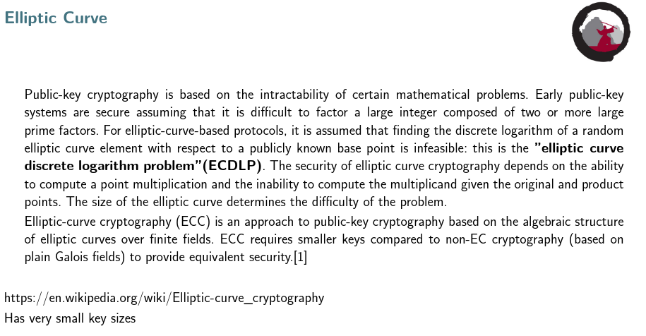
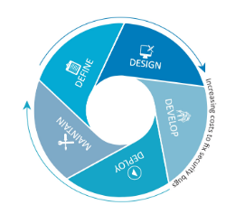
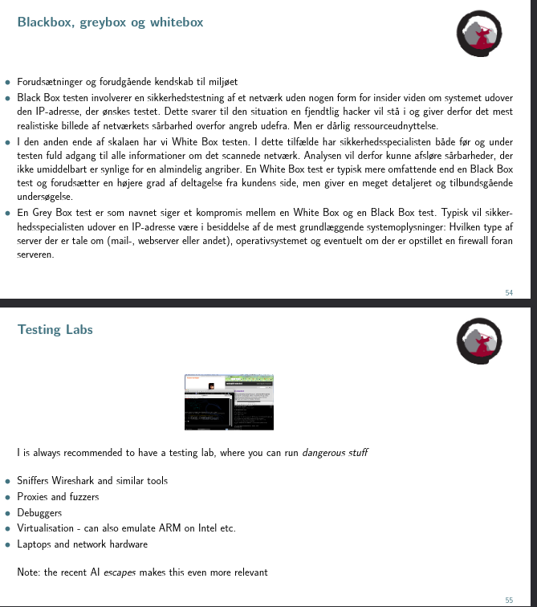
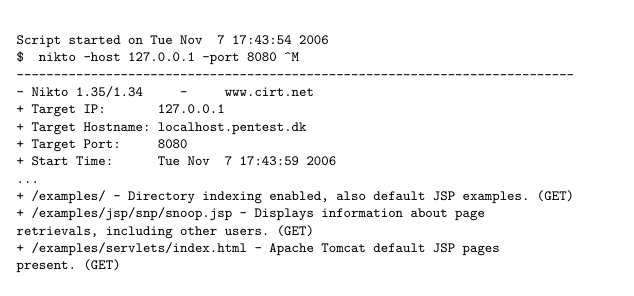
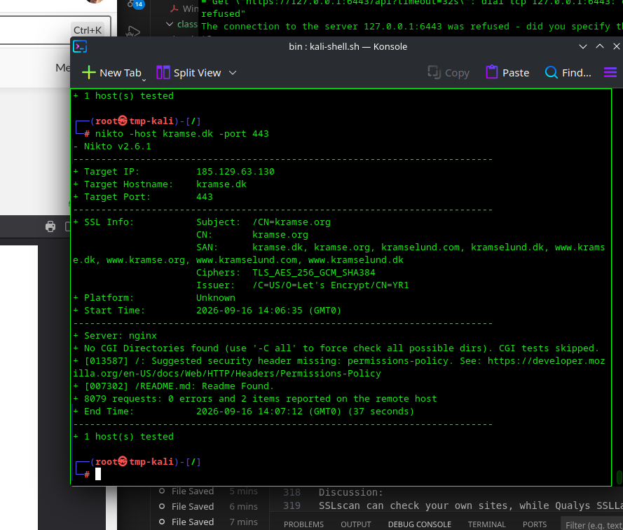
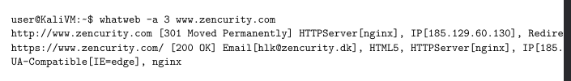
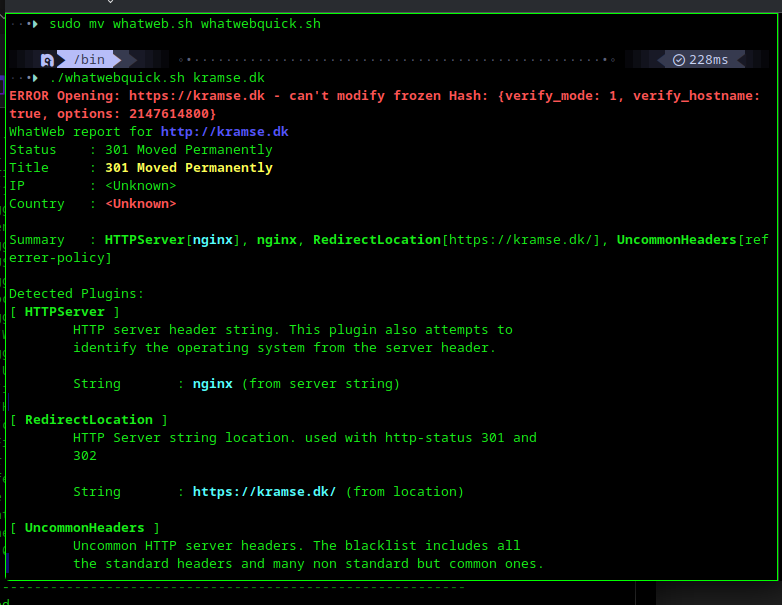
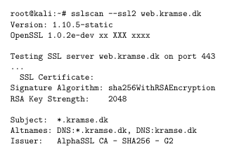
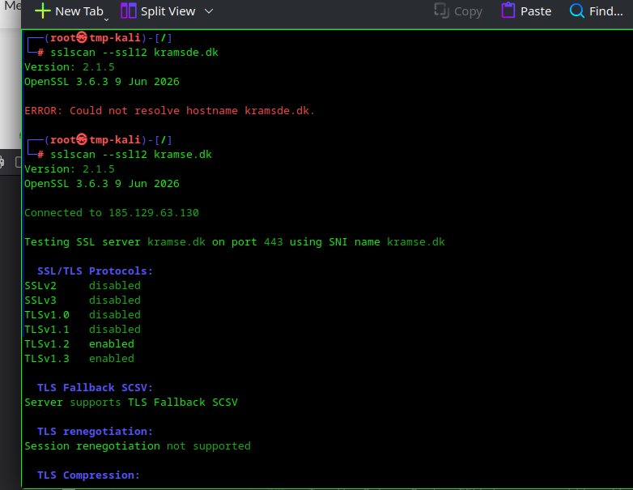

# SDLC : Secure Development Life Cycle
## Crypto
Windows IZ vuln

Exim vuln - send special chars and end up executing command son mail server. June/july and september, 3 cves.
>  is ”exploitable by sending an SNI ending in a backslash-null sequence during
the initial TLS handshake” which leads to RCE with root privileges on the mail server.
[exim tls flaw -> rce](https://www.bleepingcomputer.com/news/security/critical-exim-tls-flaw-lets-attackers-remotely-execute-commands-as-root/)

[qualys](https://www.qualys.com/2019/06/05/cve-2019-10149/return-wizard-rce-exim.txt)

<-- MAIL SERVER exploits with RCE

### Basic crypto

Confidentiality and Integrity ca be secured with crypto.
MiTM compromises it.
Is pratice and tsudy of techniques fr secure communication. Breaking crypto should be really really hard.
Mprdern cryptoi uses combinations to make it even better.

### Principles
-algos are known
- keys are secret
- keys have a lifetime and deathtime
- etc.

### Poor use of crypto
DOnt create your own crypto -> USE soemthing proved to work.
Be careful choosing which algo
Dont rely on algo security throigh obscurity
Dont jard code secrets / mishandle private info, if your mobile app binary contains aprivate key and is distributed to millions of users, the its not pricvate.

Crypto is hard!

Read crypto book if interested - not mandtaory : 
A Graduate Course in Applied Cryptography By Dan Boneh and Victor Shoup
https://toc.cryptobook.us/
https://crypto.stanford.edu/~dabo/cryptobook/BonehShoup_0_4.pdf

### WEP design majot cryptographiv errors
weak keying, small IVs, CRC-32 intgerity check NOt strog enough, auth gives pad (if get encryption pad for one IV -> you can produce packets forever)
-> WPA much stronger algos and protocols

### AES
is teh one we use nowadays
also look at EC<xxx> ex ECDLP, elliptic cruve crypto algos : short keys but ultra secure. not that intuitive but really good.

### TLS
old protocol, originally netscape comms inc, ssl vas adopted by TLS.
Tls server name indication (sometime sobscured now)

### sslscan
tool to scan ssl - check by yourselves.

### Opgave 16 : Real Vulnerabilities up to 30min
#### Objective:
Look at real vulnerabilities. Choose a few real vulnerabilities, prioritize them.
#### Purpose:
See that the error types described in the books - are still causing problems.
#### Suggested method:
We will use the 2019 Exim errors as examples. Download the descriptions from:
• Exim RCE CVE-2019-10149 June
https://www.qualys.com/2019/06/05/cve-2019-10149/return-wizard-rce-exim.txt
• Exim RCE CVE-2019-15846 September
https://exim.org/static/doc/security/CVE-2019-15846.txt
When done with these think about your own dependencies. What software do you depend on? How
many vulnerabilities and CVEs are for that?
I depend on the OpenBSD operating system, and it has flaws too:
https://www.openbsd.org/errata65.html
You may depend on OpenSSH from the OpenBSD project, which has had a few problems too:
https://www.openssh.com/security.html
#### Hints:
Remote Code Execution can be caused by various things, but most often some kind of input validation failure.
#### Solution:
When you have identified the specific error type, is it buffer overflows? Then you are done.

**********
##### CVE-2019-10149 (June 2019) — "Return of the WIZard"

Root cause: expand_string() in Exim recognizes a ${run{<command>}} expansion syntax, and under certain delivery-failure code paths (deliver_message()), attacker-controlled recipient addresses get passed through that expansion. Send a mail to ${run{/bin/sh -c "..."}}@localhost and Exim executes it as root.
Locally it's trivial. Remotely it required a convoluted 7-day trick abusing bounce-message timing (timeout_frozen_after, ignore_bounce_errors_after) to get attacker-controlled data back into the vulnerable code path.

https://www.qualys.com/2019/06/05/cve-2019-10149/return-wizard-rce-exim.txt

**Vulnerability class: this is not a buffer overflow**: it's a command injection / improper input validation issue. 
User-supplied data (an email address) is passed into a function that interprets special syntax as executable commands, with no sanitization.

##### CVE-2019-15846 (September 2019)

Root cause: a crafted SNI (Server Name Indication) value ending in a backslash-null sequence, sent during the TLS handshake, triggers the bug — again root-privileged code execution, local or remote, against any Exim server that accepts TLS.

**Vulnerability class: Looks like a string handling flaw, so not specifically buffer oveflow??**

*******************
Discussion:
How do you feel about running internet services. Lets discuss how we can handle running insecure code.

What other methods can we use to restrict problems caused by similar vulnerabilities?
A new product will often use a generic small computer and framework with security problems.

## Soft Development lifecycle

Chris Wysopal (good name to know)

Vulnerabilities emerge during design and implementation : before, during and after approach is needed.

### Same concept, many names across vendors and standards
• SSDL / SDL — Secure (Software) Development Lifecycle
• Microsoft SDL — Security Development Lifecycle
• NIST SSDF — Secure Software Development Framework (SP 800-218)
• BSIMM — Building Security In Maturity Model
• OWASP SAMM — Software Assurance Maturity Model

SSDL repredsents a structured apporach toward implementing and performing secure fotware deveoopment

This way securtity issues are evaluated and addressed early.
the process is iterative.

### Phases

1. Security Guidelines, Rules, and Regulations
2. Security requirements attack use cases
3. Architectural and design reviews/ threat modeling
4. Secure coding guidelines
5. Black / grey / white box testing (white, you can read code and see evrythong and test vs. black you dont know anything)
6. Determining exploitability

Secure DEPLOYMENT comes AFTER this.

> Look at OWASP guide to testing book.

#### Phase 1

Umbrella req.
gov regs -> SOX
payment regs -> PCI
OWASP, HIPAA, FISMA, BASEL II, GDPR...
ISO 27001
SSAE 16 No 16
ISAE 3402

#### Phase 2
Where do we use the SW, WHY, how is it used etc

MITRE ATT&CK framework (a BEASSST to work with )
read MORRIS worm

#### Phase 3

Help avoid insecure archs and low sec designs'
'Threat modelling, a whole subject in itself!
ID security critical parts of app

#### Phase 4
plan tuse of static and dynamic analysis tools
train for secure coding
lay down rules for coding, dont use strcpy only strlcpy fx.

**Best pratcices**
>CHECK out the VERACODE handbook for sdecure coding best pratctices (pdf asset)

• **#01 Verify for Security Early and Often**
• #02 Parameterize Queries
• #03 Encode Data
• #04 Validate All Inputs
• #05 Implement Identity and Authentication Controls
• #06 Implement Access Controls
• #07 Protect Data
• #08 Implement Logging and Intrusion Detection
• #09 Leverage Security Frameworks and Libraries
• #10 Monitor Error and Exception Handling

#### Phase 5

pLAN FOR testing and fix vulnerabilities 
continuous integration helps avoid pitfalls like we are out of time

#### Phase 6
Ideally every vuln are fixed
> determining exploitability is a factor in estimating risk associated
acces needed to attempt exploitation, ...

### Deploy securely

- have secure defaults
- good init file perms
- make sure app can be patched
- track and prioritize id'ed vulns
- make it easy to report vulns to the org
ex. the security.txt file

### Roles and responsibilities
Make it CLEAR who has what and when.
> GOVernance here primarily

### Security based testing

> Wysopal dude here again

Time anbn dresources are ocnstrained, SW develeopment must be prioritized, threat mpdelling / risk modelling exist to help here.

id threat paths, id threats, id vulns, rank prioritize vulns
> sounds easy but is hard in practice.

### DREAD

- D : DAMAGE
- R : Reproductibility
- E : Expliotability
- A : Afffected users
- D : Discoverability

### Microsoft secure dev lifecycle

There are five major threat modeling steps:
• Defining security requirements.
• Creating an application diagram.
• Identifying threats.
• Mitigating threats.
• Validating that threats have been mitigated. Threat modeling should be part of your routine development lifecycle,
enabling you to progressively refine your threat model and further reduce risk.

If microsoft or owasp jumped off a bridge -> you should too. 
Basocally.

> check kOWASP web security testing guide 

### Black, grey and white box tests

REMEMBER bin sh scripts for kali or bash shell! 

### Exercise 17: Nikto Web Scanner 15 min
#### Objective:
Try the program Nikto locally your workstation
#### Purpose:
Running Nikto will allow you to analyse web servers quickly.
Description Nikto is an Open Source (GPL) web server scanner which performs com-
prehensive tests against web servers for multiple items, including over 3200 potentially
dangerous files/CGIs, versions on over 625 servers, and version specific problems on over
230 servers. Scan items and plugins are frequently updated and can be automatically
updated (if desired).
Source: Nikto web server scanner http://cirt.net/nikto2
Easy to run, free and quickly reports on static URLs resulting in a interesting response
nikto -host 127.0.0.1 -port 8080
When run with port 443 will check TLS sites
#### Suggested method:

Run the program from your Kali Linux VM

#### Hints:
Nikto can find things like a debug.log, example files, cgi-bin directories etc.

If the tool is not available first try: apt-get install nikto
Some tools will need to be checked out from Git and run or installed from source.
#### Solution:
When you have tried the tool and seen some data you are done.

### Exercise 18: Whatweb Scanner 15 min
#### Objective:
Try the program Whatweb locally your workstation
#### Purpose:
Running Whatweb will allow you to analyse which technologies are used in a web site.
I usually save the command and the common options as a small script:
#! /bin/sh
whatweb -v -a 3 $*
Suggested method:

#### Hints:
If the tool is not available first try: apt-get install *thetool*
Some tools will need to be checked out from Git and run or installed from source.
#### Solution:
When you have tried the tool and seen some data you are done.
#### Discussion:
How does this tool work?
It tries to fetch common files left or used by specific technologies.

### Exercise 19: SSL/TLS scanners 15 min
#### Objective:
Try the Online Qualys SSLLabs scanner https://www.ssllabs.com/ Try the command line tool sslscan
checking servers - can check both HTTPS and non-HTTPS protocols!
Purpose:
Learn how to efficiently check TLS settings on remote services.
Suggested method:
Run the tool against a couple of sites of your choice.

Also run it without --ssl2 and against SMTPTLS if possible.
Hints:
Originally sslscan is from http://www.titania.co.uk but use the version on Kali, install with apt if not
installed.
Solution:
When you can run and understand what the tool does, you are done.
Discussion:
SSLscan can check your own sites, while Qualys SSLLabs only can test from hostname

