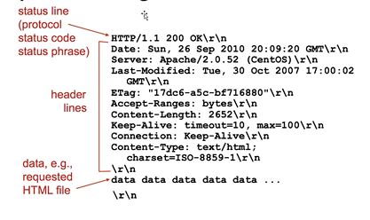

# Network 1

> [xx] = out of scope

## 5 LAYER MODEL / TCP/IP / INTERNET PROTOCOL STACK (BY HEART)

> (exam question ex draw the model and the deep dive into one protocol)

### Top down approach

#### LAYER 5: Application layer

(protocols: HTTPS=443, DNS=53, SMTP=25, FTP=20/21, HTTP=80, SSH=22, NTP=123, DHCP=67/68) -BY HEART

#### LAYER 4: Transport layer

(protocols: TCP: in order,connection oriented (3 way handshake), congestion control, reliable (=no loss), flow control, sequecing; UDP: reverse TCP but FASTER, + EFFICIENT,LIGHTER)

#### LAYER 3: Network layer

(protocols: IPv4, IPv6, ICMP (for pinging fx.))[OSPF, RIP, BGP, ISPS]

#### Layer 2: DataLink (D-Link) Layer

(WiFi 802.11.x, EtherNet 802.3.x, ARP, bluetooth)

#### LAYER 1: Physical Layer

[cables, fiber etc out of scope]

### ENCAPSULATION (BY HEART)

- LAYER 5 -> message = Headers in payload (in Layer 5)
- LAYER 4 -> segment => message + protocol header from layer above etc (H + M)
- LAYER 3 -> Datagram (router) (H + H + M)
- LAYER 2 -> Frame (switch) (H + H + H + M)
- LAYER 1 -> Bits and Bytes (H + H + H + H + M)

DNS, DHCP runs over UDP
IPv4, IPv6
ICMP
Wifi
Ethernet
are **unreliable**

HTTP, DNS, DHCP, UDP, IPv4, IPv6, ICMP, Ethernet, ARP ==> **THE MOST IMPORTANT ONES!**

## PROTOCOLS:

Def: Set of rules/standards/states for how 2 differents packets can intercat with each other. How do we communicate with each other? We have a lot of different ones, for different needs : security, performance, basic stuff, specifics needs and levels of communication. (ex, 5 layer levels). No need to guess - only rules to follow.

ISO has made OSI model
with 2 extra layers (the theoretical model)
app > pres > session > transport > network > link > physical

pres -> allow apps to interpret meaning of data (encryption, compression etc)

session -> sync, checkpointing, recovery

> IS IN APP LAYER - developer implements them there if needed

### APP LAYER

many are raw ascii - nogle gange binary

typically request/response -
sometimes, one way

the protocols define, the type of message, the message syntax, the semantics, the rules.

### Open vs proprietary protocols

- Open protocols: defined in RFC (ex HTTP, SMTP) -> allow interoperability
- Proprietary protocol ex Skype, exchange

RFC number -> see how to build http to be compatible, it is the definition fo the protocol.
Request For Comments

### HTTP protocol

HTTP is by default stateless, the sever doesnt keep data from past client requests. every requets is independant from other requests.

HTTP has client server architetcture
client sends request server sends response.

Uses TCP because we want reliable transport.

#### Connections

Persistent vs non-persistant

##### Non persistant

Only one object sent, then connection closed. (HTTP 1.0)

##### Persistant

Multiple objects can ben sent over a single TCP connection. Connection is closed after timeout (HTTP 1.1)

#### Request message


ASCII text

1. Request line (obligatory)
   - method (GET, POST, PUT, DELETE commands) space Resource (ex. /index.html) space Version that I support (client) (stop line) \r\n
2. header lines (some of them are not obligatory depending on the version)
3. carriage return and line feed at start of line = end of header lines


#### Response message


Alle headers er optional

#### STATUS CODES

- 2xx -> ok
- 3xx -> moved
- 4xx -> client error
- 5xx -> server error

EXERCISE
Trying out HTTP (client side) for yourself

1. Telnet to a web server:
   telnet www.kallas.dk 80
1. Type in a GET HTTP request:
   GET /index.html HTTP/1.1
   Host: www.kallas.dk
1. Look at response message sent by HTTP server (use WireShark to look at captured HTTP
   request/response)
1. Try to change the version to 1.0
   What happens?
1. In kali you can also enter:
   ○ echo "GET / HTTP/1.1\r\nHost: www.kallas.dk\r\n\r\n" | nc www.kallas.dk 80

---

1.

```
─(kali㉿kali)-[~]
└─$ telnet www.kallas.dk 80
Trying 165.232.77.195...
Connected to www.kallas.dk.
Escape character is '^]'.

>GET /index.html HTTP/1.1
>Host: www.kallas.dk

HTTP/1.1 200 OK
Date: Tue, 27 Jan 2026 10:09:00 GMT
Server: Apache/2.4.41 (Ubuntu)
Last-Modified: Wed, 26 Aug 2020 19:57:36 GMT
ETag: "12-5adcd3b36cd16"
Accept-Ranges: bytes
Content-Length: 18
Content-Type: text/html

Here goes nothing
Connection closed by foreign host.
```

2.

```
┌──(kali㉿kali)-[~]
└─$ telnet www.kallas.dk 80
Trying 165.232.77.195...
Connected to www.kallas.dk.
Escape character is '^]'.
> GET /index.html HTTP/1.0
> Host: www.kallas.dk

HTTP/1.1 200 OK
Date: Tue, 27 Jan 2026 10:20:25 GMT
Server: Apache/2.4.41 (Ubuntu)
Last-Modified: Wed, 26 Aug 2020 19:57:36 GMT
ETag: "12-5adcd3b36cd16"
Accept-Ranges: bytes
Content-Length: 18
Connection: close
Content-Type: text/html

Here goes nothing
Connection closed by foreign host.

```

3.

```
──(kali㉿kali)-[~]
└─$ echo "GET / HTTP/1.1\r\nHost: www.kallas.dk\r\n\r\n" | nc www.kallas.dk 80
HTTP/1.1 200 OK
Date: Tue, 27 Jan 2026 10:22:34 GMT
Server: Apache/2.4.41 (Ubuntu)
Last-Modified: Wed, 26 Aug 2020 19:57:36 GMT
ETag: "12-5adcd3b36cd16"
Accept-Ranges: bytes
Content-Length: 18
Content-Type: text/html

Here goes nothing
```

With _netcat_ (nc) you need to add the \n\r on every line, _telnet_ doesnt need it

This is an emulation of how a browser sends a request

---
