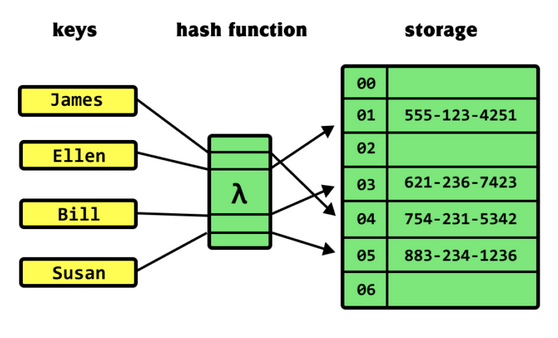
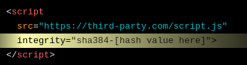
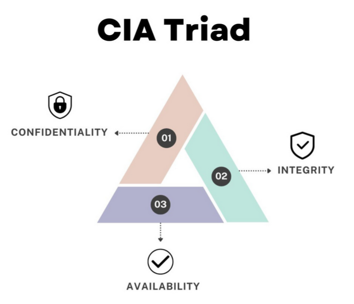

# Hashing

## Hash functions

A way to check integrity of a file/data you download - check if they're the same. If the value != then files not same.
Is a string of x length generated from the data of a file and the algorithm used. Should be irreversible.

### Where are they used
- Pwd protection
- cloud systems
    - id identical files + detect mod files
- git
    - id files in a repo
- host based intrusion detection systems HIDS
    - detect modified files
- network based intrusion detection systems NIDS
    - detect known malicious data going through network
- forensic analysis
    - prove that digtial artifacts haven't been modified
- bit coin

### Represetation

### Malware hashes
> ex. Resources for DFIR professionals responding to the Revil ransomware attack

### Resource integrity
> ex. check integrity of Js lib or files

### BitTorrent

To distribute a file, it is cut into chunks and each chunk is hashed
These hashes are shared as src of trust to represent file to dl
There are != mechas allowing a peer to obtain chunks of a file fom =! peers
[something soehting]

### Information security goals: The CIA triad

Conf = prevent unauthorized access to info
>>> Integ = prevent unauthorized altering of info
Avai = ensure disposal or accessibility of syste for authorized users

### Integ vs confidentiality
Integrity = attacker cannot change msg without being detected

confidentiality = attacker cannot read message correctly without a key

Encryption doesnt guarantee integrity

Reason : attacker can change the ciphertext arbitrarily and any ciphertext can be decrypted to get the corresponsing plaintext (although possibily garbage)

### Cyrtographic functions
Implement data fingerprinting

Maps arbitrary sized input x to fixed size hash H(x)
- typical fixed size 256 [missing info]

### Building a hash function

Merkle Damgård contruction [research]

### Properties
- **Unpredictability**: you can't guess the og msg from the hash value, you can't rever engineer it
- **Avalanche effect**:the smallest change should change the hash completely
- **Collision resistant**: can't find any two inputs that hash to the same value (you choose both freely)
    - **pre img resistant**: can't reverse a hash to find any input
    - **second pre image resistant**: given a specific input, can't find another input with the same hash

### Birthdays
> Birthday attack
The name comes from the birthday paradox: in a room of 23 people, there's a ~50% chance two share a birthday. You don't need to match one specific birthday — any two matching is enough.
Applied to hashing:

You don't look for a hash that matches one specific hash
You generate a large number of hashes and look for any two that match

The math:

A hash of n bits has 2^n possible values
You only need ~2^(n/2) attempts to get a 50% chance of a collision

So for MD5 (128-bit): 2^64 attempts — sounds big, but it's broken in practice
For SHA-256 (256-bit): 2^128 attempts — currently considered safe
Why it matters for security:

It's why hash output size matters — a 128-bit hash is not "128-bit secure" against collision attacks, only 64-bit secure
It's one of the reasons MD5 and SHA-1 are deprecated — the birthday bound is reachable with modern hardware

### Hash function names

- MD5
- SHA-1
- SHA-2
- SHA-3
- Special hash functions (pwd based KDF):
    - PBKDF2
    - Bcrypt
    - Scrypt
    - Argon2
Some of those are no longer secure! But we need to remeber them anyways, because we might see them in the wild, maybe because of technical debt.

### Non cryptographic hash functions
- CRC32 - error detecttion code function aka **checksum**
No properties of pre image, second pre image nor collision resistance - CANNOT BE USED FOR SECURITY REASONS!

### MD5
> Designed by Ronald Rivest in 1991
> Output: 128-bit
> Several weaknesses uncovered, vulnerable to real collision attacks. Broken in 2005.
> No longer recommended!

### SHA-1 (Secure hash algorithm)
> Designed by the NSA
> Uses a block cipher (SHACAL) internally
> Input length: <2^64 bit
> Output: 160  bit digest 
> No longer secure
> Broken on feb 23 2017

### SHA-2
> Desiigned by NSA
> Family of hash functions includiing 224, 256 (MOST USED), 384, 512 (for paranoids), 512/224, 512/256
> Better security but slower than SHA-1

### SHA-3 (Keccak)
> SHA-2 is too similar to SHA1 and researchers grew concerned about its long-term security
> 2007, NIST Hash function competition
> after rounds - 5 finalists:
    - BLAKE
    - Grøstl
    - **Keccak** 2015 -> current recommended hash function
    - Skein
    - JH

### Watch out for truncation
If digest size is reduced -> security is reduced aswell
> never lower than 256bit for collision resistance ex integrity check
> never lower than 128bit for pre & second image resistance ex password protection

## Pwd protection

Most common case for crypto hash functions.

Login system, how to store pwd?
Hash pwd at the server sidie with cryptographically secure hash function. If attacker steals the db, the attacker will only see the hashes.

###

## Key derivation functions