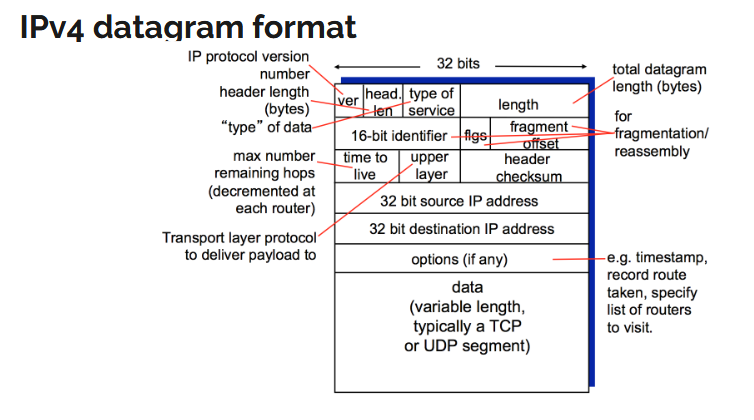
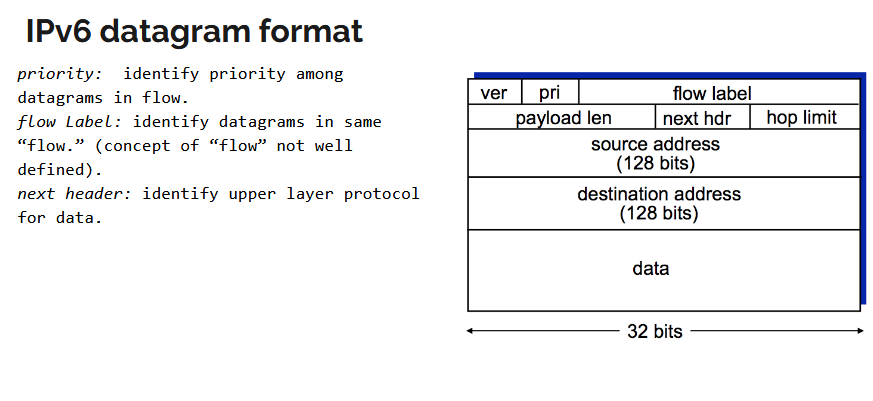

# Network 3

## Network Layer

### Overview

- Transports segments from sending to receiving host
- **Sending side:** encapsulates segments into datagrams
- **Receiving side:** delivers segments to transport layer
- Network layer protocols in EVERY host and router
  - Routers examine header fields in all IP datagrams passing through

### Network Layer Functions

**1. Forwarding**

- Moves datagrams from router input to appropriate router output
- Handled by data plane

**2. Routing**

- Determines route from source host to destination host
- Uses routing algorithms
- Handled by control plane
- Two approaches:
  - Traditional routing algorithms (implemented in routers)
  - SDN - Software-defined networking (implemented in remote servers)
- **Routing protocols out of pensum for us**

---

## IP Protocol

### IPv4 Datagram Format



Network layer packet = **datagram** (vs. segment in transport layer)

**Key header fields:**

- **Version** - IP protocol version number
- **Header length** - in bytes
- **Type of service** - type of data
- **Total length** - total datagram length in bytes

**Fragmentation fields:**

- **16-bit identifier** - same for all fragments of original datagram
- **Flags** - add fragmentation details
- **Fragment offset** - like seq number, shows where we are in the packet, where we cut it
- If datagram too long (>1500 bytes), needs fragmentation into smaller pieces

**Other important fields:**

- **TTL (Time To Live)** - NOT a time measure, it's a hop counter
  - Counts down by 1 at each router
  - When hits 0, packet discarded
  - Prevents packets that aren't relevant anymore from living forever
  - We want newest data, so old packets should die
  - Use `traceroute` to see TTL in action

- **Upper layer protocol** - tells which transport protocol to deliver to (TCP/UDP) (sometimes ICMP)
- **Header checksum** - quick (not super reliable) way to check if packets sent = packets received
- **32-bit source IP address** (4 bytes)
- **32-bit destination IP address** (4 bytes)
- **Options** - e.g., timestamps, not used often, mostly in routing protocols
- **Data** - variable length, typically a TCP or UDP segment

---

## IP Addressing

### Basics

**IP address:** 32-bit identifier for host or router interface (or 4 bytes)

**Interface:** connection between host/router and physical link

- Routers typically have multiple interfaces
- Hosts typically have 1-2 interfaces (e.g., wired Ethernet + wireless 802.11)
- Each interface gets an IP address

**Example:**

```
223.1.1.1 = 11011111 00000001 00000001 00000001
            └─ 223 ─┘└─ 1 ──┘└─ 1 ──┘└─ 1 ──┘
```

---

## Subnets

### IP Address Structure

- **Subnet part** - high order bits (the network portion)
- **Host part** - low order bits (the device portion)

### What's a Subnet?

- Device interfaces with same subnet part of IP address
- Devices can physically reach each other WITHOUT going through a router

A subnet (subnetwork) is a network inside a network.

Subnets make networks more efficient. Through subnetting, network traffic can travel a shorter distance without passing through unnecessary routers to reach its destination.

**Example:** Network with 3 subnets:

- 223.1.1.0/24
- 223.1.2.0/24
- 223.1.3.0/24

### Subnet Mask Notation

A subnet mask is a 32-bit number that acts as a filter, dividing an
IP address into two distinct parts: the network address (which network the device belongs to) and the host address (the specific device). It tells computers which devices are on their local network and which require a router to reach, enabling efficient data transmission.

Use **/24** notation = CIDR notation

The number (24) = first 24 bits are the network mask (the network part)

**Why /24 is important:**

- Defines how many bits identify the network vs. individual hosts
- /24 means first 24 bits = network, last 8 bits = host addresses
- Must be able to explain this for exam

---

## CIDR (Classless InterDomain Routing)

### Format

**a.b.c.d/x** where x = number of bits in subnet portion

### Example: 200.23.16.0/23

```
        network prefix           host part
11001000 00010111 00010000 00000000
└────────────────────────┘└────────┘
```

### How Organizations Get Addresses

Organizations typically get allocated a range of addresses with a common prefix from their ISP

**Example:**

```
ISP's block:        200.23.16.0/20

Organization 0:     200.23.16.0/23
Organization 1:     200.23.18.0/23
Organization 2:     200.23.20.0/23
...
Organization 7:     200.23.30.0/23
```

### Hierarchical Addressing: Route Aggregation

ISPs can advertise one aggregated route to the rest of the internet:

- "Send me anything with addresses beginning 200.23.16.0/20"
- More efficient than advertising each organization separately

---

## Getting IP Addresses

### How ISPs Get Addresses

**IANA (Internet Assigned Numbers Authority)** - www.iana.org  
Under **ICANN (Internet Corporation for Assigned Names and Numbers)** - www.icann.org

**IANA/ICANN responsibilities:**

- Allocates IP addresses
- Manages DNS
- Assigns domain names, resolves disputes
- Assigns port numbers to services

### How Hosts Get IP Addresses

**Method 1: Hard-coded by system admin**

- Windows: Control Panel → Network → Configuration → TCP/IP → Properties
- Unix: /etc/rc.config

**Method 2: DHCP (Dynamic Host Configuration Protocol)**

- Dynamically get address from network server when joining network

---

## DHCP (Dynamic Host Configuration Protocol)

### Overview

- Also called **"plug-and-play"** or **"zeroconf"** protocol
- Dynamically assigns IP addresses when devices join network

### What Host Learns from DHCP

1. **Own IP address assignment** (same IP each time OR temporary)
2. **IP address lease time**
3. **Subnet mask**
4. **Address of first-hop router** (default gateway)
5. **Name and IP address of local DNS server**

### 4-Step Process: DORA

**D**iscover → **O**ffer → **R**equest → **A**cknowledge

1. **DHCP Discover**
   - Client broadcasts: "Is there a DHCP server out there?"
   - Uses UDP packet to port 67
   - Broadcast because client has no IP yet (can't use TCP - needs 3-way handshake)

2. **DHCP Offer**
   - Server broadcasts: "I'm a DHCP server! Here's an IP address you can use"
   - Why broadcast? Because client still doesn't have IP address to receive unicast
   - Broadcast IP: 255.255.255.255

3. **DHCP Request**
   - Client broadcasts: "OK, I'll take that IP address!"
   - Still broadcast (client hasn't configured IP yet)

4. **DHCP ACK**
   - Server broadcasts: "OK, you've got that IP address!"
   - Final confirmation

### DHCP as Application Layer Protocol

- Runs on **port 67** (server) and **port 68** (client)
- Uses UDP
- Why do we talk about it in network layer? Because it's how network layer gets configured!

### DHCP Server Location

- **At home:** Your router is the DHCP server
- **At work/university:** Dedicated DHCP server somewhere on network

### Testing DHCP

Check in Wireshark:

- Interface: eth0
- Filter: `dhcp`
- Should see 4 packets: Discover, Offer, Request, ACK

---

## NAT (Network Address Translation)

### What is NAT?

- Allows entire local network to use **one public IP address** as far as outside world is concerned
- Router sits between local network and Internet, **translating local addresses to public addresses** LAN addr to WAN addr

NAT is a receptionist making all calls from one company number, tracking which extension really called, and routing replies to the right person.

### NAT Setup Example

```
Local network (e.g., home network): 10.0.0.0/24
  - Host 10.0.0.1
  - Host 10.0.0.2
  - Host 10.0.0.3

NAT Router:
  - Inside interface: 10.0.0.4
  - Outside interface: 138.76.29.7 (public IP)

All traffic leaving network appears to come from 138.76.29.7
```

### Why Use NAT? Motivation

**Advantages:**

1. **Only need ONE public IP address for all devices**
   - Range of addresses not needed from ISP
   - Saves IPv4 address space
2. **Can change internal addresses without notifying outside world**
   - Flexibility in internal network design

3. **Can change ISP without changing internal device addresses**
   - Just change router's public IP

4. **Security plus: devices inside not explicitly addressable by outside world**
   - External hosts can't directly contact internal devices

### How NAT Works

**NAT Translation Table** (maintained by router):

| WAN side addr     | LAN side addr  |
| ----------------- | -------------- |
| 138.76.29.7, 5001 | 10.0.0.1, 3345 |
| 138.76.29.7, 5002 | 10.0.0.2, 3346 |

**Process:**

1. **Outgoing packet (from host 10.0.0.1:3345 to web server 128.119.40.186:80)**
   - Host sends: Source = 10.0.0.1:3345, Dest = 128.119.40.186:80
   - NAT router changes source to: 138.76.29.7:5001
   - Router stores mapping in table
   - Server receives from 138.76.29.7:5001 (doesn't know real source!)

2. **Incoming packet (response from server)**
   - Server sends to: 138.76.29.7:5001
   - NAT router looks up 5001 in table → finds 10.0.0.1:3345
   - Router changes destination to: 10.0.0.1:3345
   - Packet delivered to correct internal host

**Router "pretends" to be the source!**

### NAT Breaks Layering Principle

**The Problem:**

- NAT operates in **network layer**
- But it uses **port numbers** (from transport layer!)
- Violates layer separation principle

**Why is this necessary?**

- Need port numbers to distinguish between multiple internal hosts using same public IP
- NAT must look at both network AND transport layer
- So NAT breaks TCP/IP layering - but it's necessary to make it work

### Finding Your Public IP

Google search: "my ip address" → shows your public IP (NAT router's external address)

### Packet Inspection Exercise

Command:

```bash
python -c "print('x'*1000)" | nc -u 192.168.234.254 53
```

**What this does:**

- Sends 1000 x's via UDP to 192.168.234.254 port 53
- Creates a large packet that may need fragmentation
- 1480 bytes ≈ segment size limit before fragmentation

**Look for in packet inspection:**

- Fragmentation in IP headers
- How packet is split
- Fragment offset values
- Fragment IDs (same for all fragments)

---

## IPv6

### Why IPv6?

**Initial motivation:** 32-bit IPv4 address space running out

- Need more addresses for all devices

**Other improvements:**

- Header format helps speed processing/forwarding
- Simpler, more efficient

### IPv6 Datagram Format



**Fixed-length 40-byte header** (vs. variable in IPv4)

**Key differences from IPv4:**

- **IP addresses: 128 bits** (vs. 32 bits in IPv4)
  - Provides vastly more addresses
- **Priority field:** identify priority among datagrams in flow

- **Flow label:** identify datagrams in same "flow" (concept not well-defined yet)

- **Next header:** identifies upper layer protocol for data (like "protocol" in IPv4)

- **Hop limit:** like TTL in IPv4

### Changes from IPv4

**Removed:**

- **Checksum:** removed entirely to reduce processing time at each hop (had to calculate new checksum based on new TTL every time)
- **Fragmentation:** moved out of router responsibility

**Changed:**

- **Options:** allowed but outside main header, indicated by "Next Header" field

**New:**

- **ICMPv6:** new version of ICMP
  - Additional message types (e.g., "Packet Too Big")
  - Multicast group management functions

### Transition from IPv4 to IPv6

**Problem:** Can't upgrade all routers simultaneously

- No "flag days" where everyone switches at once
- Network must operate with mixed IPv4 and IPv6 routers

**Solution: Tunneling**

- IPv6 datagram carried as **payload** inside IPv4 datagram
- IPv6 packet gets encapsulated when entering IPv4-only section
- IPv6 packet gets extracted when exiting IPv4 section

```
[IPv6 datagram] → [IPv4 header | IPv6 datagram] → [IPv6 datagram]
```

---

## ICMP (Internet Control Message Protocol)

### Purpose

Used by hosts and routers to communicate **network-level information**. Is used as a status indicator.

**Functions:**

- **Error reporting:** unreachable host, network, port, protocol
- **Echo request/reply** (used by `ping`)

### ICMP in Network Stack

- Network-layer protocol "above" IP
- ICMP messages carried **inside** IP datagrams
- Considered part of IP layer

### ICMP Message Format

- **Type** and **Code** fields
- Plus **first 8 bytes of IP datagram that caused error**

### Common ICMP Messages

| Type | Code | Description                      |
| ---- | ---- | -------------------------------- |
| 0    | 0    | Echo reply (ping)                |
| 3    | 0    | Destination network unreachable  |
| 3    | 1    | Destination host unreachable     |
| 3    | 2    | Destination protocol unreachable |
| 3    | 3    | Destination port unreachable     |
| 3    | 6    | Destination network unknown      |
| 3    | 7    | Destination host unknown         |
| 8    | 0    | Echo request (ping)              |
| 9    | 0    | Route advertisement              |
| 10   | 0    | Router discovery                 |
| 11   | 0    | TTL expired                      |
| 12   | 0    | Bad IP header                    |

### Traceroute and ICMP

**How traceroute works:**

Some routers disable traceroute to stay anonymous.

1. **Source sends series of UDP segments to destination**
   - First set: TTL = 1
   - Second set: TTL = 2
   - Third set: TTL = 3, etc.
   - Uses unlikely port number

2. **When nth datagram reaches nth router:**
   - Router decrements TTL to 0
   - Router discards datagram
   - Router sends ICMP message (type 11, code 0 - "TTL expired")
   - ICMP includes router name and IP address

3. **When ICMP arrives, source records RTT**
   - Knows which router is n hops away
   - Knows round-trip time to that router

4. **Stopping criteria:**
   - Eventually UDP segment reaches destination
   - Destination returns ICMP "port unreachable" (type 3, code 3)
   - Source stops - knows it reached destination

**Result:** List of all routers on path with RTT to each
