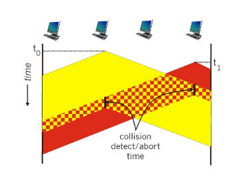
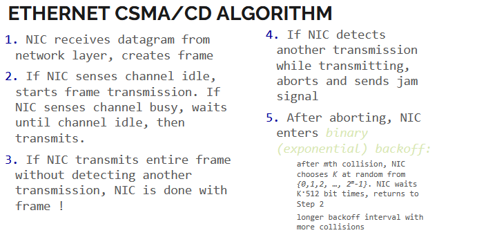
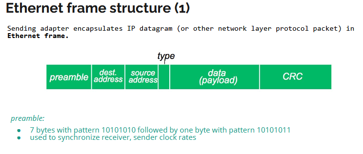
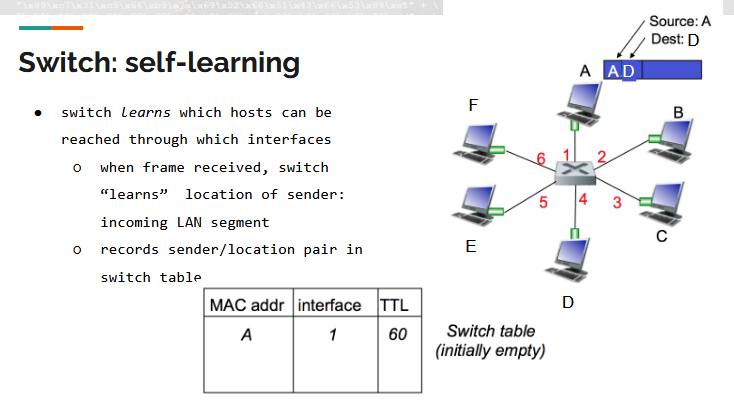
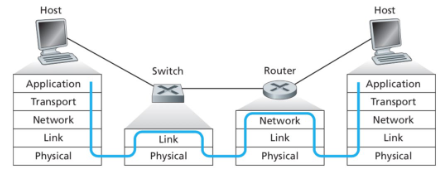
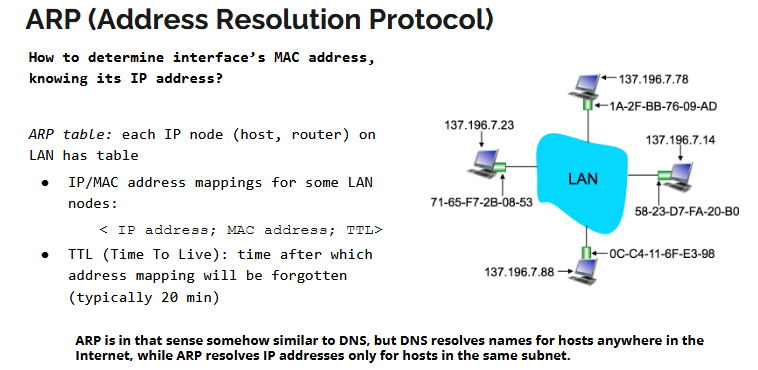

# Network 4

## DataLink Layer (2nd layer)

Direct connection between two nodes on the internet network.

Transfers datagram from one node to a physically close node, over a link.

Hosts, routers, switches, WiFi access points : NODES

Communicate with a LINK (wired link, wireless link, LAN)

### Services

Framing : encapsulate datagram into frame, adding header

Link access : channel access if shared medium, "MAC" addresse use din frame headers to id source, dest (NOT same as IP addr)

Error detection and correction, impelemted in hardware

### Implementation

in a network adapter (hardware level : NIC, Network Interface Card)

Some of it is implemeted in software that runson host CPU + part of hadrware

### Multiple access links, protocols (not exam rleevant that much)

#### Multiple Access protocols

#### Classes of multiple access protocol

#### Taking turns - MAC protocols

### CMSA (Carrier Sense Multiple Access)

CSMA, listen before transmit

if channel sensed idle : transmit entire franme

if channel sensed busy, defer transmission

(Doesnt interrupt others, listens and stops talking when others speak)

#### Collisions

● collisions can still occur:
propagation delay means two nodes
may not hear each other’s
transmission
● collision: entire packet transmission
time wasted
○ distance & propagation delay play role in
in determining collision probability

### CMSA/CD (Collision detection)

listens WHILE speaking, if other speaks, stop speaking to avoid losing too much data by speaking at the same time.

CSMA/CD: carrier sensing, deferral as in CSMA
▪ collisions detected within short time
▪ colliding transmissions aborted, reducing channel wastage

collision detection:
▪ easy in wired LANs: measure signal strengths, compare transmitted, received signals
▪ difficult in wireless LANs: received signal strength overwhelmed by local transmission strength

human analogy: the polite conversationalist
This is relevant in half-duplex state.

Use binary BACK OFF algorithm

After aborting, NIC enters binary (exponential) backoff:

Step 1: after mth collision, NIC chooses K at random from {0,1,2, …, 2m-1}. NIC waits K·512 bit times, returns to

Step 2 : longer backoff interval with more collisions

### DL layer addressing

switches dont understand IP addr - so how do they forward link-layer frames ?

#### MAC addresses

- (recap of) IP address:
  - 32 bit (4 bytes)
  - network layer addr for interface
  - used for network layer forwarding

vs. MAC addr:

- MAC (or LAN or PHYSICAL) address:
  - used "locally" to get frame form one interface to another PHYSICALLY-connected interface 8same network, in IP addr sense)
  - 48bit MAC addr (burned in NIC ROM - shoudnt be changed, but sometimes settable with software)
    ex: 1A-2F-BB-76-09-AD :Hexadecimal (base 16) notation. Each character represents 4 bits. - A vendor/manufactorial part (1A-2F-BB) and a serial number (76-09-AD) - should be unique in practice but isnt in reality.

### Ethernet

Cabled connection, cheapr and simpler, has different speeds.

#### Ethernet Frame structure

No header, just a stream. No fixed size.

1. Preamble, long binary of 7 bytes. ends with a 1 always, then comes the data.
2. starts with dest (MAC addr) and
3. then source (turned around from others) - that way easy check if the stream is for us or not and discard if not. 6 byte source.
4. type - which higher layer protocol (motsly IP) IS the glue between link layer protocol and network protocol
5. payload, the content (typically IP datagram)
6. CRC cyclic redundancy check, kinda like checksum, find errors, better check than checksum. check if need to discard on hardware level instead of needing to send packs all the way back again. Chip in ethernet card. Is a check at receiver.

Is connectionless - no hanshaking between sending ans receiving NICs.
Is unreliable, receiving NIC doesnt send ACKs to sending NIC - need to use tcp if need to be able to resend if needed.

Ethernets's MAC protocol : unslotted CSMA/CD with binary backoff

#### ethernet switch

the device that is charged with connecting different nodes together. Receives pack, finds out where to send and forwards pack.

Not configured, plug and play, self learning.
You dont need to be able to detect them, or see them.

##### Self learning

discovers who adn where on its own. discovers something is sent byt checking WHO sends it.

When frame is received, switch learns location of sender (incoming LAN segment).
Records sender and location pair in a switch table.

Duplicates pack and sends everywhere, the receivers check dest and if not them, drop the pack.

#### Switch vs Router

Both store and forward :

- router: network layer devices (examine network layer headers)
- switch: link layer devices (examines link layer headers)

Both have forwarding tables:

- router: compute tables with routing algos, IP addr
- switch: learn forwarding table by using flooding, learning MAC addr

### ARP (Adress Resolution Protocol)

Used to determine interface's MAC addr by knowing its IP addr. Translate IP to MAC.

broadcast who has dest IP tell src IP, and the one that has it answer and sends the mac back.

#### protocol

"caches"/keeps information in a table

### Addressing
