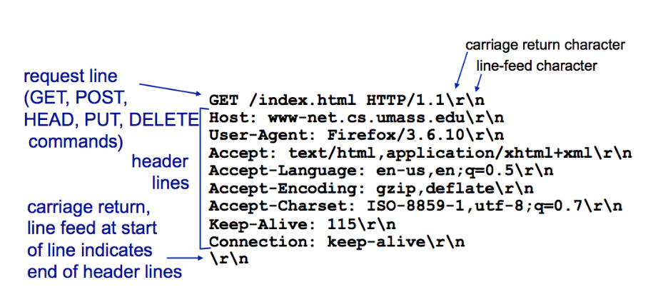
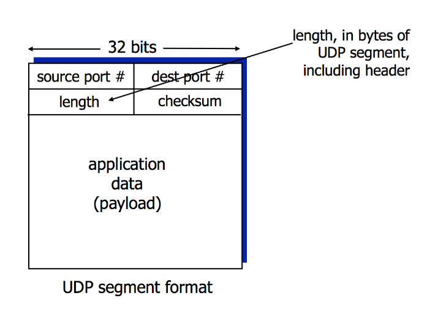
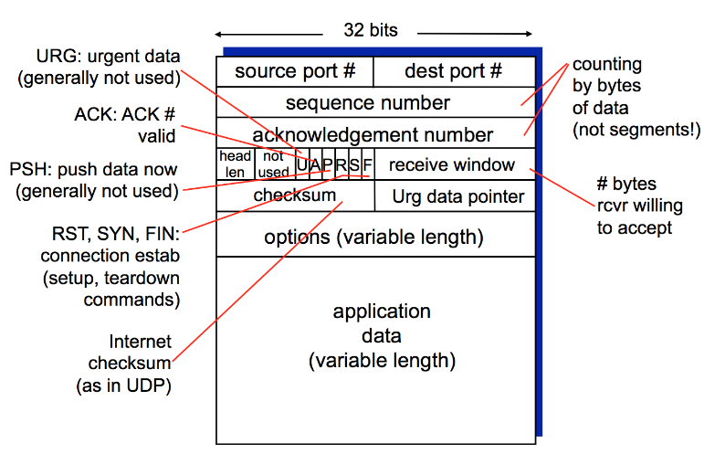
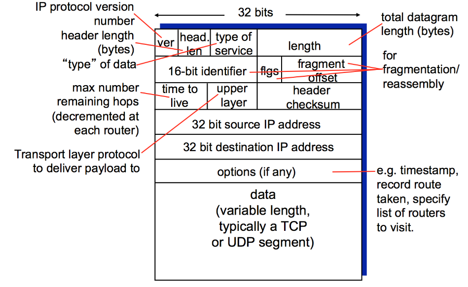
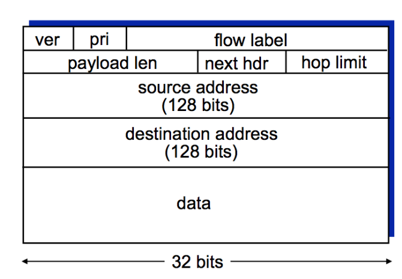
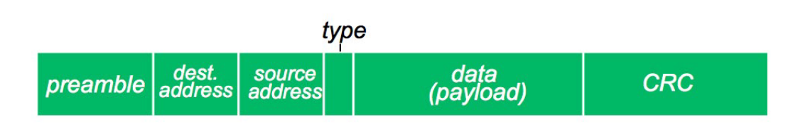
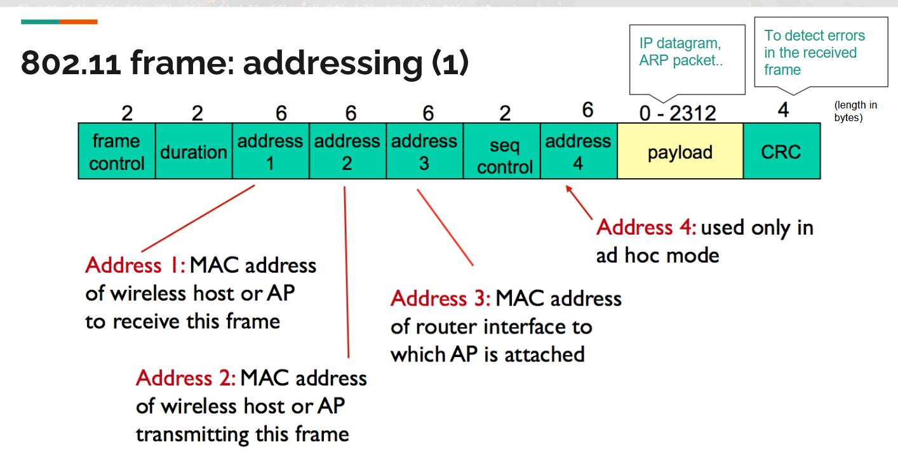

# PROTOCOL HEADER FORMATS

## All Headers from Intro

1. HTTP Request Message (Layer 5)
2. UDP Segment Header (Layer 4)
3. TCP Segment Header (Layer 4)
4. IPv4 Datagram Header (Layer 3)
5. IPv6 Datagram Header (Layer 3)
6. Ethernet Frame Structure (Layer 2)
7. WiFi (802.11) Frame Structure (Layer 2)

## HTTP REQUEST MESSAGE (Layer 5 - Application)

STRUCTURE:


FIELD EXPLANATIONS:

**REQUEST LINE (First Line):**

1. method ("GET", "POST", "PUT", "DELETE", "HEAD")

2. sp = space character (separator)

3. URL = The resource being requested

4. sp = another space

5. version = HTTP version (1.1, 1.0)

6. cr = carriage return (\r)

7. lf = line feed (\n)

**HEADER LINES (Multiple lines, key-value pairs):**

Common headers:

- Host: www.example.com (required in HTTP/1.1 _NOT required_ for HTTP/1.0)
- User-Agent: browser identification
- Accept: what content types client accepts (ex. text/html)
- Accept-Language: preferred language
- Connection: keep-alive (persistent connection)
- Cookie: for state

Each header line ends with cr lf

Blank line (cr lf) separates headers from body

**BODY:**

- Contains data being sent to server

EXAMPLE HTTP REQUEST:

```
GET /index.html HTTP/1.1
Host: www.example.com
User-Agent: Mozilla/5.0
Accept: text/html
Connection: keep-alive

```

NOTES:

- ASCII text (human-readable)
- Stateless by default (no memory of previous requests)
- Uses TCP port 80 (HTTPS uses 443)
- Client-server
- Request/response

## 2. UDP SEGMENT HEADER (Layer 4 - Transport)

STRUCTURE (Total: 8 bytes header + variable data):



FIELD EXPLANATIONS:

1. **src port #** (16 bits = 2 bytes)
   - Range: ish 65.500 (2^16)

2. **dest port #** (16 bits = 2 bytes)
   - Identifies which service/application to deliver to
   - Example: 53 for DNS, 67/68 for DHCP

3. **length** (16 bits = 2 bytes)
   - Total length of UDP segment in bytes
   - Includes header (8 bytes) + data
   - Example: If data is 100 bytes, length = 108 bytes

4. **checksum** (16 bits = 2 bytes)
   - Error detection mechanism
   - Calculated from segment contents (header + data)
   - Receiver recalculates and compares
   - If mismatch → error detected → segment discarded
   - NOT bulletproof (simple calculation)
   - Optional in IPv4, mandatory in IPv6

5. **application data (payload)**
   - Variable length
   - Contains data from application layer
   - Example: DNS query, DHCP message

NOTES:

- Header size: ONLY 8 bytes (very small!)
- Everything TCP isn't
- Connectionless (no handshake)
- Unreliable
- No ordering guarantee
- FAST (minimal overhead)
- No flow control
- No congestion control

WHEN USED:

- DNS (port 53) - fast lookups
- DHCP (ports 67/68) - broadcasts
- NTP (port 123) - time sync
- Streaming video/audio
- Online gaming

## 3. TCP SEGMENT HEADER (Layer 4 - Transport)

STRUCTURE (Minimum 20 bytes, can be longer with options):



FIELD EXPLANATIONS:

**BASIC ADDRESSING (8 bytes):**

1. **source port #** (16 bits = 2 bytes)
   - Range: ish 65.500 (2^16)

2. **dest port #** (16 bits = 2 bytes)
   - Ex: 80 (HTTP), 443 (HTTPS), 25 (SMTP), 22 (SSH)

**SEQUENCE MANAGEMENT (8 bytes):**

3. **sequence number** (32 bits = 4 bytes)
   - Random starting number (0 to 2^32 - 1 ≈ 4 billion)
   - Byte stream "number" of FIRST byte in this segment's data
   - Used to put packets in correct order
   - Ex: If seq=1000 and sending 100 bytes, next seq=1100

4. **acknowledgement number** (32 bits = 4 bytes)
   - Sequence number of NEXT byte expected from other side
   - Cumulative ACK (acknowledges all bytes up to this number)
   - Example: ACK=1500 means "I got all bytes up to 1499, send 1500 next"
   - Only valid when ACK flag is set
   - Formula: ack = received_seq + 1 (during handshake)
   - Formula: ack = received_seq + data_length (during transfer)

**CONTROL INFORMATION (4 bytes):**

5. **header length** (4 bits)
   - Length of TCP header in 32-bit words (not bytes!)
   - Minimum value: 5 (= 5 × 4 = 20 bytes minimum header)
   - Maximum value: 15 (= 15 × 4 = 60 bytes with max options)
   - Needed because options field is variable
   - Also called "data offset"

6. **not used** (6 bits)
   - Reserved for future use
   - Set to 0

7. **FLAGS** (6 bits)
   Each flag is 1 bit (0 or 1):

   **U (URG)** - Urgent pointer field significant

   **A (ACK)** - Acknowledgment field valid
   - Set to 1 when ack number is valid
   - Used in ALL packets except initial SYN
   - Always on after connection established

   **P (Push)** - Push function
   - Tell receiver to pass data to application immediately
   - Used in telnet
   - Last packet of a multi-packet message

   **R (Reset)** - Reset the connection
   - Ungraceful connection teardown
   - Used when unrecoverable error occurs
   - Immediately closes connection
   - No handshake needed

   **S (SYN)** - Synchronize sequence numbers
   - Used ONLY during connection setup (3-way handshake)
   - Set to 1 in steps 1 and 2 of handshake
   - Set to 0 after connection established

   **F (FIN)** - No more data from sender
   - Used to gracefully close connection
   - Sender says "I'm done sending"
   - Both sides send FIN to fully close

8. **receive window** (16 bits = 2 bytes)
   - **FLOW CONTROL** mechanism
   - Number of bytes receiver is willing to accept
   - Prevents overwhelming receiver's buffer
   - Range: 0-65535 (2^16)
   - Updates with each ACK

**ERROR DETECTION & URGENT DATA (4 bytes):**

9. **checksum** (16 bits = 2 bytes)
   - Error detection for entire segment (header + data)
   - Similar to UDP checksum but more reliable
   - Receiver recalculates and compares
   - If mismatch → segment discarded
   - Simple calculation, not bulletproof

10. **Urg data pointer** (16 bits = 2 bytes)
    - Only used if URG flag = 1
    - Points to end of urgent data

**OPTIONAL EXTENSIONS:**

11. **options** (variable length: 0-40 bytes)
    - Extends TCP functionality
    - Must be multiple of 32 bits (padded if needed)
    - Common options:
      - MSS (Maximum Segment Size) - biggest segment sender can receive
      - Window scale - allows windows larger than 65KB
      - Timestamps - for RTT calculation
      - SACK (Selective ACK) - acknowledge non-contiguous blocks
    - Mostly in routing protocols or performance tuning

**PAYLOAD:**

12. **application data** (variable length)
    - Actual data being transmitted
    - From application layer (HTTP, SMTP, etc.)
    - Variable length (can be 0!)
    - Ex: HTTP request, email message

Notes:

- Minimum header: 20 bytes
- Maximum header: 60 bytes (with 40 bytes options)
- Connection-oriented (3-way handshake)
- Reliable (guaranteed delivery with ACKs)
- In-order delivery (uses sequence numbers)
- Flow control (receive window)
- Congestion control (not in header, but algorithm)

SEQUENCE NUMBER EXAMPLE:

```
Client sends: seq=100, data="HELLO" (5 bytes)
Server ACKs:  ack=105 (100 + 5 = expecting byte 105 next)
```

FLAGS IN 3-WAY HANDSHAKE:

```
Step 1: SYN=1, ACK=0 (client initiating)
Step 2: SYN=1, ACK=1 (server responding)
Step 3: SYN=0, ACK=1 (client confirming)
After: SYN=0, ACK=1 (all data packets)
```

## 4. IPv4 DATAGRAM HEADER (Layer 3 - Network)

STRUCTURE (Minimum 20 bytes, up to 60 bytes with options):



FIELD EXPLANATIONS:

**BASIC IP INFORMATION (4 bytes):**

1. **version** (4 bits)
   - IP protocol version number
   - Router checks this to know how to process packet

2. **header length** (4 bits)
   - Length of IP header in 32-bit words (not bytes!)
   - Minimum value: 5 (= 5 × 4 = 20 bytes)
   - Maximum value: 15 (= 15 × 4 = 60 bytes with options)
   - Needed because options field is variable
   - Most common value: 5 (no options)

3. **type of service** (8 bits)
   - Indicates type of datagram

**LENGTH (2 bytes):**

4. **total length** (16 bits = 2 bytes)
   - Total length of IP datagram in bytes (header + data)
   - Includes IP header and payload
   - Maximum: 65,535 bytes (but usually limited by MTU)

**FRAGMENTATION FIELDS (4 bytes):**

When datagram is too large (> 1500 bytes), it must be fragmented:

5. **16-bit identifier** (2 bytes)
   - Unique ID for this datagram
   - All fragments of same original datagram share same ID
   - Helps receiver reassemble fragments

6. **flags** (3 bits)
   - for reassembling

7. **fragment offset** (13 bits)
   - Position of this fragment in original datagram

**TIME & ROUTING (4 bytes):**

8. **TTL - Time To Live** (8 bits = 1 byte)
   - **NOT a time measure!** It's a HOP COUNTER!
   - Starts at a value (typically 64, 128, or 255)
   - Decremented by 1 at EACH router
   - When reaches 0 → packet DISCARDED
   - Router sends ICMP "Time Exceeded" (type 11) back to sender
   - **Why:** Prevents packets from looping forever
   - **Used by traceroute:** Intentionally sets low TTL values

9. **upper layer protocol** (8 bits = 1 byte)
   - Tells which transport protocol to deliver payload to
   - Common values:
     - 1 = ICMP (ping, traceroute)
     - 6 = TCP (web, email, file transfer)
     - 17 = UDP (DNS, DHCP, streaming)
   - Like "type" field in Ethernet (glue between layers)

**ERROR DETECTION (2 bytes):**

10. **header checksum** (16 bits = 2 bytes)
    - Error detection for IP HEADER ONLY (not data!)
    - Quick check if header was corrupted, sot super reliable
    - Must be recalculated at EVERY router (because TTL changes!)
    - If checksum fails → packet discarded
    - Removed in IPv6 for faster processing

**ADDRESSING (8 bytes):**

11. **32-bit source IP address** (4 bytes)
    - IP address of sender
    - Format: 4 bytes
    - Stays the same

12. **32-bit destination IP address** (4 bytes)
    - IP address of final destination
    - Router uses this to make forwarding decisions
    - Stays the same

**OPTIONS (variable, 0-40 bytes):**

13. **options** (variable length)
    - Extends IP functionality
    - Rarely used (mostly in routing protocols)
    - Ex:
      - Record route: Each router adds its IP
      - Timestamp: Record time at each hop
      - Loose/strict source routing: Specify path
    - Makes processing slower (routers must parse)
    - Must be multiple of 32 bits (padded if needed)

**PAYLOAD:**

14. **data** (variable length)
    - Typically contains TCP or UDP segment
    - Sometimes contains ICMP message
    - Maximum: 65,515 bytes (if no options)
    - Typically limited by MTU (1500 bytes for Ethernet)

KEY CHARACTERISTICS:

- IPv4 address: 32 bits (4 bytes)
- Total IPv4 addresses: ~4.3 billion
- Header minimum: 20 bytes
- Header maximum: 60 bytes
- Variable header length (because of options)
- Allows fragmentation at routers
- Has checksum (recalculated at each hop)

## 5. IPv6 DATAGRAM HEADER (Layer 3 - Network)

STRUCTURE (Fixed 40 bytes - no variable options in main header!):



FIELD EXPLANATIONS:

**BASIC INFORMATION (4 bytes):**

1. **version** (4 bits)
   - IP protocol version

2. **priority** (8 bits)
   - Identifies priority among datagrams in same flow
   - Similar to TOS in IPv4

3. **flow label** (20 bits)
   - Identifies datagrams in same "flow"
   - Flow = sequence of packets from source to destination

**SIZE INFORMATION (4 bytes):**

4. **payload length** (16 bits = 2 bytes)
   - Length of data AFTER the 40-byte header
   - Does NOT include header itself (unlike IPv4 total length)
   - max 65,535 bytes
   - ex: 100 bytes of data → payload length = 100

5. **next header** (8 bits = 1 byte)
   - Identifies type of header that follows IPv6 header
   - Like "upper layer protocol" in IPv4
   - ex:
     - 6 = TCP
     - 17 = UDP
     - 58 = ICMPv6
     - 43 = Routing header (IPv6 extension)
     - 44 = Fragment header
     - 60 = Destination options

6. **hop limit** (8 bits = 1 byte)
   - Same as TTL in IPv4
   - Hop counter (NOT time!)
   - Decremented by 1 at each router
   - When reaches 0 → packet discarded
   - Router sends ICMPv6 "Time Exceeded"
   - Prevents infinite routing loops

**ADDRESSING (32 bytes total!):**

7. **128-bit source IP address** (16 bytes)
   - IPv6 address of sender
   - 128 bits = 8 groups of 4 hexadecimal digits
   - Format: 2001:0db8:85a3:0000:0000:8a2e:0370:7334
   - Can compress zeros
   - Vastly more addresses than IPv4!
   - 2^128 = 340 something-illion addr

8. **128-bit destination IP address** (16 bytes)
   - IPv6 address of final destination
   - Same format as source address

**PAYLOAD:**

9. **data** (variable length)
   - Contains transport layer segment (TCP/UDP) or extension headers
   - Variable length

WHY IPv6?

- IPv4 exhausted: Only ~4.3 billion addresses
- IPv6 provides: 340 undecillion (3.4×10^38) addresses

TRANSITION FROM IPv4 TO IPv6:

- Can't upgrade all routers at once
- Solution: **Tunneling**
  - IPv6 packet carried as PAYLOAD inside IPv4 packet
  - IPv6 → [IPv4 header | IPv6 packet] → IPv6
  - Allows IPv6 to travel through IPv4-only networks

Notes:

- Fixed 40-byte header (simple, fast processing)
- 128-bit addresses (vastly more than IPv4)
- No fragmentation at routers (only source fragments)
- No checksum (faster forwarding)
- Extension headers for options
- Mandatory IPsec support

## 6. ETHERNET FRAME STRUCTURE (Layer 2 - Data Link)

STRUCTURE:



Total frame: 26-1526 bytes (minimum 64 bytes including preamble)

FIELD EXPLANATIONS:

1. **preamble** (8 bytes = 64 bits)
   - **Purpose:** Synchronize receiver and sender clock rates
   - "wake up, new frame droping!"
   - Not considered part of actual frame data

**ADDRESSING (12 bytes):**

2. **destination address** (6 bytes = 48 bits)
   - MAC address of receiver
   - Format: 6 bytes = 12 hexadecimal digits
   - Example: 1A-2F-BB-76-09-AD or 1A:2F:BB:76:09:AD
   - Structure:
     - First 3 bytes: Vendor/manufacturer ID
     - Last 3 bytes: Serial number
   - FF-FF-FF-FF-FF-FF for broadcast (all devices)
   - **Placed FIRST so receiver can quickly check if frame is for them**
   - If not for this device → discard immediately (efficient!)

3. **source address** (6 bytes = 48 bits)
   - MAC address of sender
   - Same format as destination address
   - Should be globally unique (but not always in practice)

**PROTOCOL TYPE:**

4. **type** (2 bytes = 16 bits)
   - Indicates higher layer protocol
   - **The "glue" between link layer and network layer**
   - Receiver uses this to know which network protocol to deliver to

**DATA:**

5. **data (payload)** (46-1500 bytes, variable)
   - Contains data from network layer
   - Typically IP datagram, sometimes ARP message
   - **Minimum: 46 bytes**
     - If less, must PAD to 46 bytes
     - Why? Collision detection needs minimum frame size
   - **Maximum: 1500 bytes**
     - Called MTU (Maximum Transmission Unit)
     - 1500 standard for ethernet
     - If IP packet > 1500 bytes, must fragment

**ERROR DETECTION:**

6. **CRC - Cyclic Redundancy Check** (4 bytes = 32 bits)
   - Error detection at receiver
   - More sophisticated than checksum
   - Calculated on entire frame (dest, source, type, data)
   - Receiver recalculates CRC
   - If mismatch → frame is DROPPED
   - Implemented in HARDWARE
   - Very good at detecting errors
   - If error detected: Frame discarded, no ACK, sender doesn't know
   - **Reliability must come from higher layers (TCP)**

RECEPTION PROCESS:

1. Adapter receives frame
2. Checks destination MAC address
   - If matches own MAC → continue
   - If broadcast (FF-FF-FF-FF-FF-FF) → continue (e.g., ARP)
   - Otherwise → discard frame immediately
3. Check CRC for errors
   - If error → drop frame
   - If OK → pass data to network layer protocol (based on type field)

Notes:

- **Connectionless:** No handshaking between NICs
- **Unreliable:** No ACKs sent back to sender
  - Sender doesn't know if frame arrived
  - Must use TCP for reliability
- **Self-contained:** Each frame independent
- CSMA/CD with binary backoff
- **Plug and play:** No configuration needed
- **Transparent:** Upper layers don't know it exists

CSMA/CD (Carrier Sense Multiple Access with Collision Detection):

- **CS (Carrier Sense):** Listen before transmitting
  - If channel idle → transmit
  - If channel busy → wait
- **MA (Multiple Access):** Shared medium (multiple devices)
- **CD (Collision Detection):** Listen WHILE transmitting
  - If collision detected → stop, wait random time, retry
  - Binary exponential backoff

ETHERNET vs WiFi:

- **Ethernet:** Wired, 2 MAC addresses, CSMA/CD
- **WiFi:** Wireless, up to 4 MAC addresses, CSMA/CA (collision avoidance)

## 7. WiFi (802.11) FRAME STRUCTURE (Layer 2 - Data Link)

STRUCTURE:


Total frame: 28-2350 bytes (without Address 4), or 34-2356 bytes (with Address 4)

FIELDS:

1. **frame control** (2 bytes = 16 bits)
   - Control information about frame type and properties
   - Contains:
     - Protocol version (2 bits)
     - Frame type: data, control, or management (2 bits)
     - and much more
   - Much more complex than Ethernet

2. **duration** (2 bytes = 16 bits)
   - How long channel will be occupied (in microseconds)
   - Helps with collision avoidance (CSMA/CA)

**4 MAC ADDRESSES (up to 24 bytes!) != ETHERNET:**

WiFi can have UP TO 4 MAC addresses (Ethernet only has 2)

3. **Address 1** (6 bytes = 48 bits) - RECEIVER
   - MAC address of wireless host or AP to RECEIVE this frame
   - Immediate destination on wireless network
   - Similar to destination MAC in Ethernet

4. **Address 2** (6 bytes = 48 bits) - TRANSMITTER
   - MAC address of wireless host or AP TRANSMITTING this frame
   - Immediate source on wireless network
   - Similar to source MAC in Ethernet

5. **Address 3** (6 bytes = 48 bits) - ROUTER INTERFACE
   - MAC address of router interface to which AP is attached
   - Needed for routing between wireless and wired networks
   - UNIQUE TO WiFi - Ethernet doesn't need this!
   - Why needed? Because there's an intermediate hop (the Access Point)

**SEQUENCING:**

6. **sequence control** (2 bytes = 16 bits)
   - Fragment number (4 bits)
   - Sequence number (12 bits)
   - Used for reassembling fragmented frames

**OPTIONAL ADDRESS:**

7. **Address 4** (6 bytes = 48 bits) - AD HOC MODE ONLY
   - Used ONLY in ad-hoc mode (peer-to-peer wireless)

**PAYLOAD:**

8. **payload/data** (0-2312 bytes)
   - Contains network layer data
   - Typically: IP datagram or ARP packet
   - Variable length
   - Maximum: 2312 bytes

**ERROR DETECTION:**

9. **CRC - Cyclic Redundancy Check** (4 bytes = 32 bits)
   - Error detection (same as Ethernet)
   - on HardWare

KEY DIFFERENCES: WiFi (802.11) vs Ethernet (802.3)

| Feature                | Ethernet          | WiFi                       |
| ---------------------- | ----------------- | -------------------------- |
| **MAC Addresses**      | 2 addresses       | Up to 4 addresses          |
| **Header size**        | 18 bytes          | 28-34 bytes (more complex) |
| **Medium**             | Wired (cable)     | Wireless (radio waves)     |
| **Collision protocol** | CSMA/CD (detect)  | CSMA/CA (avoid)            |
| **Payload max**        | 1500 bytes        | 2312 bytes                 |
| **Complexity**         | Simpler           | More complex               |
| **Why different?**     | Direct connection | Needs intermediate AP      |

### CSMA/CA (Collision Avoidance) vs CSMA/CD:

Ethernet CSMA/CD:

- Listen before transmit
- Listen WHILE transmitting
- If collision detected → stop, backoff, retry

WiFi CSMA/CA:

- Listen before transmit
- Can't detect while transmitting (wireless limitation!)
- Use RTS/CTS (Request To Send / Clear To Send) handshake
- Try to AVOID collisions instead of detecting them

Wireless signals too weak to detect collision while transmitting!

Notes:

- WiFi standard: IEEE 802.11
- MAC addresses: Up to 4
- Header: 28-34 bytes
- Payload: 0-2312 bytes
- Wireless connection
- CSMA/CA protocol (avoid collisions)

## SUMMARY TABLE

| Layer | Protocol | Header Size    |
| ----- | -------- | -------------- |
| L5    | HTTP     | Variable       |
| L4    | UDP      | 8 bytes fixed  |
| L4    | TCP      | 20-60 bytes    |
| L3    | IPv4     | 20-60 bytes    |
| L3    | IPv6     | 40 bytes fixed |
| L2    | Ethernet | 18 bytes       |
| L2    | WiFi     | 28-34 bytes    |
