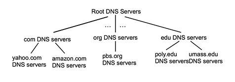
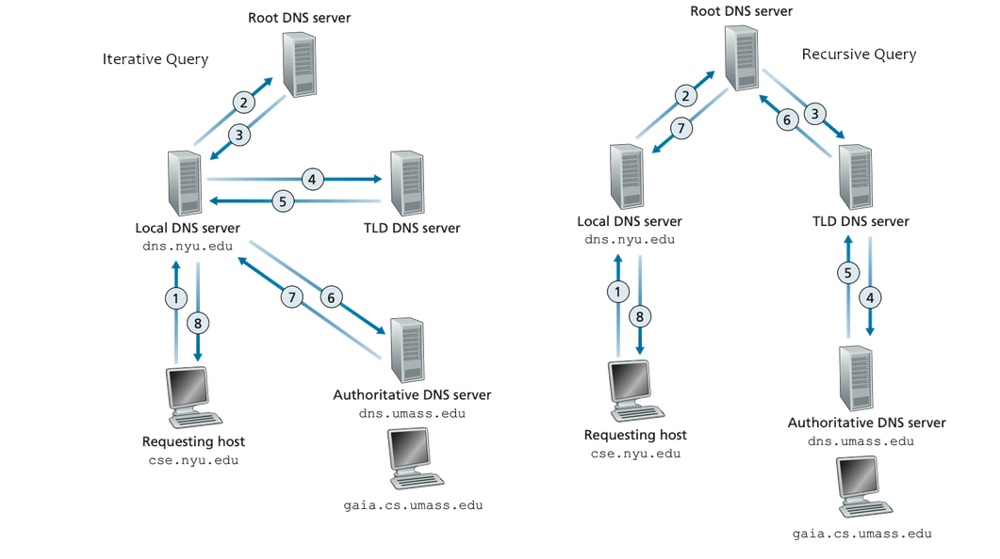

# Network 1

> [xx] = out of scope

## 5 LAYER MODEL / TCP/IP / INTERNET PROTOCOL STACK (BY HEART)

> (exam question ex draw the model and the deep dive into one protocol)

### Top down approach

#### LAYER 5: Application layer

(protocols: HTTPS=443, DNS=53, SMTP=25, FTP=20/21, HTTP=80, SSH=22, NTP=123, DHCP=67/68) -BY HEART

#### LAYER 4: Transport layer

(protocols: TCP: in order,connection oriented (3 way handshake), congestion control, reliable (=no loss), flow control, sequecing; UDP: reverse TCP but FASTER, + EFFICIENT,LIGHTER)

#### LAYER 3: Network layer

(protocols: IPv4, IPv6, ICMP (for pinging fx.))[OSPF, RIP, BGP, ISPS]

#### Layer 2: DataLink (D-Link) Layer

(WiFi 802.11.x, EtherNet 802.3.x, ARP, bluetooth)

#### LAYER 1: Physical Layer

[cables, fiber etc out of scope]

### ENCAPSULATION (BY HEART)

- LAYER 5 -> message = Headers in payload (in Layer 5)
- LAYER 4 -> segment => message + protocol header from layer above etc (H + M)
- LAYER 3 -> Datagram (router) (H + H + M)
- LAYER 2 -> Frame (switch) (H + H + H + M)
- LAYER 1 -> Bits and Bytes (H + H + H + H + M)

DNS, DHCP runs over UDP
IPv4, IPv6
ICMP
Wifi
Ethernet
are **unreliable**

HTTP, DNS, DHCP, UDP, IPv4, IPv6, ICMP, Ethernet, ARP ==> **THE MOST IMPORTANT ONES!**

## PROTOCOLS:

Def: Set of rules/standards/states for how 2 differents packets can intercat with each other. How do we communicate with each other? We have a lot of different ones, for different needs : security, performance, basic stuff, specifics needs and levels of communication. (ex, 5 layer levels). No need to guess - only rules to follow.

ISO has made OSI model
with 2 extra layers (the theoretical model)
app > pres > session > transport > network > link > physical

pres -> allow apps to interpret meaning of data (encryption, compression etc)

session -> sync, checkpointing, recovery

> IS IN APP LAYER - developer implements them there if needed

## APP LAYER

many are raw ascii - sometimes binary

typically request/response -
sometimes, one way

the protocols define, the type of message, the message syntax, the semantics, the rules.

### Open vs proprietary protocols

- Open protocols: defined in RFC (ex HTTP, SMTP) -> allow interoperability
- Proprietary protocol ex Skype, exchange

RFC number -> see how to build http to be compatible, it is the definition fo the protocol.
Request For Comments

### HTTP protocol

HTTP is by default stateless, the sever doesnt keep data from past client requests. Every requets is independant from other requests.

HTTP has client server architetcture
client sends request server sends response.

Uses TCP because we want reliable transport.

We looked at HTTP 1.0 and HTTP 1.1.

Runs on 80 on TCP.

#### Cookies

Cookies - Persistant, they are stored in the browser and stay there even if you close the browser.

Session cookies - when you close the session, they disappear (non-persistant)

Local host/ local cookies - another kind 

#### Connections

Persistent vs non-persistant

##### Non persistant

Only one object sent, then connection closed. (HTTP 1.0)

##### Persistant

Multiple objects can ben sent over a single TCP connection. Connection is closed after timeout (HTTP 1.1)

#### Request message


ASCII text

1. Request line (obligatory)
   - method (GET, POST, PUT, DELETE commands) space Resource (ex. /index.html) space Version that I support (ex. HTTP/1.1) (client) (stop line) \r\n and one stop line again to stop the request
2. header lines (some of them are not obligatory depending on the version)
   - Host: ek.dk (is obligatory for HTTP1.1 - not HTTP 1.0)
3. carriage return and line feed at start of line = end of header lines


#### Response message


Alle headers er optional

HTTP/1.1 200 OK \r\n\r\n

#### STATUS CODES

- 2xx -> ok
- 3xx -> moved
- 4xx -> client error
- 5xx -> server error

EXERCISE
Trying out HTTP (client side) for yourself

1. Telnet to a web server:
   telnet www.kallas.dk 80
1. Type in a GET HTTP request:
   GET /index.html HTTP/1.1
   Host: www.kallas.dk
1. Look at response message sent by HTTP server (use WireShark to look at captured HTTP
   request/response)
1. Try to change the version to 1.0
   What happens?
1. In kali you can also enter:
   ○ echo "GET / HTTP/1.1\r\nHost: www.kallas.dk\r\n\r\n" | nc www.kallas.dk 80

---

1.

```
─(kali㉿kali)-[~]
└─$ telnet www.kallas.dk 80
Trying 165.232.77.195...
Connected to www.kallas.dk.
Escape character is '^]'.

>GET /index.html HTTP/1.1
>Host: www.kallas.dk

HTTP/1.1 200 OK
Date: Tue, 27 Jan 2026 10:09:00 GMT
Server: Apache/2.4.41 (Ubuntu)
Last-Modified: Wed, 26 Aug 2020 19:57:36 GMT
ETag: "12-5adcd3b36cd16"
Accept-Ranges: bytes
Content-Length: 18
Content-Type: text/html

Here goes nothing
Connection closed by foreign host.
```

2.

```
┌──(kali㉿kali)-[~]
└─$ telnet www.kallas.dk 80
Trying 165.232.77.195...
Connected to www.kallas.dk.
Escape character is '^]'.
> GET /index.html HTTP/1.0
> Host: www.kallas.dk

HTTP/1.1 200 OK
Date: Tue, 27 Jan 2026 10:20:25 GMT
Server: Apache/2.4.41 (Ubuntu)
Last-Modified: Wed, 26 Aug 2020 19:57:36 GMT
ETag: "12-5adcd3b36cd16"
Accept-Ranges: bytes
Content-Length: 18
Connection: close
Content-Type: text/html

Here goes nothing
Connection closed by foreign host.

```

3.

```
──(kali㉿kali)-[~]
└─$ echo "GET / HTTP/1.1\r\nHost: www.kallas.dk\r\n\r\n" | nc www.kallas.dk 80
HTTP/1.1 200 OK
Date: Tue, 27 Jan 2026 10:22:34 GMT
Server: Apache/2.4.41 (Ubuntu)
Last-Modified: Wed, 26 Aug 2020 19:57:36 GMT
ETag: "12-5adcd3b36cd16"
Accept-Ranges: bytes
Content-Length: 18
Content-Type: text/html

Here goes nothing
```

With _netcat_ (nc) you need to add the \n\r on every line, _telnet_ doesnt need it

This is an emulation of how a browser sends a request

---

### DNS protocol

Domain Name System

Translate a name to an address

Runs on port 53 on UDP and sometimes TCP. (Good tip: double check if a tcp runs on port 53, what kind of request it is)



#### Levels

1.  Root DNS server
    First one to ask for translation, then next level etc.
2.  Top level domain (TLD) DNS servers
3.  Authoritative DNS servers

##### Root DNS server

13 root dns servers
Backbone of internet

##### Top level domain (TLD)

is the endpoint (.com, .org etc)

##### Authoritative

the server that translates the specific name to an address (ip address)

non authoritative = the address is cached somewhere an you get that answer

#### Local name server

parallel, intern

### 2 ways to make a request



A request is a query and an answer.

#### Iterative (if recursive not supported, fallback)

local -> root -> tld -> autho

#### Recursive (primary way)

local -> root (recursive?) You can ask for me, give caching ability (asks on its own to TLD and autho that caches responses in turn).
Is more efficient.

#### Nslookup and dig

These are tools to make a dns lookup.

```
- nslookup > www.kallas.dk (recursive)
- nslookup > set norecurse > www.kallas.dk (not recursive response)
```

### DNS records

#### Type A

name is hostname, the domain of the IPv4
value is IPv4

#### Type AAAA

domain od IPv6

#### Type CNAME (canonical name) - subdomain

name is alias for real name
value is canonical name

```
nslookup > www.kallas.dk = non authoritative answers
```

#### Type NS

name is domain (ex. foo.com)
value is hostname of authoritative name server for this domain

```
nslookup > set type=NS > www.kallas.dk = authoritative answers

server origin
```

! remember to set the type back

#### Type MX

Value is canonical name of mail server associated with alias naem as in name

Access a mail server - port 25

### SMTP (Simple Mail Transfer Protocol)

Mail sending protocols, is a push protocol. Not based on response but more on communication.

3 major components:
1. User agents 
2. Mail servers
3. SMTP

Uses TCP (to be reliable, you can't lose data). 

Is a direct transfer, sending server to receiving server.

3 phases of transfer:
1. handshaking (greeting)
2. transfer of messages
3. closure

Command/repsonse intercation (like HTTP). Commands arein ASCII and responses are status and code.

Binary data gets encoded to 7-bit ASCII. 

#### Example of interaction (looks like a conversation)

Sample SMTP interaction
S: 220 hamburger.edu
C: HELO crepes.fr
S: 250 Hello crepes.fr, pleased to meet you
C: MAIL FROM: <alice@crepes.fr>
S: 250 alice@crepes.fr... Sender ok
C: RCPT TO: <bob@hamburger.edu>
S: 250 bob@hamburger.edu ... Recipient ok
C: DATA
S: 354 Enter mail, end with "." on a line by itself
C: Do you like ketchup?
C: How about pickles?
C: .
S: 250 Message accepted for delivery
C: QUIT
S: 221 hamburger.edu closing connection


## Transport Layer

### Processes communicating

Process: program running with a host. Within same host -> 2 processes communicate using inter-process communication (defined by OS, we dont do it ourselves). Processed in different hosts commuincate by exchnaging messages.

Do we use UDP or TCP when creating a new ntwork app? 

### Sockets
process sends/receives messages from and to its socket. (analogous to door)

To send a message you need identifiers : Ip address and port number.

Two socket types for two transport services:
● UDP: unreliable datagram
● TCP: reliable, byte stream-oriented

### multiplexing/demultiplexing


From source Ip you can see the diffenrece between the two. The dest port is another, 80 or 25 fx.
The source port and source IP. They must all be taken into account to find differences that make steh comm unique. demultiplexing is trying to make a diffenrece between the connections, to connect them to the right socket.

#### Demultiplexing


You represent packs by sepearting them in 32 bits in length and adding mor or less lines. 32 bits is not the size of the header, just the width of the representation. As a minimum its 32 bits.

1 byte is 8 bit, so its 4 bytes.
- 1 bit -> a char. Has 2 parts (4 bits each - called a nible, nyble)
- 16 bis -> a short or word. 
- 32 bits -> d-word (double word) or long
- 64 bits -> q-word (quad word)

ASCII is up to 255bits.

We usually count things in D-word.

4 things to id a connection:

How demultiplexing works:
● host receives IP datagrams
   ○ each datagram has source IP address,
destination IP address
   ○ each datagram carries one transport-layer
segment
   ○ each segment has source, destination port
number
● host uses IP addresses & port numbers to direct
segment to appropriate socket

### TCP

- Connection oriented. you need a connection before sending data.
- Full duplex - both parts can send messages when they want.
- Point to point, one sender one receiver.
- TCP is not secure, as default. It is reliable- all data is sent, no loss.
- Has congestion and flow control mechanisms. 
   - flow is securing no overloading for receiver.
   - congestion the sender decides itsself how many packets to send based on errors received. 
- To make it secure, use TLS and TCP.

Provides RELIABLE, IN ORDER byte-stream transfer ("pipe") between LCIENT and SERVER.

client MUSt contact server - server process must run, server must have created a socket ( a new one per connection with the 4 elements (the 4 elements also called a process))

client ocntacts server by creating a socket, [ting TCP socket, specifying IP address, port number of server process
● when client creates socket: client TCP establishes connection to server TCP
● when contacted by client, server TCP creates new socket to communicate with that
particular client.
○ allows server to talk with multiple clients
○ source port numbers used to distinguish clients]

#### TCP handshake 

to explain make a ladder diagram 


syn -> syn/ack -> ack

#### tcp segment structure


source port = sender port number, max size is 16 bits (binary so you : 2^16 so you can have a number between 0 and ish 65 535, some of them are reserved). because max width is 32 bits. - OS tries to find the first availbale port, but usually teh higher numbers.

dest port = the port you wish to connect to, the servie/process you want to connect to. 80, 25 etc.

This is the first request - the syn =1, the identifiers.

The sequence number = random number, between 0 and 4 billions something (2^32) -> to see how far we are in the communication and be sure to put the packets in the right order.

acknowledgment number is the sequence number + something - server acknowledges my number and gives me something related back. IS NOT SYN NOR ACK.

Header len, can variate, so we send the length min 20 bytes, so min 5 d-words = the lines for the header (in this -> 5 lines).

Something not used in TCP 

Then flags -> S is for syn (synschronize), A is for ack (acknoledge), F is for fin.
Syn is only used to connect, not after. Fin is only used to close the connection. Indicate what we want to do with the packet.
R is reset - ungraceful teardown of connection, brute closing it. Use it if you get a state error and nothing more can happen, need to reset the conneciton, error you cant recover from. U is for urgent. P is for push, used fx in telnet. Used for segmentation , data too big for one packet, then make multiple packets and in the last one, send a P to say, this is one thing.

Receive window (header still) - indicate how many packets i can and want to receive as a response. (FLOW CONTROL here) - cannot and will not receive more than this until after ive aknowledged the data first. Cannot be bigger than 2^16.

Checksum, simple calculation to se eif there is an error with the packet. Not really bulletproof, the calculation is too basic.

Urg data pointer, not used a lot.

Options - variable length, now we can precise some more things.


### UDP

unreliable transfer of groups of bytes (datagrams) between client and server. 

connectionless - no connection betweem client and server, no handshaking before sending data, sender attacheks dest IP + port num to each pckets explicitely
receiver then extratcs sender ip and port from packet.

unreliable, the data may be lost of received out of order.
faster, lightweight. DNS uses UDP, or live stuff ex live broadcast - needs to be fast and is ok if you lose some data. more interested in getting updates than all lost data fx.

#### udp segemnt header


Mandatory assignment part 1 is individual - at leats 30, upload code to fronter - allowed to do toether, but hand in alone.
python files to dl and import them and do the exercises one at a time.
look at slides - all explained in tutorial.

Mandatory part 2 is group - 
xcel file on teams to make groups (check tcp server and make it to a web server instead) - no libraries, regex is okay and stuff.
task description file is on fronter in resources / mandatory.