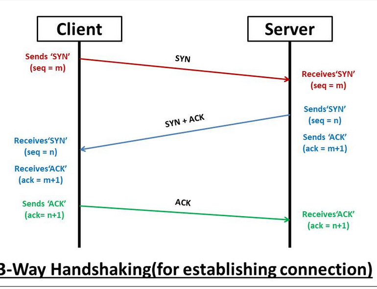
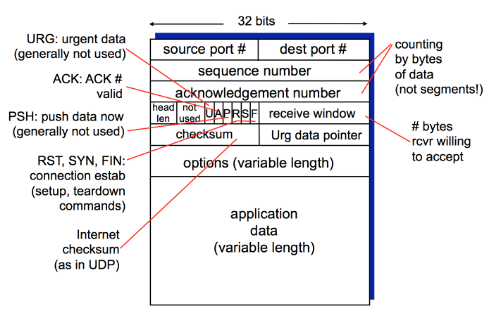
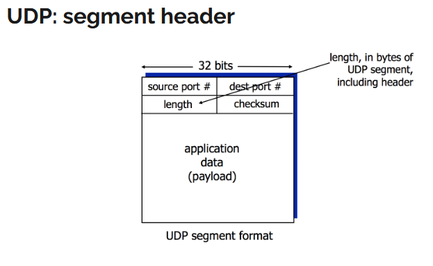

# Network 2
## Transport Layer

### Processes communicating

Process: program running with a host. Within same host -> 2 processes communicate using inter-process communication (defined by OS, we dont do it ourselves). Processed in different hosts commuincate by exchnaging messages.

Do we use UDP or TCP when creating a new ntwork app? 

### Sockets
process sends/receives messages from and to its socket. (analogous to door)

To send a message you need identifiers : Ip address and port number.

Two socket types for two transport services:
● UDP: unreliable datagram
● TCP: reliable, byte stream-oriented

### multiplexing/demultiplexing

From source Ip you can see the diffenrece between the two. The dest port is another, 80 or 25 fx.
The source port and source IP. They must all be taken into account to find differences that make steh comm unique. demultiplexing is trying to make a diffenrece between the connections, to connect them to the right socket.

#### Demultiplexing

You represent packs by sepearting them in 32 bits in length and adding mor or less lines. 32 bits is not the size of the header, just the width of the representation. As a minimum its 32 bits.

1 byte is 8 bit, so its 4 bytes.
- 1 bit -> a char. Has 2 parts (4 bits each - called a nible, nyble)
- 16 bis -> a short or word. 
- 32 bits -> d-word (double word) or long
- 64 bits -> q-word (quad word)

ASCII is up to 255bits.

We usually count things in D-word.

4 things to id a connection:

How demultiplexing works:
● host receives IP datagrams
   ○ each datagram has source IP address,
destination IP address
   ○ each datagram carries one transport-layer
segment
   ○ each segment has source, destination port
number
● host uses IP addresses & port numbers to direct
segment to appropriate socket

### TCP

- Connection oriented. you need a connection before sending data.
- Full duplex - both parts can send messages when they want.
- Point to point, one sender one receiver.
- TCP is not secure, as default. It is reliable- all data is sent, no loss.
- Has congestion and flow control mechanisms. 
   - flow is securing no overloading for receiver.
   - congestion the sender decides itsself how many packets to send based on errors received. 
- To make it secure, use TLS and TCP.

Provides RELIABLE, IN ORDER byte-stream transfer ("pipe") between LCIENT and SERVER.

client MUSt contact server - server process must run, server must have created a socket ( a new one per connection with the 4 elements (the 4 elements also called a process))

client ocntacts server by creating a socket, [ting TCP socket, specifying IP address, port number of server process
● when client creates socket: client TCP establishes connection to server TCP
● when contacted by client, server TCP creates new socket to communicate with that
particular client.
○ allows server to talk with multiple clients
○ source port numbers used to distinguish clients]

#### TCP handshake 

to explain make a ladder diagram 

syn -> syn/ack -> ack

#### tcp segment structure

source port = sender port number, max size is 16 bits (binary so you : 2^16 so you can have a number between 0 and ish 65 535, some of them are reserved). because max width is 32 bits. - OS tries to find the first availbale port, but usually teh higher numbers.

dest port = the port you wish to connect to, the servie/process you want to connect to. 80, 25 etc.

This is the first request - the syn =1, the identifiers.

The sequence number = random number, between 0 and 4 billions something (2^32) -> to see how far we are in the communication and be sure to put the packets in the right order.

acknowledgment number is the sequence number + something - server acknowledges my number and gives me something related back. IS NOT SYN NOR ACK.

Header len, can variate, so we send the length min 20 bytes, so min 5 d-words = the lines for the header (in this -> 5 lines).

Something not used in TCP 

Then flags -> S is for syn (synschronize), A is for ack (acknoledge), F is for fin.
Syn is only used to connect, not after. Fin is only used to close the connection. Indicate what we want to do with the packet.
R is reset - ungraceful teardown of connection, brute closing it. Use it if you get a state error and nothing more can happen, need to reset the conneciton, error you cant recover from. U is for urgent. P is for push, used fx in telnet. Used for segmentation , data too big for one packet, then make multiple packets and in the last one, send a P to say, this is one thing.

Receive window (header still) - indicate how many packets i can and want to receive as a response. (FLOW CONTROL here) - cannot and will not receive more than this until after ive aknowledged the data first. Cannot be bigger than 2^16.

Checksum, simple calculation to se eif there is an error with the packet. Not really bulletproof, the calculation is too basic.

Urg data pointer, not used a lot.

Options - variable length, now we can precise some more things.

Max segemtn size tcp 1460 (tcp header 20 and something else 20 and magic number is 1500 (max transport unit) so together 1460)

### UDP

unreliable transfer of groups of bytes (datagrams) between client and server. 

connectionless - no connection betweem client and server, no handshaking before sending data, sender attacheks dest IP + port num to each pckets explicitely
receiver then extratcs sender ip and port from packet.

unreliable, the data may be lost of received out of order.
faster, lightweight. DNS uses UDP, or live stuff ex live broadcast - needs to be fast and is ok if you lose some data. more interested in getting updates than all lost data fx.

#### udp segemnt header

