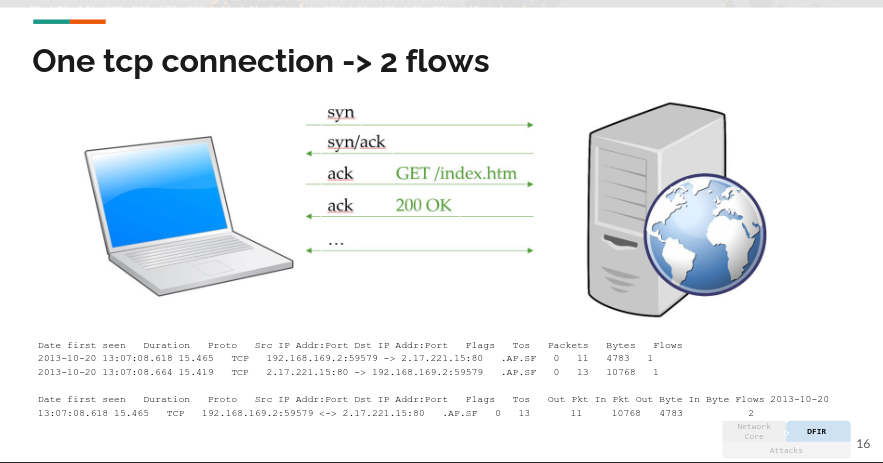

# Full Packet Capture and NetFlow

## Traffic capture

### Traffic capturing options
Full traffic capture = dumping all traffic
Session data = only info about the traffic
Packet strings = app level headers

### Full Packet Capture

Takes a lot of space + privacy issues.
This is what Wireshark does for us. In linux you can also use tcpdump for capturing traffic:

> tcpdump -i eth0 -w dmp.pcap

### How to actually collect data
- Hardware taps (passive (no memory -> just copieds/transfers bits)/active (stores and copies traffic + higher  speed))
    - pros: can be scaled for need
    - cons: can be very expensive for high speed
- Mirroring the port on the switch (SPAN)
    - pros: available if the switch supports it. no dowtime.
    - cons: can be a problem if collecting more data than the port speed

### Tools

- tcpdump (BFP)
- capinfos
- editcap
- tshark

## Tools

### tcpdump

Is a tool for capturing and displaying traffic. You call it:
> sudo tcpdump

You can use Berkeley Packet Filter (BPF) syntax for specifying filters:
- Type: **host, net, port, portrange** (ex: “host foo”, “net 128.3”, “port 20”, “portrange 6000-6008”. If there is no type qualifier, host is assumed.)

- Dir: **src, dst, src or dst and src and dst** (ex: “src foo”, “dst net 128.3”, “src or dst
port ftp-data”. If there is no dir qualifier, src or dst is assumed.)

- Proto: **ether, wlan, ip, ip6, arp, tcp, udp**(and some other ex: “ether src foo”, “arp net 128.3”, “tcp port 21”, “udp portrange 7000-7009”)

#### Exercise:

tcpdump -examples
The following will capture all the traffic from/to kallas.dk

> sudo tcpdump host kallas.dk

We can be a bit more specific and only capture http traffic:

> sudo tcpdump tcp port 80 and host kallas.dk

We can make it more specific by only capturing the requests to kallas.dk:

> sudo tcpdump tcp port 80 and dst host kallas.dk

**If you don't see the checksums, how do show it?**
add -v or -vv flag to tcpdump (verbose mode).

**Why are some of the tcp checksums incorrect?**
because the checksum are calculated after they get captured (by nic)

(Claude says: 
This is almost always due to checksum offloading — a performance feature where the OS delegates checksum calculation to the network card (NIC) rather than doing it in software. tcpdump captures the packet before it reaches the NIC, so it sees the packet before the checksum has been filled in, making it appear incorrect. It's not actually an error on the network — the NIC fills it in correctly before sending.)

**How do we make disable name/port autoresolution?**
sudo tcpdump -n host kallas.dk

-n disabbles hostname and port name resolution
You get raw IP and port numbers instead of alias. 
-nn to be extra explicit.

**How would you capture the dns requests/responses?**

specify the port you want to look at and capture on, so dns is port 53.

#### More cool tcpdump stuff

You can dump the whole packet with verbose output (-vv):

> sudo tcpdump -vv tcp port 80 and dst host kallas.dk

You can after that do a grep on the data you would like to extract (let’s grab the browser):

> sudo tcpdump -vv host kallas.dk | grep 'User-Agent:'

To write a tcpdump to a file, you need to provide the -w option:

> sudo tcpdump -w testfile.pcap

You can the open this file in wireshark:

> wireshark testfile.pcap

Or you can open it in tcpdump itself with -r option , filter through the file:

> sudo tcpdump -vvr testfile.pcap

It can also be used to create new pcap files with filters applied to it:

> sudo tcpdump -r testfile.pcap -w testfile2.pcap 'tcp port 80'

### capinfos
Pcap files contain more than just the packets. With capinfos, you get some of the metadata of the capture file - not the connections, just the file.

> capinfos file.pcap

### editcap
Can make very large pcap file more manageable by splitting them up in smaller files.
youc an do it based on number of packets and based on dates.

Split the pcap file into files of 1000 packets.
> editcap -c 1000 cap.pcapng cap1000

Split based on spec date:
> editcap -B "2017-09-03 18:26:51" cap.pcapng cap2.pcapng

### tshark

Just like wireshark, but more scalable + better for repetitive jobs.

can read a file using -r:
> tshark -r file.pcap | head

you can apply wireshark filters with -Y:
> tshark -r file.pcap -Y 'tcp.flags.ack==1 && tcp.flags.syn==1' | head

so for dns fx:
tshark -r cap.pcapng -Y 'dns.qry.name==demo.testfire.net'

And if you only need the amswers out with -T:
> tshark -r cap.pcapng -Y 'dns.qry.name==demo.testfire.net && dns.a' -T fields -e dns.a

tshark exercise:

You can use the option -G to see the field names that you can apply in your display filter.

tshark -G | head

1. Let’s use the option -G and display all field names related to http, together with only their description
(use what you learned from last time as well)
ajp13.method HTTP Method
ajp13.rmsg HTTP Status Message

> tshark -G fields | awk -F'\t' '$3 ~ /^http\./' | cut -f2,3

...

Run the following on the file f5-honeypot-release.pcap:

1. Have tshark return the number of responses with any other status code than 200. (use what you learned
from last time as well)
27512 or 27516

> tshark -r f5-honeypot-release.pcap -Y "http.response.code and http.response.code != 200" | wc -l

'''

Run the following on the file cap.pcapng:

1. Now lets list all the uniq servers (http.server) that you see in the capture
ebay server
lighttpd/1.4.28
Microsoft-IIS/8.0
ocsp_responder

> tshark -r cap.pcapng -Y "http.server" -T fields -e http.server | sort -u

## NetFlow

- Unidirectional
- 2 flows
- Aggregated metadata (for the individual connection)
- Pros:
    - very fast
    - takes up only about 0,01% of traffic capture
    - encrypted traffic looks like the unencrypted
    - very efficient for detecting anomalies in traffic patterns (detect patterns faster)
- Cons:
    - does not provide the traffic

## Full cap vs netflow compromise

Combining full packet capp with netflow data can be considered an optimal solution.

F.ex: Rotating Full packet capture after 1 week and netflow data after 365 days

Setting up netflow sensors on all routers, but only for full packet capture on critical segments.

### COnponents needed

#### Fprobe (gen)
this is the exporter that generates the netflow updates (mkes the session, collects it and sends it)

#### Nfcapd (keep)
This is the collector that cacpets the updates fromt he exporter (take the collections, ennriches them and keeps them)

#### Nfdump (dump)
The analysis tool that enables up to query the netflow data

