# Network Segmentation and Firewalls

## Why apply subnetting?
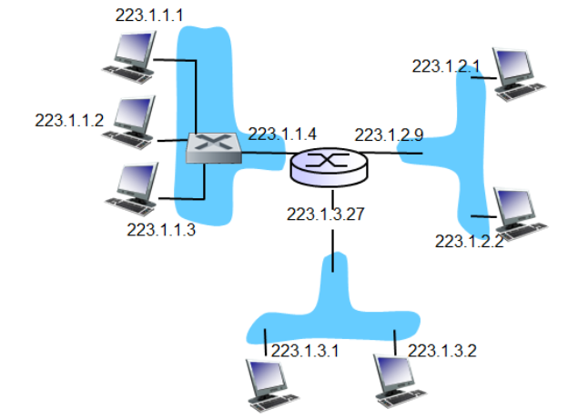
How many networks?
3 - but we are missing the subnet mask to know for sure.

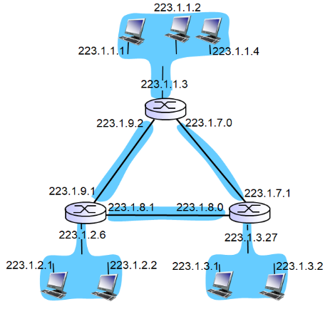
How many subnets?
6 - but we dont have the submask to knwo for sure.

Subnets and segmentations are different sizes and are different.

**Subnetting** is divising the network into shared networks to minimize collision domain and broadcast domain.

in 192.168.0.0/24 :

- 192.168.0 is network
- .0 is host (0-255), 0 is unusable because it the network name, 255 is unsuabled because its the broadcast address, so we have 254 "free" addresses.

**Segmentation** is [...]

### Exercise

Private subnets
What are private subnets?
 - Subnets that can't be accessed by the internet.
 Keep your resources shielded from direct internet access. This is ideal for components that manage sensitive data or services not meant for direct user interaction, such as databases.

Classes: A.B.C.D/x
Describe each of the following ranges (what are they used for, what is the subnetmask, and how
many addresses do they each contain):

**The three "true" private ranges (RFC 1918):**
Private network IPs

You need to use NAT to communicate to the world, they arent accessible by internet.

The submasks cited under are the maximum, you can always make them smaller, but you can't make them bigger.
ex. if /8, cant have submask /4, but can have /16, /24 etc.

● 10.0.0.0/8

    Used for: Large enterprise network; one big flat private space
    Subnet mask: 255.0.0.0
    Addresses: 2^(32-8) = 2^24 = 16,777,216

● 172.16.0.0/12

    Used for: Medium-sized networks (less common, but valid private range)
    Subnet mask: 255.240.0.0 ← this one is awkward because /12 doesn't fall on a clean byte boundary
    Addresses: 2^(32-12) = 2^20 = 1,048,576

● 192.168.0.0/16

    Used for: Home routers and small office networks (your WiFi at home is almost certainly a /24 inside this range)
    Subnet mask: 255.255.0.0
    Addresses: 2^(32-16) = 2^16 = 65,536

**The special-purpose ranges:**
● 127.0.0.0/8 — Loopback

    Used for: Talking to yourself — 127.0.0.1 is "localhost". The packet never leaves your machine. Used for testing local services.
    Subnet mask: 255.0.0.0
    Addresses: 2^24 = 16,777,216 (though only 127.0.0.1 is practically used)

    Why so many when its your own machine you talk to? If you want to run services on same port, you can use a dif addr. and ruun booth/all of services on same port without problem. /8 is a convention, /24 is enough in almost all scenarios, but /8 is good enough. 

● 169.254.0.0/16 — Link-local / APIPA / Zero-config

    Used for: Automatic fallback when DHCP fails. If your computer can't get an IP from a DHCP server, it self-assigns a 169.254.x.x address. A classic sign something is wrong with your network config.
    Subnet mask: 255.255.0.0
    Addresses: 2^16 = 65,536

● 198.18.0.0/15 — Benchmark testing

    Used for: Controlled performance/load testing between two devices. Keeps test traffic from leaking into real networks.
    Subnet mask: 255.254.0.0 ← /15, so also not on a clean byte
    Addresses: 2^(32-15) = 2^17 = 131,072

● 240.0.0.0/4 — Reserved (Class E)

    Used for: Officially "reserved for future use" / experimental. Not routed anywhere in practice. You'll never see this in the wild.
    Subnet mask: 240.0.0.0
    Addresses: 2^(32-4) = 2^28 = 268,435,456

## Firewall types

- prevent denial of service attackks:
    - SYN flooding : attacker establishes nmany bbogus conns., no resources left for "real" connectipns
- prevent illegal mods/access of internal data
- allow only auuthorized access to insiide network
    - set of authen. users/hosts
- 3 types of firewalls:
    - Stateless packet fileters (not used in todays world)
    - stateful packet filters (mosty used today, operates in layers 2-4)
    - netxt-gen firewall (operates in layer 5, can much more than stateful )

### Stateless packet filtering

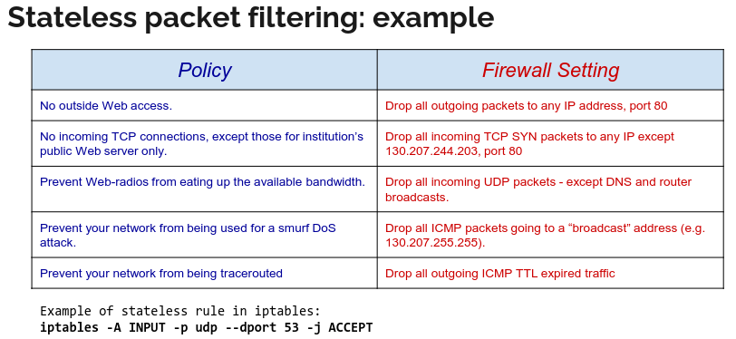

Internal network connected to Internet via Router firewallRouter filters packet-by-packet, decision to forward or drop packet based on:
- src ip addrs/dets IP
- TCP/UDP src and dest port num
- ICMP msg typep
- TCP SYN and ACK bits

Not used often, replaced by stateful.

Access control list, rules implemented on router (network layer), tells which IP is allowed to get in etc. So stateless is used for ACL.

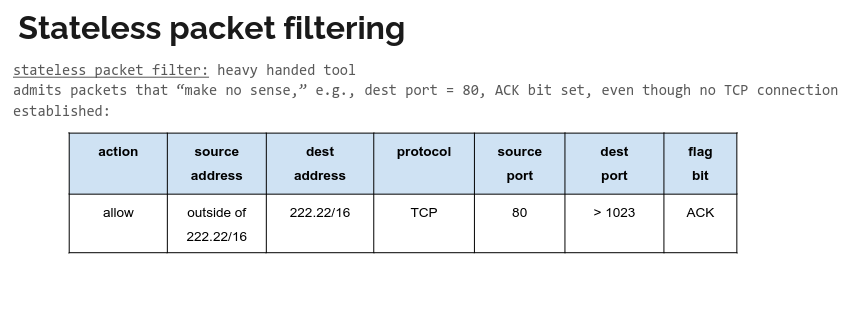

Make generic rules to implement everywhere.

When we haev a match on all columns values, we give the action - in this case "allow".

### Stateful packet filtering
- Tracks the status of every TCP connection
- Tracks connection setup (SYN), teardown (FIN): determine whether incoming or outgoing packets "mamkes sense"
- Timeout inactive conns at firewall : no longer admit packets

Example of stateful rule in iptables:
iptables -A INPUT -m conntrack --ctstate RELATED,ESTABLISHED -j ACCEPT

States can be :
    - NEW:
        teh packet has started a new conn, or otherwise associtaed with a connection which has not seen packets in  both directions. WHOLELY new.
    - ESTABLISHED:
        the packet is associated with a conn which has seen packets in n´both directions
    - RELATED:
        the packet is starting a new conn, but is associated with existung connection, such as FTP (has 2 ports, so port 20 opens up port 21 automatically fx) or ICMP error

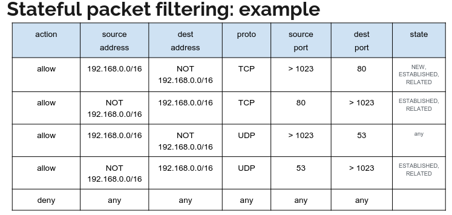
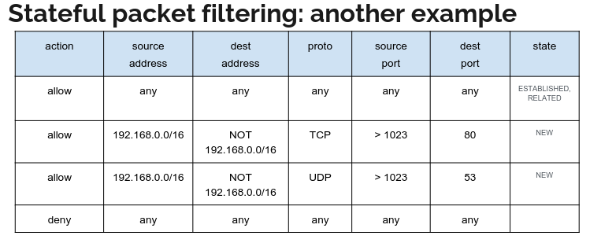

## Network Segmentation

- We divide the exposed areas into smaller sections
- If certain parts are exploited, the rest is still protected
- Gives better transparency and makes network more manageable.

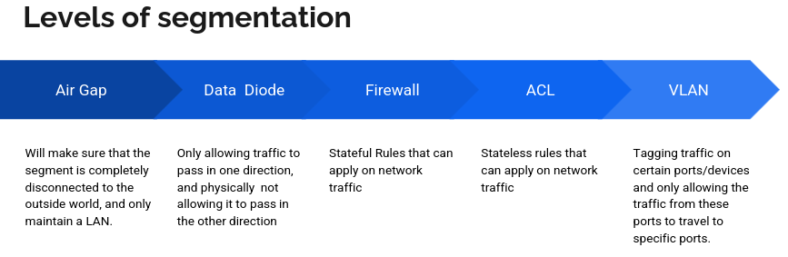

From most extreme to softest.

### Air Gap
Makes sure that the segment iis completely disconnected to the outside world, and only maintain a LAN. Make a segemnt airtight.

### Data Diode
Only allows traffic to pass in one direction, and physically not allows it to pass in the other direction

(The 3 levels we are looking at for mandatory 1:)

### Firewall (Layer 3-4)
Stateful Rules that can apply on network traffic

### ACL (Layer 3, Stateless rules to implement on routers)
Stateless rules that can apply on network traffic

### VLAN (datalink layer)
Tagging traffic on certain ports/devices and only allowing the traffic from these ports to travel to spec ports.

When we segemnt we also look at:

#### DMZ
Demilitarized Zone
 A spot in the network behind the firewall where there is some protection, but some internal resources are still available to the inside/outside world.

**Two ways of repreenting DMZ:**

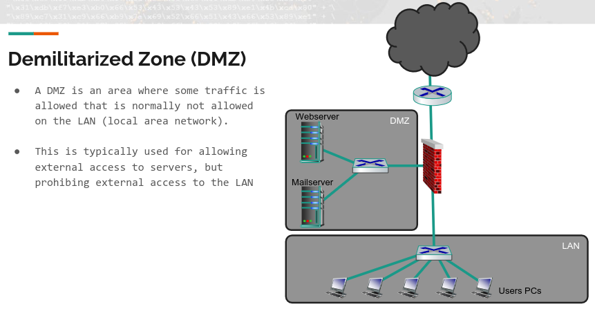
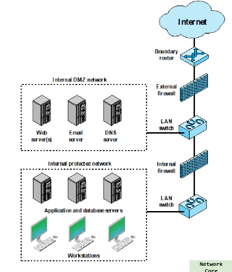

A location on the network where we have more breathing room- less protection.
So some traffic normally not allowed on LAN, is allowed there.
Typically used for externnal NEW connection to access servers.

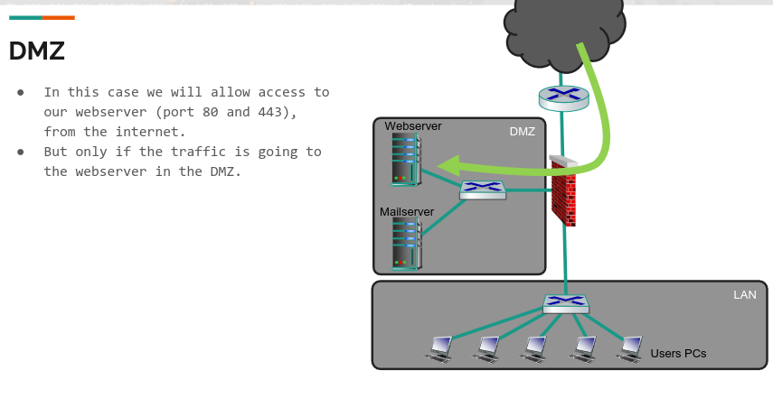

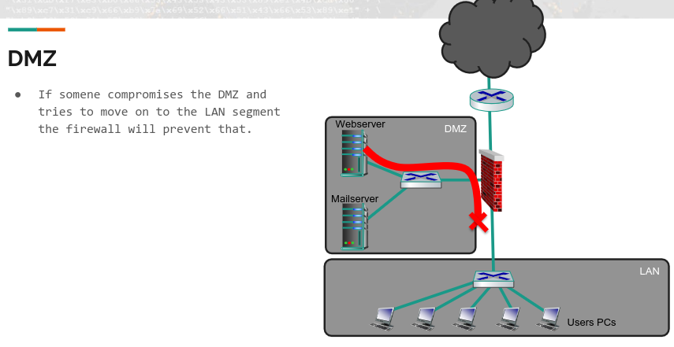
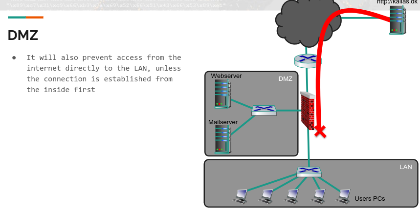

If someone compromises the DMZ and tries to movce on to the LAN segemnt, the firewall will prevent that.

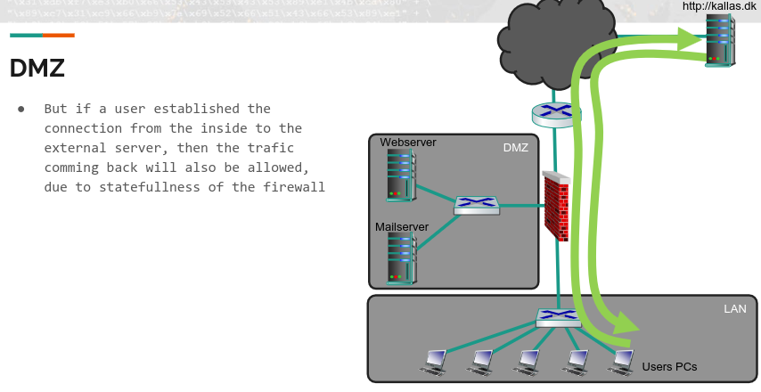

But if user establishes conn. from iinside of external server, then traffic coming back will also be allowed, due to statefullness of firewall.

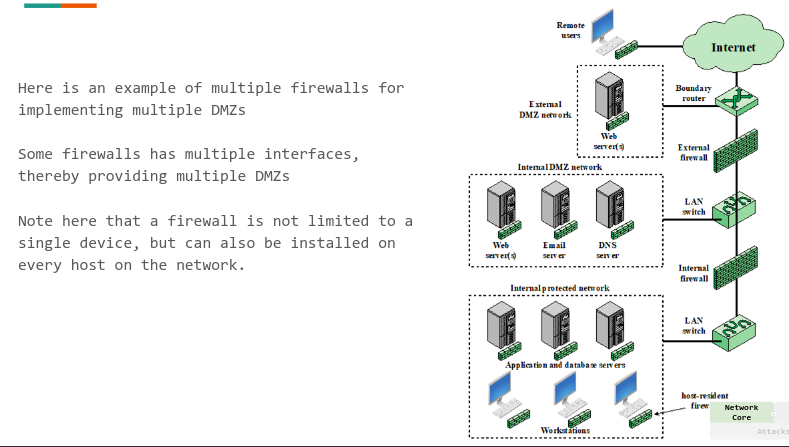

#### VPN into a network
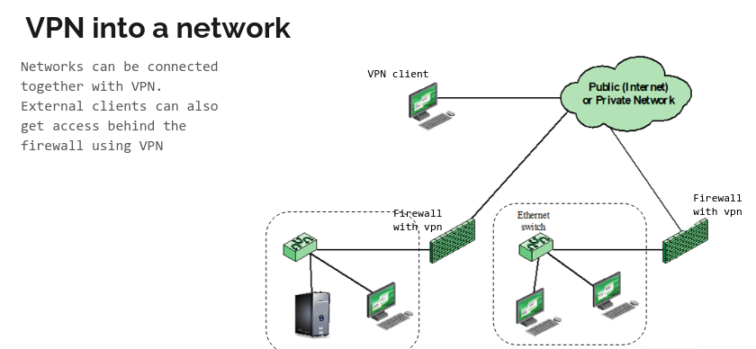

## Trad approach
Traditionally firewall are used to protect teh network in a perimeter. Separating between trusted and untrusted perimeter. Once inside the tristed perimeter, traffic flow freely. (This approach when doing mandatory).

You need inherent trust for this approach, there we also have ZT approach, Zero trust approach.

## Zero Trust Architecture

Is newer.

- Is a paradigm, we do not inherit trust.
- We do not operate in trusted and untrusted "spheres". NONE are inherently trusted, nor implied trusted and must gain trust by some mean.
- This goes for Users, Systems and Devices.
- In ZT, trust is not a matter of setup on devices/HW, but going through all the systems.
- This approach is fairly new, and not implemented fully everywhere yet, nor is the terminology (in books fx).

### Key components
- User/system/device:
 - Authentication: encryption is key.
 - Authenticating trust: private certificates or PKI is the key to ensure trust and non repudiation
 - Minimizing trust: POLP
 - Authorization: ensuring that it is req based on identity and context.

In general, for all data we must ensure ENCRYPTION, INTEGRITY and NO REPLAY.

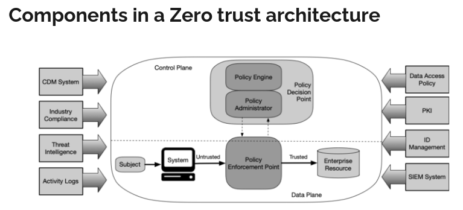

**Subject** is a User, system or device. Could be a combination of above.
**Policy Enforcement Point PEP** makes sure allows or denies access depending on PDP. Can also be seen as an app proxy.
**Policy Decision Point PDP** looks at subject and context of request to the resource. The policy engine makes a deciision based on the policies on "policy administrator" and can lso implement a "trust engine" that can aid the policy engine with a score.

Finally the deciisionn is based on inut from ID manage,ent, PKI, SIEM etc.
