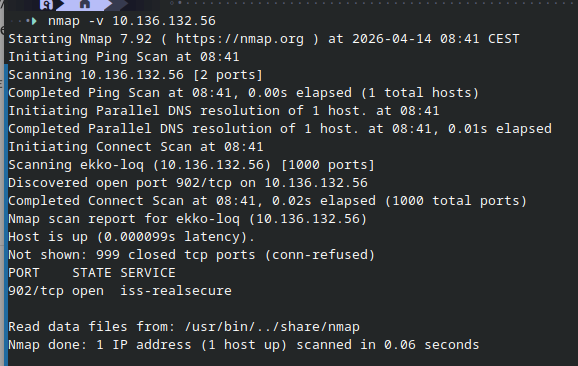

# Security in TCP/IP (NETCORE)

## nmap

- Scanner tool
- Can apply various approcahes for detecting open ports
- Uses the RFC 9293
- Can be detected by most ids and ips systems today 

- scans the first 1000 most used ports 

Journey: 
    - sends TCP request with SYN flag
    - Get syn/ack response from open ports 

    ON WIRESHARK to see open ports : tcp.flags.syn==1&&tcp.flags.ack==1

### nmap host discovery:
- some of the scanning modes are more aggressive than others
    - sudo nmap -vv -n -sn -T4 <IP>
        - vv = very verbose, n = no packet resolution, sn = ping scan - arp discovery, T4 = Time (the higher the number, the faster)
        - Wireshark : send who has and find the "is at" to see the ones open (filer = opcode 2) arp.opcode == 2
        - Is to detect if host is up or not
    - sudo nmap -vv -Pn -sT -A <IP> - target of open ip
        - Pn = No ping! , sT = full three way handshake to the machine (scan Transaction), A = aggressive
        - wireshark :
        - is to sniff host

The faster you scan, the more patterns and traces you leave - therefore the more chances of detection. On the other hand, the slowest you scan packets, the less traces and visible patterns you leave and therefore less chances of detection.

### ARP vs PIng to detect:

Ping uses ICMP protocol and is on network layer
arp in on datalink layer.

So to run arp, you have to been on same network as host. ICMP packs gets routed - you can scan out fo your own network.

Arp is less intrusive than ping, ergo less detectable, they usually run in the background. Whereas ping is something you have to actively do. Arp is never detected by ids and ips, its under the radar. So if possible, use arp, much less suspicious and malicious.

### nmap output to file 

nmap can write the output to a file
> sudo nmap -sn <IP> -oG ips.txt

You can now use grep and cut to process the output
> grep "Up" ips.txt | cut -d' ' f2 > ips_up.txt

Now you can use -iL to read from file
> nmap -sS -iL ips_up.txt

### nmap TCP scans

-sS and -sT dif?
- -sT is a full conection
- -sS is a half connection, we send a syn and get at syn/ack back and then reset, drop the last ack (stealth scan) - is stealth because most firewalls dont write a connection if its not full - but most ids will detect anyways. but really not stealthy anyways because pattern is : syn, syn/ac, reset instead of full 3 way handshake syn, syn/ack, ack.
nmap injects a syn in the driver - not the kernel-, an os cannot make a haslf connection on purpose. then the kernel receives the syn/ack and doesnt know here it comes from - then the kernel resets it immediately because it cannot know it. To avoid that, you can make a firewall rule tgat says that you dont send a reset packet.

How do we know if a firewall is tehre?
    - consider using -sA
    - a rst is sent back in case its open or closed
    - open: connection possible
    - closed: no service availabke
    - filtered firewall drops packet

Then the last packet doesnt come through, but the syn/ack just stays there and waits - which is an otehr way to detect attack - is another pattern to look out for.
You have to think abotu which flags you want to trigger.

## SYN flood

## scapy

## ARP poisoning

## SSLstrip/SSLsplit

## DNSspoof