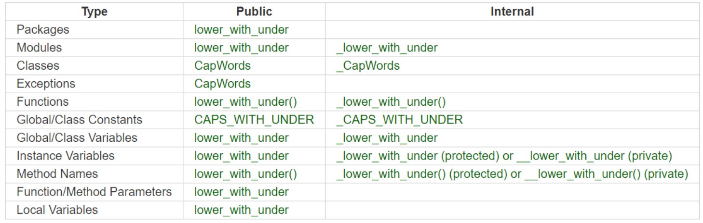
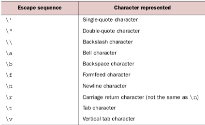
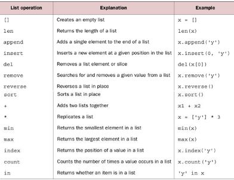

# Python

first line in python file to make it executable

#!/usr/bin/python3
#! = Shebang

remember to chmod +x file.name to make executable

kali - visual editor is gedit and interpretor is just write python3 -> write code directly to terminal
ctrl + l in interpretor for clean slate

Built in function can be called from python like
len(x) whereas a types own methods are called by x.append(x).

## Syntax

Indentation marks blocks of code
Comments with # or """ for multi line comment
importing with import
shorthand notaion -> multiple variables on on single line
input("") > makes the program stop and wait for terminal input

## Conventions

immutable = can not be changed in anyway
you can reference the immutable var but you cant change it

make math operations by the real way maths works - priorities etc

## Types

### String str

operators: in, + , \*

immutable

built in funcs: len, max, min, slice, split, upper, lower, title, find, startswith, endswith, replace, strip, encode

#### split

x = "emma-kiosk"
y = x.split("-")
y prints ["emma", "kiosk"], which is a list

split without identifier, will split on white space

to set together again:
y = ":".join(y)
y prints "emma:kiosk" a string

#### print

will make assumption tat you want a space between concateneated strings and also add a new line in the end
overwrite that by adding argument in the end

- print(x, y, sep=""), can also print(x, y, sep="-") etc
- print(x,y,end="") will skip the new line, can also print(x,y,end=" /over") or whater
- combined : print(x, y, end=" ", sep=" :: ")

#### find

x.find("a") returns index of first occurence
x.rfind dos the same but starts from the end (rear)
if occurenec doesnt exists - get a -1

#### index

x.index("q")
if doesnt exists return an error
x.rindex("q") liek before, from the rear

#### strip

strip() both rear and leading
rstrip() rear
lstrip() leading

#### raw string

x = r"C:\test\newfile.txt"
becaue then it doesnt react to the \n and \t

### Numbers

Float, int

5 / 2 gives a float
5 // 2 gives integer (doesnt round up -just trashs the decimals)
5 % 2 gives you the remainder
2 \*\* 3 powers up (go go power rangers)

### None None

empty value

### Boolean bool

for i in list(range(1, 11)) :
if i % 2 : print(f'{i} is uneven)

x = False
not x
y = True \* 2 # Booleans behave like the numbers 1 (True) and 0 (False)
Logical operators: [not] [or] [and]

### List

x = [1, 2, etc]

ikke immutable
ordered
can contain other types : strings, tuples, lists, dictionaries, functions, file objects and any type of number

x[0] # indexing from the front of the list
x[-1] # indexing from the back of the list
x[1:-1] # slicing from x[1] to x[-1], this last one not included
x[:3] # slicing from the beginning to x[3] excluded
x[-2:] # slicing from x[-2] to the end
x[::-1] revert list
x[::2] even elements in list

x = list(range(0,501,2)) - from 1 to 500 and only get even numbers

x[1:2:3]
1 is start index
2 is end index
3 is stepper

functions built in: len, max, min

methods built in : append, count, extend, insert, pop, remove, reverse, sort

sort doesnt change list, sorted changes list

#### operators:

in, +, \*

### Tuple

x = (1,etc)

used for data you dont want being changed ex, logs w/ ips and ports
ex:
x = (("192.168.0.1", 400), ("192.168.1.1", 500))

like list but immutable, is ordered

built in functions : len, max, min

methods: count, index

operators: in, +, \*

indexes and slice work the same as in lists - but cant add, replace or remove elements (immutable)

to make changes you can cast to a list and do whatever you want to do, and then make a tuple from it again.

### Dictionary

x = {"first": "one", 2: "two"}
x["first"] = "one" => Keys must be of an immutable type (string, number, tuple)

Values can be any kind of object (also lists and dictionaries)

built in functions: len, del

methods: clear, copy, get, items, keys, update, values, pop

x = y.copy() gives med a COPY that i can do stuff to, its its own, whereas if you y = x, when you change something in y, you also change it in x because you refer to x when you change something in y.

x.update(y) - makes x be like y

instead of old deprecated "has_key()" we use "in" operator -> so it only looks for keys, not values.

if you try to find a key by x.["keyname"] and it doesnt exist, the program crashes - so you use get instead - x.get("keyname"), returns the value if it exists or nothing if it doesnt.
You can x.get("keyname", "Key doesnt exist") and return the last value if th ekey doesnt exist.

x.items() returns the dictionary pais in a list.
x.values() returns a list of the values
x.keys() returns a list of the keys

### Set

unordered collections of objects without duplicates
Items in set must be immutable.

int, float, string, tuple (not list, dicts, sets)

## Control flow and structures

### If, elif, else

elif makes the conditions mutually exclusive

you can use "pass" for when you dotn have code readu for something, but dotn want the program to crash.