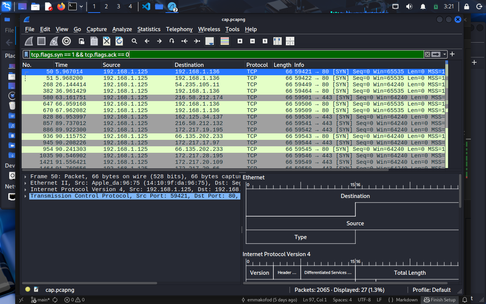

wireshark analyse

source port = 59557
source ip = 192.168.1.125

dest port = 80
dest ip = 65.61.137.117

seq num raw = 1188992502
rel seq num 0 0

ack num = 0

flags -> syn 1

---

dest port = 59557
dest ip = 192.168.1.125

source port = 80
src ip = 65.61.137.117

seq num raw = 3775696889
rel seq num = 0

ack num = 1
ack raw = 1188992503

flags ack 1 syn 1

----

source port = 59557
source ip = 192.168.1.125

dest port = 80
dest ip = 65.61.137.117

seq num rel 1
seq raw 1188992503

ack = 1
ack raw = 3775696890

flags ack 1

----

http 

source port = 59557
source ip = 192.168.1.125

dest port = 80
dest ip = 65.61.137.117

rel seq = 1
seq raw = 1188992503

ack rel 1
ack raw  = 3775696890

flags ack 1 push 1

tcp ayload 364 bytes

----

source port = 59557
source ip = 192.168.1.125

dest port = 80
dest ip = 65.61.137.117

seq rel 1
seq raw 3775696890

ack rel 365 (tcp payload + rel 1)
ack raw 1381 (tcp seg length 1380 + rel 1)

flags ack 1

__________

Network Challenge
First download the file cap.pcapng from fronter.
A host (lets call it Thor) is connections to demo.testfire.net. Try to investigate the traffic.
Also note down the packet numbers where you found the answers.

1. What is the IP address of demo.testfire.net, and what is Thors IP address?

2. In what package(s) did we get the DNS response, and what happened?

3. What kind of service(s) did Thor access on demo.testfire.net?

4. HTTP traffic was observed. Tell what elements the first page accessed contained?

5. How did the user land on demo.testfire.net? Any indications on what directed him there?

6. A photo called “home1.jpg” is fetched from demo.testfire.net. Try to extract it

7. Which packet(s) contains the photo?

8. How many HTTP requests were in total made to demo.testfire.net?

9. What is going on in packet 1694, and to what is that packet replying?

10. TCP connection with demo.testfire.net torn down? If yes then where, and if no then why not?

11. Figure out who is behind the IP address 172.217.19.195 (without using google)

12. A machine has the IP address 192.168.1.101. Try to find its hostname

13. Generate a list of all the endpoints (IPv4) seen on the network

