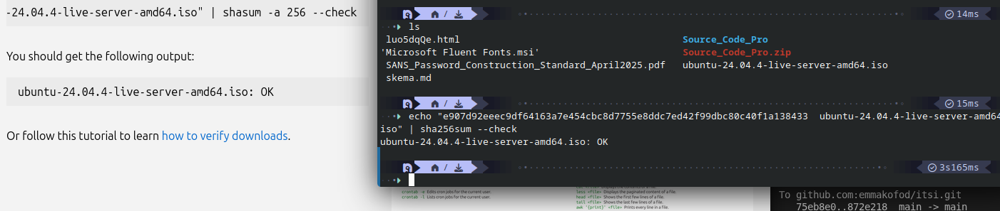
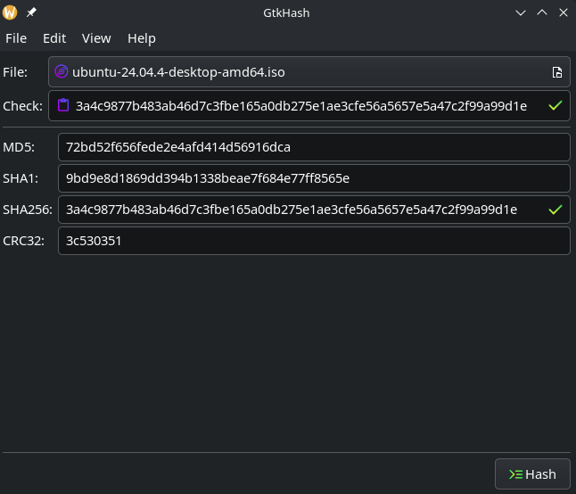
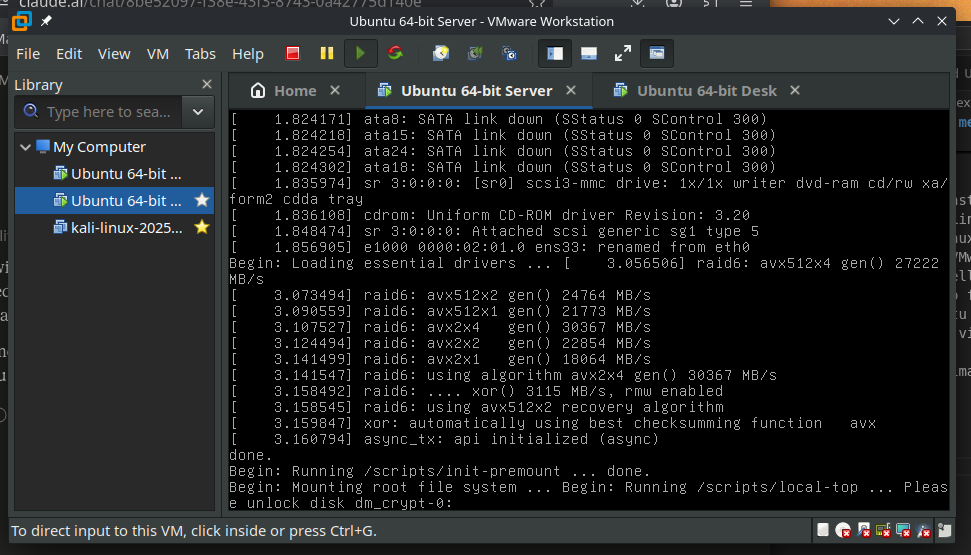

# Installation media integrity
## EX 1.1:
Other security policies
– Your company should have policies for all other
relevant aspects of IT Security.
– Where can you find best pratices and overview of
what security policies could be relevant?...
• digitalsikkerhed.dk, pro på linkedin guides, center for
cybersikkerhed, cisa.gov, digital-strategy.ec.europa.eu, CIS
Controls, Industriens Fond, ds.dk -> ISO2700x, IEC62443,
NIST, Ekran best practices, NIS2, OWASP,…
– Kik lidt i de forskellige, og lav din egen top-10 af regler
(overskrifter) som du ville synes er fornuftigt at bruge i
dit firma. Plus…. en ekstra regel nr 11 som du synes er
sjov/fornuftig.
_________

1.  Access Control Policy (ISO 27001)
        Principle of least privilege. A user only gets access to what they need for their job. No shared accounts, every right needs an approval and justification.
2.  Password and MFA Policy (NIST)
        Strong passwords are required, and mandatpry MFA for critical systems and remote access.
        2.1 Password construction standard (CRF & SANS) - best practices for strong passwords
3.  Patch and Vulnerabilities Management Policy (CIS Controls)
        All systems ansd sw must be kept up to date. Critical security patches must be applied quickly (within 72h of release)
4.  Incident Response Plan (NIS2 - obligatory in EU following the digital european act)
        Your need a well documented and tested plan for what needs to be done when a breach happens. WHO needs to do WHAT, WHEN, WHERE. 
5.  Backup and Recovery
        All critical data needs to be backed up following a 3-2-1 rule (daily), 3 copies, 2 != media types, 1 offsite. The backups must be tested on a regular schedule (quarterly). Not just assume it works, need to test them.
6.  Security Awareness Training (CFCS)
        All employees must have a training in security, been tested and have gotten to know what to do if for ex. phishing. Untrained and unknowing humans are the biggest risk, their unknowkingness makes their handling random or not secure. Training makes them aware and responsible.
7.  Network Segmentation and Firewall Policy (IEC and CIS Controls)
        International network must be divided into zones, attack surfaces (devices, employees, guests etc) must not share the same network. Traffic is logged and controlled.
8.  Data Classification and Handling (ISO 27001)
        All data must be labeled with levels, and every level need a clear set of rules for storage, sharing etc. Everything needs to be identified in order to be able to defend it, you just can't protect what you don't know you have.
9.  Third Party and Vendor Risk Management (NIS2 and ISO 27036)
        Before any extern vendor gets access to your systems, they need to get assessed. Have a written proof and contract, specify what they can and can't do. No loophole left open.
10. Physical Security Policy (digitalsikkerhed.dk)
        Be careful of your surroundings. Clear your desktop of critical material, close doors, keep your password secret, log access into rooms, dont allow extern hardware inside of ppremises etc. As stated previously, humans are the biggest weak link in security.
11. Don't feed the AI
        Dont feed our company data and critical information into random AI chats.
    5 seconds rule
        If you're away from your computer (unlocked) for more than 5 seconds, its fair game and colleagues SHOULD change your wallpaper or send an embarassing mail from "you" - peer pressure. Lock your screen.

## EX 1.2:
In what situations can this SHA256 checksum/ hash integrity check be fooled, so that you will install a compromised software including malware?
Find at least 2 situations where this can happen.

_________

- MITM over http download
- if you have access to sw server, change sw dl to your own, then new hash for check matches your hash
- infect targets computer with malware
- hw hacking, change sw on target computer

## EX 1.3:
Make an MD5 check (or SHA256) of your ISO file.
How:
• Download a Linux installation ISO file (not Kali)
– One Linux with GUI, and another Linux serevr version without GUI.
• Open the terminal, change to the dir with the ISO file.
• Enter something like:
– md5sum ubuntu-22.04.2-desktop-amd64.iso
• Now you will get the calculated MD5 hash, and SHA256,…
• Go to the Ubuntu download web page, find the hash.
• Compare (copy and search) the md5 you got with the one on
the web page. Do they match?

– Bonus exercise:
• Try out the GtkHash tool for GUI hash check.

## EX 1.4:
Linux system installation.
– We will use Linux for exercises.
– Install a Linux on your machine. (**not Kali**)
• You may use VMware or similar to install as guest OS
under the umbrella of your normal OS.
– Get a link to free licence from school.
• Install ubuntu 22.04.2 LTS (or 20.04 or other Linux)
– Create a new virtual machine in VMware and install from your
dowloaded ISO image file (after you have verified the ISO file
integrity)

