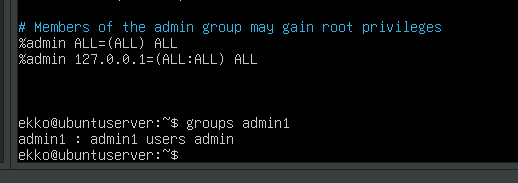
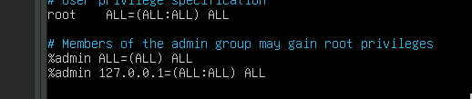
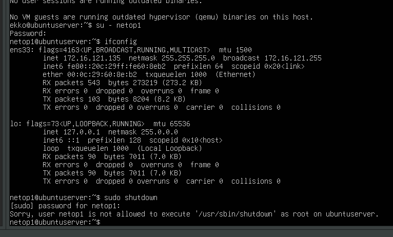

# Disk Encryption

## EX 2.1:

Exercise 2.1
• Disk encryption
– Do you have Linux in VMware?
• Create a new virtual machine from an .iso file.
• During installation select advanced and select to encrypt the disk.
• How to verify that data is encrypted and protected?
– From your laptop host OS, try to read the virtual machines disk-file.
– Use an editor or hex editor to look at the VMware virtual machine files. Then you can
read files from an unecrypted VM, but you can not read files from an encrypted VM.
Demonstrate this.

strings 'Ubuntu 64-bit encryppted server-s001.vmdk' | grep -i luks
strings 'Ubuntu 64-bit server-s001.vmdk' | grep -i luks

There is a lot of human readable text in the second one, that is not LUKS encrypted, and in the first, there is almost nothing to read and or fiind out.

Exercise 2.2a
• Configure an admin user with sudo access.
– Create a new user admin1 with adduser command.
– Set a password.
– add an admin group.
– Add admin1 user to the admin group.
– Edit the /etc/sudoers policy file by using visudo.
• Not using visudo can cripple your system 
• Allow the admin group to run ALL commands from local ip addresses only,
as any user and as any group.

Exercise 2.2b
• Configure privilege separation.
– Create users netop1, netop2, printop1, printop2, powop1 and
powop2.
– Edit the /etc/sudoers policy file using visudo.
• Make groups net_op, print_op, power_op
• Allow print_op users to manage printers:
– /usr/sbin/lpc, /usr/bin/lprm
• Allow power_op users to stop and reboot the system:
– shutdown, halt, reboot, restart
• Allow net_op users to manage network:
– route, ifconfig, ip, ping, dhclient, net, iptables, rfcomm, wvdial, iwconfig, mii-tool

Exercise 2.2c
• Configure privilege separation.
– If not using Linux, but Windows or some other OS,
Is it still relevenat to separate admin priviledges?
Why?
– If yes, then how du we figure out how to do that?
– Why
• do we separate admin priviledges?

It is always relevant, its a principle not a os matter.
the man command alsways help to find out about a coommand, so we can try to see if we can operate iwht the commands we just used for the other exercises. If not, search the docs for windows. 

gpedit.msc for group policies and for adding users, the gui is sufficient, or lusrmgr.msc for managing local users and groups.

https://www.digitalcitizen.life/geeks-way-managing-user-accounts-and-groups/

Why? beacuse pirnciple of least privilege, a user must only have access to what they must use for their jobs. no room for errors or misuse. we protect and segregate data and files. Only people concerned with womthing can have access to it.