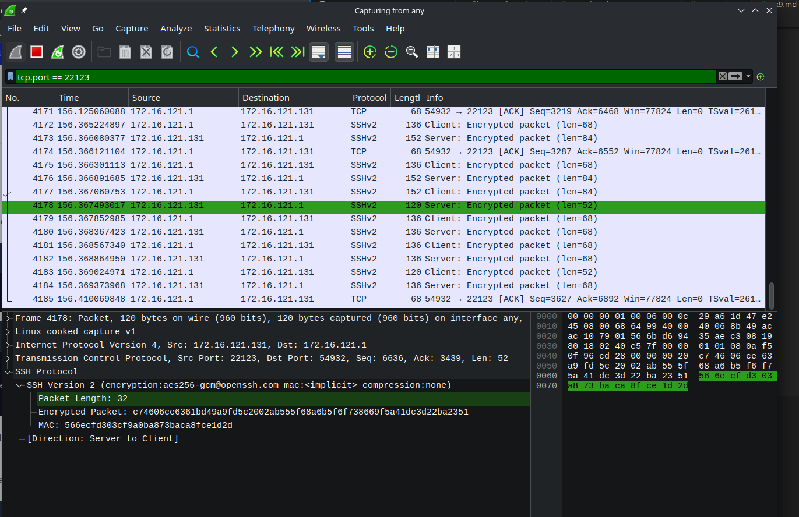

Exercise 9.1
• Test scp
– Transfer a file using scp.
– Catch packets in wireshark and show if packet
content is encrypted or not.
• Test sftp as you did with scp.
– Use packet capture and/or wireshark to see that
the transfered file is encrypted.

Exercise 9.2
• Research and prepare a Kerberos presentation.
– What is it?
– What is it good for?
• (What problems are solved / not solved.)
– How does it work?
• You should be able to explain to a beginner.
– Max 2 slides.

Exercise 9.3
• Research and prepare a Kerberos configuration.
– Install a separate Kerberos Server (in VMware).
– You already have SSH Server and Client machines.
– Configure the Kerberos Server.
– Configure the SSH Server.
– Configure the SSH Client.
– Demonstrate SSH Client login to the SSH Server
using Kerberos authentication.